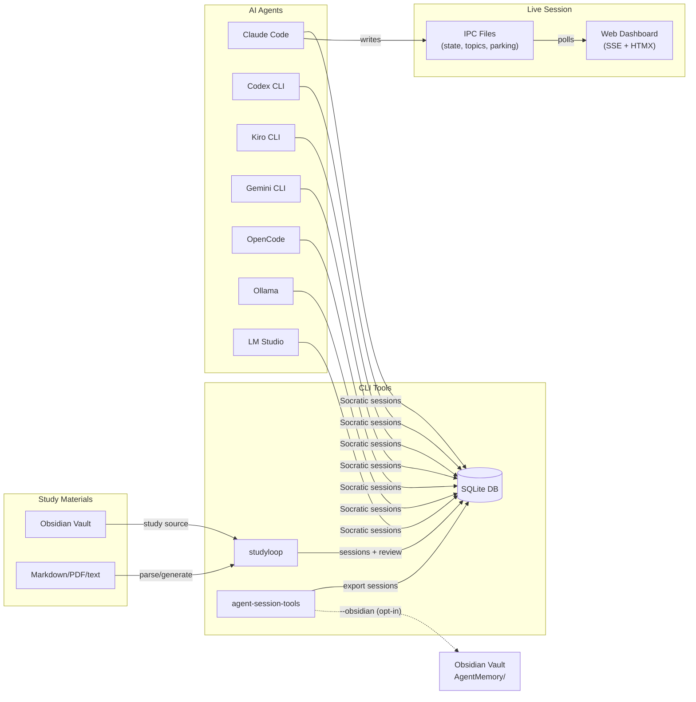

<p align="center">
  
</p>

# StudyLoop

> An AuDHD-aware study toolkit for live Socratic mentoring, body-doubling, local study artefacts, and cross-assistant session memory.


## What Does It Do?

Five things:

1. **Socratic AI sessions** — Body doubling with AI mentors that ask questions instead of giving answers. Energy-adaptive (low day? shorter chunks, more scaffolding).
2. **Content pipeline** — Chunk eBooks and Obsidian notes → generate quizzes, flashcards, and hands-on practice tasks locally, without requiring external notebook services.
3. **Active learning decisions** — `studyloop now` chooses one useful next action from due reviews, weak concepts, practice tasks, energy, modality, and time available.
4. **Flashcard review** — Spaced repetition (SM-2) via a PWA web app. Works on phone, tablet, laptop.
5. **Session tracking** — Export AI coding sessions (Claude Code, Codex, Kiro, Gemini, OpenCode, pi, omp, and more) into a searchable SQLite database. Track trends, find struggle topics, search across sessions. Optionally mirror each session into your Obsidian vault (`--obsidian`) as Dataview-compatible Markdown with `[[wikilink]]` backlinks and per-project index notes.

Built by a neurodivergent learner transitioning from networking to data engineering. If you're self-teaching and AuDHD, this might help.

## Quick Start

```bash
# Install from source (no PyPI release)
git clone https://github.com/Hookey-Street-Software/StudyLoop studyloop
cd studyloop
./scripts/install.sh

# Configure
studyloop self-test        # Lightweight post-install check
studyloop setup              # Interactive setup wizard (incl. optional Obsidian export)
studyloop doctor --fix       # Verify and apply safe fixes

# Core workflow — live Socratic study (tmux + agent, or web Study Session tab)
studyloop study "Python decorators" --energy 6
# studyloop web              # Alternative: browser picker + ACP chat

# Supporting workflows
studyloop now                # One recommended study action for your energy/time
studyloop chat-note NOTE.md  # Turn one note into a Socratic context pack
studyloop content generate-cards SOURCE --course python     # Local quiz + flashcard JSON
studyloop content generate-practice SOURCE --course python  # Local hands-on practice JSON
studyloop resume             # Where you left off (session summary)
studyloop review             # Spaced repetition due today
studyloop recap today        # One win, one repair target, one due item, one next action
studyloop web                # Flashcards, quizzes, live session dashboard
session-export               # Export AI sessions to SQLite
session-query search "decorators"
```

See [docs/first-week.md](docs/first-week.md) for a day-by-day onboarding path.

## Architecture



## CLI Reference

### studyloop

```bash
# Study sessions (tmux + AI agent + sidebar)
studyloop study "topic" --energy 7      # Full tmux environment in one command
studyloop study "topic" --web           # Also start web dashboard + auto-open browser
studyloop study "topic" --lan           # LAN access with password auth (implies --web)
studyloop study "topic" --lan --password SECRET  # Explicit LAN password
studyloop study --resume                # Resume conversation from history
studyloop study --end                   # End session (quit Claude also works)
studyloop park "question"               # Park tangential topic

# Content pipeline
studyloop content split SOURCE       # Split PDF by chapters
studyloop content generate-cards DIR --course COURSE  # Generate local quiz/flashcard JSON
studyloop content generate-practice DIR --course COURSE  # Generate local hands-on practice JSON
studyloop content discover           # Preview configured study sources
studyloop content ingest --dry-run   # Plan course-material ingest

# Review & AuDHD progress
studyloop now                        # Recommend one next study action
studyloop now --energy low --time 15 # Smaller, lower-switching recommendation
studyloop chat-note NOTE.md --mode diagram  # Socratic prompt from a note
studyloop practice verify TASKS.json --task 1 --notes "what passed"
studyloop recap today --speak        # Daily audio recap through study-speak
studyloop mastery graph --topic python  # Mermaid concept dependency graph
studyloop mastery weak-links --topic python
studyloop review                     # Check spaced repetition due dates
studyloop review --interleave adaptive --energy medium
studyloop struggles --days 30        # Find recurring struggle topics
studyloop wins                       # Learning wins (mastered / confident concepts)
studyloop resume                     # Where you left off (session summary)
studyloop streaks                    # Study streak and consistency stats
studyloop web                        # Launch flashcard/quiz PWA

# Backlog & cleanup
studyloop backlog list               # Cross-session study backlog
studyloop clean --dry-run            # Preview orphan session cleanup

# Status/topics
studyloop status                     # Show sync status
studyloop topics                     # List configured course topics (config.yaml)

# Health & metrics
studyloop doctor                     # Check installation health
studyloop doctor --fix               # Apply safe automatic fixes
studyloop install agents             # Install AI agent definitions from source checkout
studyloop setup                      # Interactive configuration
studyloop session effectiveness      # Persona effectiveness over time
```

### agent-session-tools

```bash
session-export                       # Export AI sessions to SQLite
session-export --sources claude codex
session-export --pi-only             # Export only pi sessions
session-export --omp-only            # Export only omp sessions
session-export --obsidian            # Also write notes to your Obsidian vault
session-export --obsidian --obsidian-backfill  # one-time: mirror all history
session-query search QUERY           # Full-text search across sessions
session-query list --since 7d        # List recent sessions
session-query stats                  # Database statistics
session-sync push/pull/sync HOST     # Cross-machine sync
```

## Agent Support

| Platform | Agent | Start With |
|----------|-------|------------|
| Claude Code | `socratic-mentor` | `/agent socratic-mentor` |
| Codex CLI | `AGENTS.md` | `codex` in the project root |
| Kiro CLI | `study-mentor` | `kiro-cli chat --agent study-mentor` |
| Gemini CLI | `study-mentor` | `gemini` (auto-detected) |
| OpenCode | `study-mentor` | Tab to switch agent |
| pi | `AGENTS.md` | `pi` in the project root |
| omp | `AGENTS.md` | `omp` in the project root |
| Ollama | (local LLM) | `studyloop study "topic" --agent ollama` |
| LM Studio | (local LLM) | `studyloop study "topic" --agent lmstudio` |

## Web PWA

Launch with `studyloop web`. Accessible from any device on the network.

**Flashcard review:**
- SM-2 spaced repetition with source/chapter filter
- Session history with 90-day study heatmap
- Pomodoro timer, voice output, OpenDyslexic font toggle
- PWA installable — add to home screen

**Course Explorer** (sidebar "Courses" button):
- Browse course material by provider in horizontal carousels, with per-provider filter
- Click a course to list its lessons; click a lesson to read rendered markdown + mermaid diagrams + syntax-highlighted code
- Global fuzzy search (Fuse.js, instant over titles) + full-text search (SQLite FTS5, over lesson bodies)
- "Struggling?" button in the reader flags a lesson to the session DB; surfaces in next study session and deck generation
- "Discuss" opens the current lesson as a note-companion prompt so the reader becomes an active recall or diagram session
- "▶ Listen" TTS read-aloud button (appears only when the `browser-neural-tts` feature is installed)

**Live session dashboard** (`/session`):
- Real-time activity feed via SSE (Server-Sent Events)
- Timer with energy-adaptive colour phases (green/amber/red)
- Topic counters (wins, parked, review)
- Session summary on completion
- **Terminal panel** — embedded ttyd iframe proxied same-origin at `/terminal/` for current live agent interaction. Target architecture is ACP-first web sessions with PTY fallback.
- HTMX + Alpine.js — no build step

## Optional Extras

```bash
# Repo-local optional dependencies
uv sync --all-packages --extra web      # FastAPI web UI
uv sync --all-packages --extra content  # PDF splitting + content pipeline

# Global CLI with the features used in this README
studyloop install tools

# ttyd — web terminal (enables the terminal panel in the live dashboard)
brew install ttyd            # macOS
sudo apt install ttyd        # Linux (or build from source)
```

## Documentation

- [Setup Guide](docs/setup-guide.md) — installation and configuration
- [Your First Week](docs/first-week.md) — minimal day-by-day onboarding
- [Architecture](docs/architecture.md) — current and target architecture
- [Content Pipeline](docs/content-pipeline.md) — local generation of review artefacts
- [TUI Sidebar Guide](docs/tui-guide.md) — terminal sidebar layout, timer, key bindings
- [Web UI Guide](docs/web-ui-guide.md) — live sessions, terminal fallback, flashcards, quizzes
- [Agent Installation](docs/agent-install.md) — per-platform agent setup
- [CI Workflows](docs/ci.md) — local and GitHub Actions quality gates
- [Ownership Map](docs/ownership.md) — where common changes should live
- [System Overview](docs/system-overview.md) — architecture and data flow diagrams
- [Repository Standards](docs/standards/repo-standards.md)
- [AuDHD Learning Philosophy](docs/audhd-learning-philosophy.md)
- [AuDHD Learning Loop Implementation](docs/audhd-learning-loop-implementation.md) — how notes become recall, practice, verification, recap, and mastery evidence
- [AuDHD Deep Technical Learning Roadmap](docs/audhd-deep-technical-learning-roadmap.md) — implementation status and next refinements for the six active-learning features
- [Voice Output Guide](docs/voice-output.md)
- [Contributing](CONTRIBUTING.md)

## Maintainer Tasks

For local contributor and release workflows, use `just`:

```bash
just preflight
just release-check
just smoke-installed
```

Use `just sync-web`, `just sync-content`, or `just sync-semantic` before optional profile tests when the active `.venv` does not include that dependency set.

Install `just` with:

```bash
brew install just
```

<!-- ARTEFACTS:START -->
## Generated Artefacts

> Explore this project — generated overviews from the historical artefact pipeline.

| | |
|---|---|
| 🎧 **[Listen to the Audio Overview](https://artefacts.netdevautomate.dev/studyloop/artefacts/)** | Two AI hosts discuss the project — great for commutes |
| 🎬 **[Watch the Video Overview](https://artefacts.netdevautomate.dev/studyloop/artefacts/#video)** | Visual walkthrough of architecture and concepts |
| 🖼️ **[View the Infographic](https://artefacts.netdevautomate.dev/studyloop/artefacts/#infographic)** | Architecture and flow at a glance |
| 📊 **[Browse the Slide Deck](https://artefacts.netdevautomate.dev/studyloop/artefacts/#slides)** | Presentation-ready project overview |

*Historical generated artefacts. NotebookLM is not required for the core study workflow.*
<!-- ARTEFACTS:END -->

## Maintainer Notes

### Set the GitHub social preview image

The OpenGraph card shown when this repo is shared on Slack / X / LinkedIn / etc. is **not** picked up automatically — GitHub requires a one-time upload via the web UI:

1. Go to **Settings → General** (top of the repo).
2. Scroll to **Social preview**.
3. Click **Edit** → **Upload an image…**
4. Pick `icons/studyloop-social.png` (1280×640, generated from `icons/studyloop-banner.svg`).
5. Save.

After this, link previews use the proper StudyLoop card. If the banner ever changes, regenerate the social PNG with:

```bash
rsvg-convert -w 1280 -h 640 icons/studyloop-banner.svg -o icons/studyloop-social.png
```

…then re-upload via the same Settings page. The repo can't trigger this from CI.

## License

MIT
