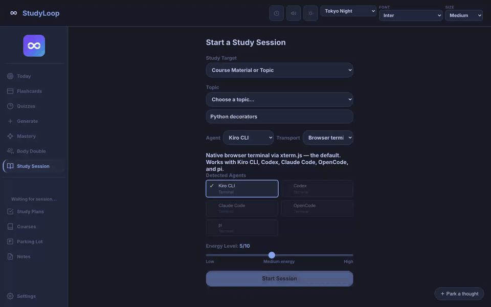
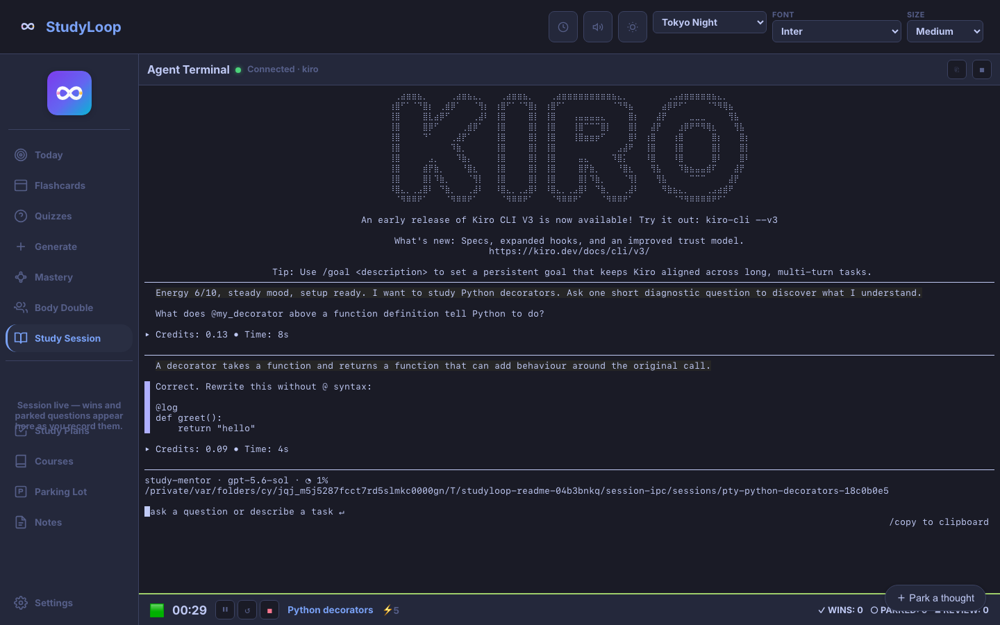
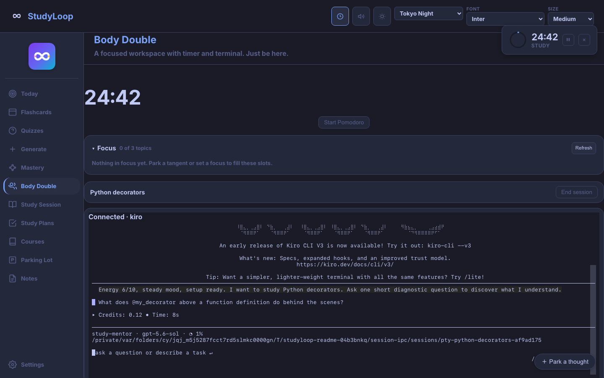

<p align="center">
  
</p>

# StudyLoop

StudyLoop is a local-first study companion for people who learn better by doing,
explaining, and being asked the next useful question. It pairs a browser workspace
with AI mentors such as Kiro, keeps track of where you left off, and turns real
practice into evidence you can revisit.


<p align="center">
  
</p>

<p align="center"><em>A real StudyLoop session with live Kiro responses; the topic and learner reply were supplied when recording.</em></p>

## What studying with it feels like

- **Study Session** gives you a live mentor that asks short Socratic questions,
  adapts to your energy, and leaves space for you to reason.
- **Body Double** gives you a calm workspace, a visible timer, and an agent beside
  you while you work through one task.
- **Today, flashcards, and quizzes** help you return to useful work without having
  to reconstruct the whole plan in your head.
- **Sessions and teach-backs** preserve what you actually practised. Notes can add
  context, but they are optional and are not treated as proof that something was
  learned.

| Study Session | Body Double |
| --- | --- |
|  |  |

StudyLoop was built by a neurodivergent learner moving from networking into data
engineering. Its AuDHD support is part of the workflow: smaller starting steps,
energy-aware pacing, visible closure, a parking lot for tangents, and prompts that
challenge without shaming.

## Is it for me?

You do not need to be a software developer to use the study workspace. You do need
someone comfortable with a terminal for the current source installation, plus at
least one supported AI command-line agent. If that setup is unfamiliar, the
[step-by-step setup guide](docs/setup-guide.md) is the best place to start—and
reports about confusing instructions are genuinely useful contributions.

The current release is best suited to:

- self-directed learners who want an active study partner rather than an answer bot;
- AuDHD learners who benefit from low-friction starts and explicit session endings;
- technical learners using Kiro CLI, Codex, Claude Code, OpenCode, or pi;
- contributors interested in learning tools, accessibility, documentation, or Python.

## Try one study session

StudyLoop currently installs from source on macOS or Linux and requires Python
3.12 or newer.

```bash
git clone https://github.com/NetDevAutomate/StudyLoop.git studyloop
cd studyloop
./scripts/install.sh
studyloop setup
studyloop doctor --fix
studyloop web
```

Open the URL printed in the terminal, choose **Study Session**, enter a topic,
select your installed agent, and start. The browser workspace runs locally; your
study database, plans, and generated materials stay on your machine unless you
choose to sync or export them. The selected AI agent may still send conversation
content to its own model provider; its privacy and billing terms apply.

Prefer the terminal? Start the same kind of session with:

```bash
studyloop study "Python decorators" --energy 6
```

Follow [Your First Week](docs/first-week.md) for a gentle path through study,
review, and session history.

## What is ready—and what is not

StudyLoop is an early open-source release, so the boundaries are worth making
clear:

- installation is from a Git checkout; there is no current PyPI or Homebrew release;
- the Web UI is built for laptop and tablet layouts. Phone widths get a usable
  bottom tab bar rather than a broken one, but a phone is not a supported layout
  and no journey is tested at that size;
- the Web UI needs the local StudyLoop server and does not work offline;
- voice uses a configured Kokoro-compatible server, then falls back to operating
  system voices when available;
- study plans can be created in the Web UI or CLI, but the current Web UI form is
  manual—an agent-led planning interview is not integrated there yet;
- practice-task generation and verification are currently CLI workflows.

Those limits are tracked openly in the [roadmap](docs/roadmap.md). If one blocks
you, an issue describing the real workflow is more helpful than a feature wishlist
without context.

## Help shape StudyLoop

Contributions do not have to be code. Clear bug reports, setup notes, accessibility
feedback, screenshots, documentation fixes, and descriptions of where a study flow
became overwhelming are all welcome.

For code changes, small pull requests with a focused test are easiest to review.
The [contributing guide](CONTRIBUTING.md) covers the development setup, checks, and
pull request process.

- [Open an issue](https://github.com/NetDevAutomate/StudyLoop/issues)
- [Browse pull requests](https://github.com/NetDevAutomate/StudyLoop/pulls)
- [Read the contribution guide](CONTRIBUTING.md)

## Guides

- [Setup Guide](docs/setup-guide.md) — install and configure the current release
- [Your First Week](docs/first-week.md) — reach a useful first routine gradually
- [Web UI Guide](docs/web-ui-guide.md) — Study Session, Body Double, review, and access
- [Study Plans](docs/study-plans.md) — create and use plans without over-planning
- [Content Pipeline](docs/content-pipeline.md) — make local cards and practice material
- [Troubleshooting](docs/troubleshooting.md) — recover from common setup problems
- [CLI Reference](docs/cli-reference.md) — complete command details
- [AuDHD Learning Philosophy](docs/audhd-learning-philosophy.md) — why the workflow is designed this way

## License and acknowledgements

MIT — see [LICENSE](LICENSE).

StudyLoop's study-plan shape (mission first, learning records kept like
decision records, primary sources over recalled knowledge) is adapted from
Matt Pocock's [`teach` skill](https://github.com/mattpocock/skills/tree/main/skills/productivity/teach),
published under the MIT License, Copyright (c) 2026 Matt Pocock. The ideas
were re-implemented rather than copied; his copyright notice and the MIT
permission notice are kept in [THIRD-PARTY-NOTICES.md](THIRD-PARTY-NOTICES.md)
so they travel with any portion that is ever reused verbatim.

Vendored fonts and JavaScript libraries, with their licences, are listed in the
same file.
