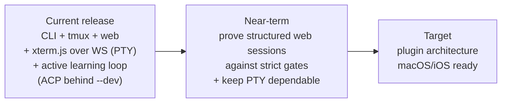

# Architecture

This is the entry point for architecture documentation.

## Read These First

- [Current Architecture](architecture/current.md) describes the release PTY path and the dev-only ACP implementation, with C4 Level 1 / 2 / 3 diagrams.
- [Target Architecture](architecture/target.md) describes the plugin-based, web-first, native-client-ready direction.
- [System Overview](system-overview.md) is the lighter-touch user-and-operator big picture.
- [Standards](standards/repo-standards.md) defines naming, structure, and documentation conventions.
- [Planning](planning/2026_05_09_planning.md) contains the remediation plan.

## Architecture Decision Summary

The project is moving toward a local-first, pluggable study platform.

The core workflow is not flashcards or quizzes. The core workflow is live interactive study with an assistant and active-learning services that understand the learner's history, recurring struggles, wins, practice evidence, weak links, and progress through the shared database.

The v1 browser transport is **PTY rendered by xterm.js over a WebSocket**.
Experimental ACP chat remains available only with `studyloop web --dev` (see
[ADR-0006](adr/0006-gate-acp-behind-dev-mode.md)). There is no ttyd browser
surface; the ttyd **server** transport is retained for maintainers only.

## Frontend Structure

The SPA's component logic is being unwound from one large inline `<script>` into ES modules. Commit `4f06915` completed Phase 1, taking `web/static/index.html` from **4,403 to 2,702 lines** (it is **3,112** today, having grown again with the study-plan panel markup).

- `web/static/js/main.js` is the ESM entry point, loaded as `<script type="module" src="/js/main.js">`.
- `web/static/js/components/*.js` holds the extracted Alpine factories — currently **seven** on `window`: `generatePanel`, `liveAgentConsole`, `plansPanel`, `sessionTimer`, `settingsPanel`, `splitLayout`, `terminalPanel`.
- `web/static/js/lib/` holds shared helpers (`chunk-text.js`, `timer-thresholds.js`).
- `web/static/components.js` is **still present and still loaded** as a classic script; components not yet extracted (for example `courseExplorer()`) continue to live there.

Factories are assigned to `window` deliberately: Alpine evaluates `x-data="sessionTimer()"` in global scope, so a module-only export is invisible to it. Any doc or diagram describing frontend logic as inline script in `index.html` is describing the pre-`4f06915` layout.

## Session Multiplexer

`studyloop/multiplexer.py` defines a `Multiplexer` protocol with two backends. `get_backend()` selects between them from `STUDYLOOP_MULTIPLEXER`:

| Value | Backend |
|---|---|
| unset (default) | `TmuxBackend` |
| `tmux` | `TmuxBackend` |
| `herdr` | `HerdrBackend` — raises `MultiplexerError` if the `herdr` binary is absent |

**tmux is still the default.** `HerdrBackend` is implemented, but herdr stays opt-in until its journey suite is green; it has **not** replaced tmux. Call sites import from `multiplexer.py` rather than `tmux.py` directly.

## Active Architecture Docs

| Document | Purpose |
|---|---|
| [Current Architecture](architecture/current.md) | Containers, components, flows, and limitations as they work today (C4 L1+L2+L3 + sequence diagram). |
| [Target Architecture](architecture/target.md) | Plugin interfaces, ACP/PTY session strategy, native app direction. |
| [pi / omp Harness Integration](architecture/pi-omp-harness-integration.md) | How `@earendil-works/pi-coding-agent` (pi) and `@oh-my-pi/pi-coding-agent` (omp) plug into the session export pipeline, installer, and doctor. Includes C4 L1+L2 diagrams and end-of-session sequence. |
| [System Overview](system-overview.md) | User-facing explanation of how the pieces connect. |
| [Web UI Guide](web-ui-guide.md) | Web UI walkthrough, ACP chat mode, theme palettes, terminal surfaces. |
| [AuDHD Learning Loop Implementation](audhd-learning-loop-implementation.md) | Product and data-flow details for `studyloop now`, note companion prompts, verification, recap, mastery graphs, and interleaving. |
| [Session Protocol](session-protocol.md) | The transport-agnostic study protocol every agent follows. |
| [MCP Integrations](mcp.md) | Agent/tool integration details. |
| [Standards](standards/repo-standards.md) | Repository and naming standards. |

## Historical Architecture Docs

Historical drafts, reviews, and old NotebookLM-specific designs live under `docs/archive/`.
