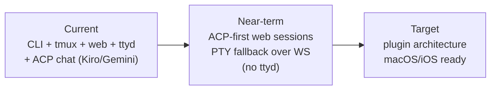

# Architecture

This is the entry point for architecture documentation.

## Read These First

- [Current Architecture](architecture/current.md) describes the system as it works today, with C4 Level 1 / 2 / 3 diagrams and a sequence diagram of the ACP persona-injection flow.
- [Target Architecture](architecture/target.md) describes the plugin-based, web-first, native-client-ready direction.
- [System Overview](system-overview.md) is the lighter-touch user-and-operator big picture.
- [Standards](standards/repo-standards.md) defines naming, structure, and documentation conventions.
- [Planning](planning/2026_05_09_planning.md) contains the remediation plan.

## Architecture Decision Summary

The project is moving toward a local-first, pluggable study platform.

The core workflow is not flashcards or quizzes. The core workflow is live interactive study with an assistant that understands the learner's history, recurring struggles, wins, and progress through the shared database.

## Active Architecture Docs

| Document | Purpose |
|---|---|
| [Current Architecture](architecture/current.md) | Containers, components, flows, and limitations as they work today (C4 L1+L2+L3 + sequence diagram). |
| [Target Architecture](architecture/target.md) | Plugin interfaces, ACP/PTY session strategy, native app direction. |
| [pi / omp Harness Integration](architecture/pi-omp-harness-integration.md) | How `@earendil-works/pi-coding-agent` (pi) and `@oh-my-pi/pi-coding-agent` (omp) plug into the session export pipeline, installer, and doctor. Includes C4 L1+L2 diagrams and end-of-session sequence. |
| [System Overview](system-overview.md) | User-facing explanation of how the pieces connect. |
| [Web UI Guide](web-ui-guide.md) | Web UI walkthrough, ACP chat mode, theme palettes, ttyd fallback. |
| [Session Protocol](session-protocol.md) | The transport-agnostic study protocol every agent follows. |
| [MCP Integrations](mcp.md) | Agent/tool integration details. |
| [Standards](standards/repo-standards.md) | Repository and naming standards. |

## Historical Architecture Docs

Historical drafts, reviews, and old NotebookLM-specific designs live under `docs/archive/`.
