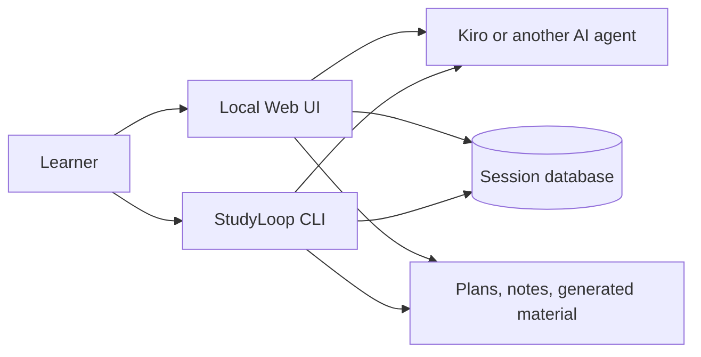

# Architecture Overview

StudyLoop is a local-first Python application with two main interfaces: a
command-line toolkit and a browser workspace served from the same machine.

## The important boundaries

### StudyLoop owns the learning workflow

StudyLoop chooses the session shape, records progress and review evidence, keeps
plans and parked thoughts, and renders the browser workspace. It does not embed
one model provider as its intelligence layer.

### The selected agent owns the model conversation

Kiro CLI, Codex, Claude Code, OpenCode, and pi launch as separate processes.
StudyLoop connects the chosen agent to the session through
a terminal or structured chat transport. Provider authentication, billing, and
data handling therefore depend on that agent.

### Local files are authoritative

Study plans and generated learning material are readable local files. Session,
review, and checkpoint history are stored in SQLite. Optional Obsidian export is
a mirror, not a requirement for the core workflow.

### The browser is a view onto the local service

`studyloop web` starts the FastAPI service that powers the browser app. Live
updates use normal local HTTP, WebSocket, and server-sent-event connections. The
app has no offline service worker, so the server must remain reachable.

## Why there are two live agent surfaces

Agents with a compatible structured protocol can use a chat-like surface with
Markdown and status events. Other command-line agents use an xterm.js terminal
connected to a pseudo-terminal over a WebSocket. Both enter the same StudyLoop
session lifecycle and save the same learning evidence.

There is no learner-facing ttyd iframe. Installing ttyd does not enable a hidden
fallback in the current Web UI.

## Repository layers

| Area | Responsibility |
| --- | --- |
| `packages/studyloop` | CLI, Web UI, planning, review, content, adapters, session runtime |
| `packages/agent-session-tools` | export, query, sync, and optional note mirroring for agent sessions |
| `agents` | mentor definitions and shared learning protocols for supported harnesses |
| `docs` | public guides plus excluded maintainer history and design evidence |
| `scripts` and `justfile` | installation, verification, release, and media workflows |

The repository also keeps detailed implementation maps, design records, audits,
and historical plans. They remain available to contributors in the source tree,
but are deliberately outside the published user documentation.

## Where to continue

- [Web UI Guide](web-ui-guide.md) for the learner-facing browser workflow
- [Agent Installation](agent-install.md) for supported harness setup
- [Content Pipeline](content-pipeline.md) for generated learning material
- [CLI Reference](cli-reference.md) for exact commands
- [Contributing](contributing.md) for repository setup and pull requests
