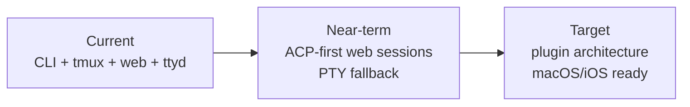

# Architecture

This is the entry point for architecture documentation.

## Read These First

- [Current Architecture](architecture/current.md) describes the system as it works today.
- [Target Architecture](architecture/target.md) describes the plugin-based direction.
- [Standards](standards/repo-standards.md) defines naming, structure, and documentation conventions.
- [Planning](planning/2026_05_09_planning.md) contains the remediation plan.

## Architecture Decision Summary

The project is moving toward a local-first, pluggable study platform.

The core workflow is not flashcards or quizzes. The core workflow is live interactive study with an assistant that understands the learner's history, recurring struggles, wins, and progress through the shared database.

## Active Architecture Docs

| Document | Purpose |
|---|---|
| [Current Architecture](architecture/current.md) | Current containers, flows, and limitations |
| [Target Architecture](architecture/target.md) | Plugin interfaces, ACP/PTY session strategy, native app direction |
| [System Overview](system-overview.md) | User-facing explanation of how the pieces connect |
| [Web UI Guide](web-ui-guide.md) | Current web UI plus target session presentation model |
| [MCP Integrations](mcp.md) | Agent/tool integration details |
| [Standards](standards/repo-standards.md) | Repository and naming standards |

## Historical Architecture Docs

Historical drafts, reviews, and old NotebookLM-specific designs live under `docs/archive/`.
