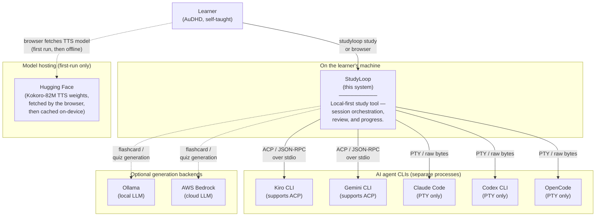
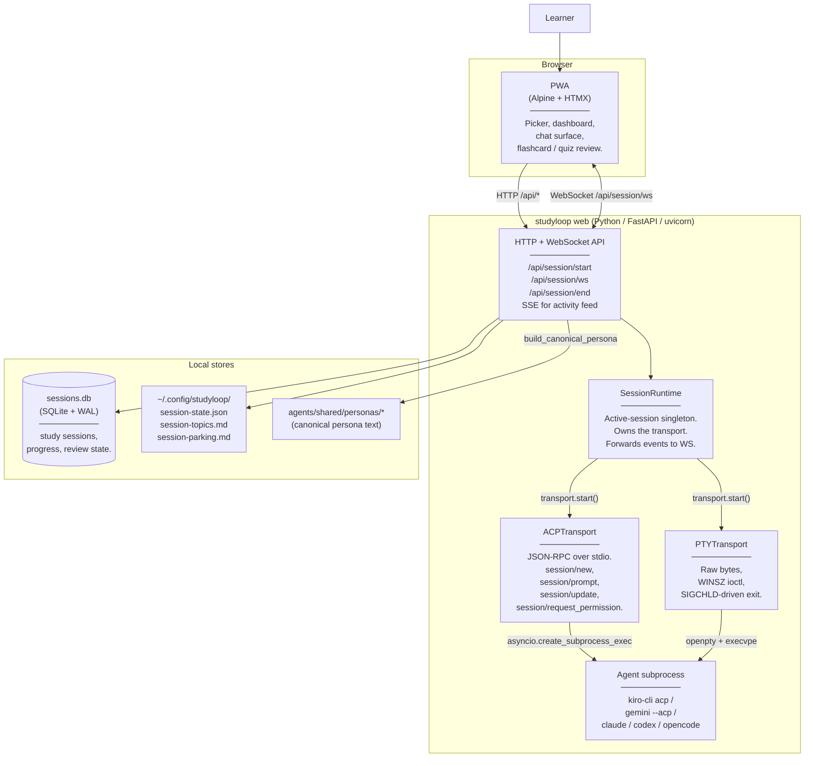
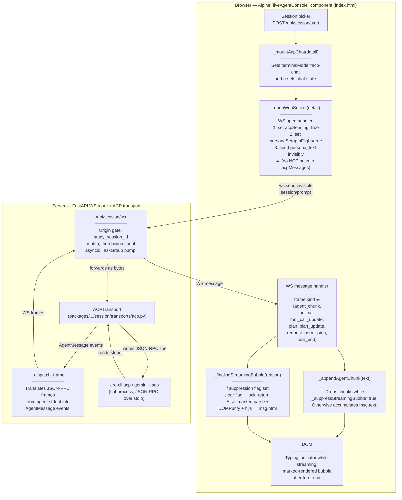
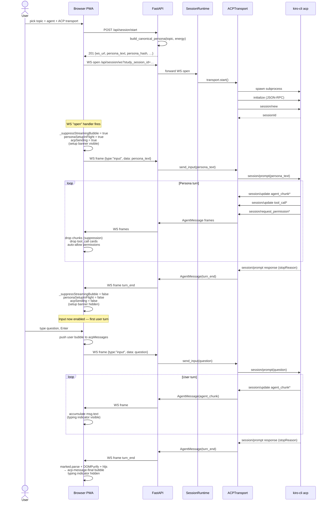
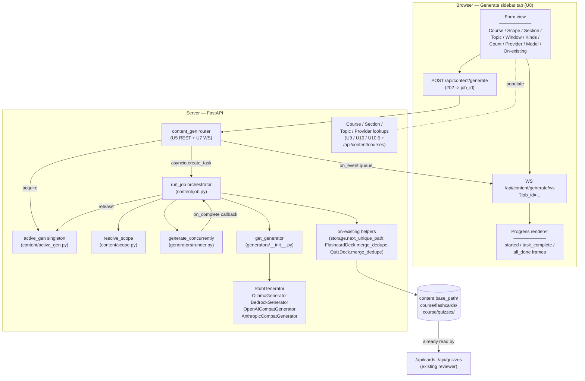
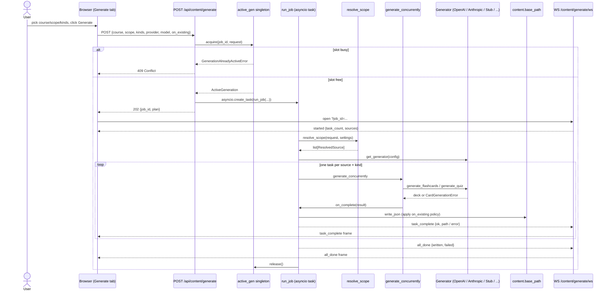
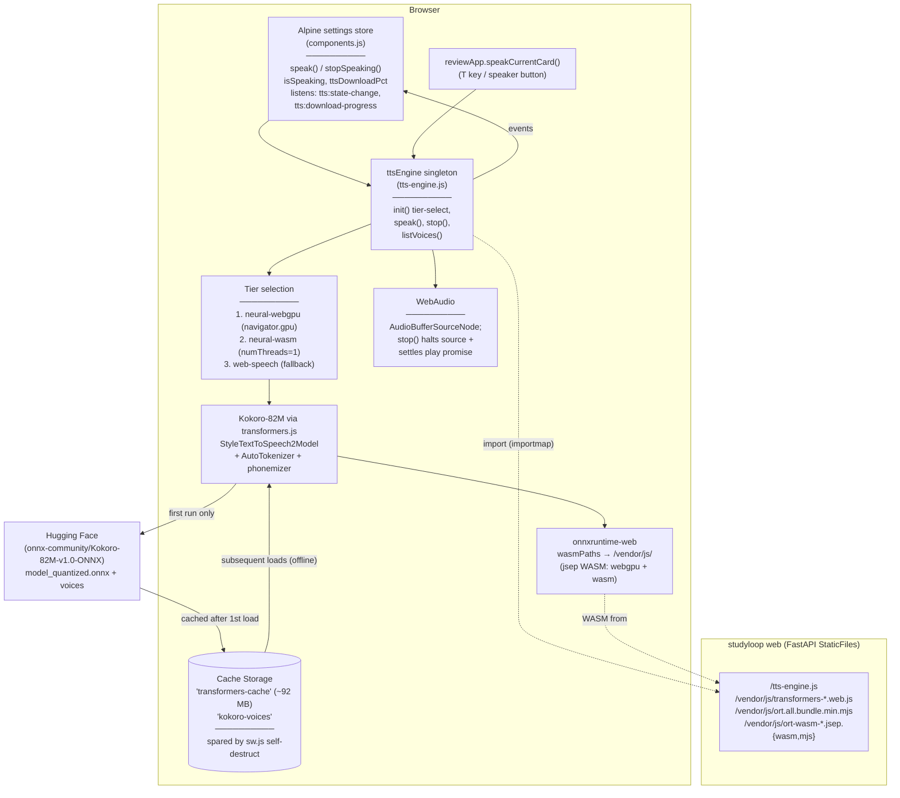

# Current Architecture

> Last updated: 2026-06-01. Reflects the ACP chat-UI feature (2026-05-27), the dogfood hotfix (2026-05-28, commit `bfe9210`), the Generate panel (2026-05-29), and the in-browser neural TTS engine (2026-06-01).

This document describes the system as it works today, using the [C4 model](https://c4model.com/) at three levels of zoom: Context → Container → Component (focused on the ACP chat surface).

For the planned direction, see [Target Architecture](target.md).

---

## C4 Level 1 — System Context

StudyLoop is single-user and runs entirely on one host. The only external systems are the AI agent CLIs (Kiro, Claude Code, Gemini, Codex, OpenCode) and optional generation backends (Ollama / Bedrock).

**Trust boundaries** — everything happens on the learner's machine. The only outbound network calls are (a) the agent CLI's own model calls (the agent owns those creds and policy), (b) optional Bedrock for content generation, and (c) a one-time browser fetch of the in-browser TTS model weights from Hugging Face (cached on-device thereafter; voice synthesis itself is fully local — no text is ever sent off-device). StudyLoop's Python server has no outbound component and never phones home.

---

## C4 Level 2 — Containers

Inside the StudyLoop boundary the work is split across several long-running processes plus the agent subprocess.

**Key invariants today**:

- **One active session at a time.** `SessionRuntime` is a singleton acquired under `asyncio.Lock`. `/api/session/start` returns 409 if a session is already live.
- **Transport selection is explicit per session.** Body field `transport: "pty" | "ttyd" | "acp"`. The env var `STUDYLOOP_TRANSPORT` can force `pty`/`ttyd` as an operator kill-switch (ACP is body-only).
- **Persona text never reaches the wire on the PTY path** — it's written to a temp file, the agent's launch command embeds the path, and the agent reads it at startup.
- **Persona text DOES travel on the wire on the ACP path** — added 2026-05-28 in commit `bfe9210`. `/api/session/start` returns `persona_text` inline in the JSON body; the browser ships it as the first invisible `session/prompt` after WS open. Hidden client-side: not pushed to `acpMessages`.
- **The PWA owns chat-surface state.** The server never sends server-rendered HTML for chat bubbles — only raw ACP events. Markdown rendering, sanitisation, syntax highlighting, theme palette: all in the browser.

---

## C4 Level 3 — Component (zoomed into the ACP chat surface)

This is the part of the system that the dogfood hotfix touched. It has two halves — the server-side dispatcher and the browser-side Alpine component — connected by the WebSocket frame contract.

**Persona-injection turn (the part the hotfix wired up)**:

**Why suppression exists**: the persona instructs the agent to read IPC files (`session-state.json`, `session-topics.md`, `session-parking.md`) for context. On a fresh session those reads happen as bash tool calls (Kiro auto-approves them today, but the protocol ALSO supports `request_permission`). Without suppression the user would see `▼ ? completed`/`▼ ? failed` cards before they had a chance to type — confusing UX. The fix:

- `agent_chunk` text: dropped (no ack scrolls past).
- `tool_call`, `tool_call_update`: dropped (no cards rendered).
- `plan`, `plan_update`: dropped (no plan tree rendered).
- `request_permission`: auto-allowed with `allow_once`-equivalent (no permission prompt shown to user).

All four are gated on a single non-reactive flag `this._suppressStreamingBubble`, set true on WS-open persona send, cleared on the persona-turn `turn_end`.

---

## Component → file map (for the chat surface)

| Component | File | Notable lines |
|---|---|---|
| Picker / `study-session-start` event | `packages/studyloop/src/studyloop/web/static/index.html` | ~1138 |
| `_mountAcpChat` | `index.html` | ~1585 |
| `_openWebSocket` (incl. invisible-persona send) | `index.html` | ~1601 |
| WS message dispatcher (frame.kind switch) | `index.html` | ~1670 |
| `_appendAgentChunk` (suppression on streaming) | `index.html` | ~1752 |
| `_finaliseStreamingBubble` (suppression on turn_end) | `index.html` | ~1775 |
| `_renderMarkdown` (marked → DOMPurify → hljs) | `index.html` | ~1787 |
| Setup banner DOM | `index.html` | ~828 |
| Typing indicator + final bubble DOM | `index.html` | ~836 |
| Theme palettes (CSS vars) | `packages/studyloop/src/studyloop/web/static/style.css` | end of file |
| Settings store (palette, dyslexic, light) | `packages/studyloop/src/studyloop/web/static/components.js` | ~43 |
| `/api/session/start` (ACP path) | `packages/studyloop/src/studyloop/web/routes/session.py` | ~687 |
| Persona injection backend | `packages/studyloop/src/studyloop/web/routes/session.py` | ~783 |
| ACPTransport `_dispatch_frame` | `packages/studyloop/src/studyloop/session/transports/acp.py` | — |
| Live Kiro Playwright test (regression fence) | `packages/studyloop/tests/test_web_acp_dogfood_kiro.py` | full file |
| Stub-driven chat-UI e2e | `packages/studyloop/tests/test_web_acp_chat_ui.py` | full file |

---

## C4 Level 3 — Component (zoomed into the Generate panel)

Sister surface to the chat surface. The Generate panel reuses the existing `content/generators/` package as its producer; the new layer is the orchestrator + the active-generation singleton + the REST + WS endpoints + the sidebar UI. **All shipped on `main` as of 2026-05-29** — backend, HTTP surface, and browser side.

**Job lifecycle (one click of Generate)**:

**Why a singleton + queue, not direct streaming**: a single Ollama process (or a single MiniMax token plan) doesn't tolerate two concurrent jobs. The singleton is the simplest possible coordinator -- one process, one heavy LLM job at a time. The per-job WS queue lets clients reconnect / resubscribe without losing events that fire during the gap.

---

## Component → file map (for the generation surface)

| Component | File | Notable lines |
|---|---|---|
| Active-generation singleton | `packages/studyloop/src/studyloop/content/active_gen.py` | full file |
| Job orchestrator (`run_job`) | `packages/studyloop/src/studyloop/content/job.py` | full file |
| Scope resolver (`resolve_scope`) | `packages/studyloop/src/studyloop/content/scope.py` | full file |
| Generator factory + Protocol | `packages/studyloop/src/studyloop/content/generators/__init__.py` | full file |
| Provider profile registry | `packages/studyloop/src/studyloop/content/generators/provider_profiles.py` | full file |
| Stub generator | `packages/studyloop/src/studyloop/content/generators/stub.py` | full file |
| OpenAI Chat Completions adapter | `packages/studyloop/src/studyloop/content/generators/openai_compat.py` | full file |
| Anthropic Messages adapter | `packages/studyloop/src/studyloop/content/generators/anthropic_compat.py` | full file |
| Shared retry-with-correction helper | `packages/studyloop/src/studyloop/content/generators/_retry.py` | full file |
| On-existing helpers (merge / unique-path) | `packages/studyloop/src/studyloop/content/{schemas,storage}.py` | `merge_dedupe`, `next_unique_path` |
| `.env` autoload | `packages/studyloop/src/studyloop/__init__.py` | full file |
| `live_provider` pytest marker | `packages/studyloop/pyproject.toml` | `[tool.pytest.ini_options]` |
| Live MVD smoke (parametrised over registry) | `packages/studyloop/tests/test_live_provider_smoke.py` | full file |
| MVD source fixture (photosynthesis) | `packages/studyloop/tests/fixtures/mvd_source.md` | full file |

---

## C4 Level 3 — Component (zoomed into in-browser neural TTS)

Shipped 2026-06-01. Voice output is a **browser-only** subsystem — there is no server-side TTS component for the web path. The page downloads a neural model once and synthesises speech on-device (WebGPU/WASM); StudyLoop's FastAPI server only serves the static engine module and the vendored ONNX-runtime WASM. This is the first part of the system that reaches an external network host (Hugging Face) directly from the browser.

**Key invariants**:

- **No COOP/COEP headers.** `env.backends.onnx.wasm.numThreads = 1` + WebGPU preference means `SharedArrayBuffer` is never requested, so `SecurityHeadersMiddleware` is untouched and the same-origin ttyd iframe (which relies on `X-Frame-Options: SAMEORIGIN`) keeps working. This is a deliberate engine-choice constraint, not an oversight.
- **ORT WASM is pinned to vendored files.** `wasmPaths = '/vendor/js/'` stops transformers.js falling back to the jsdelivr CDN — which both breaks offline use and triggers a JS-glue/WASM version mismatch (`_OrtGetInputName is not a function`). The vendored `ort-wasm-simd-threaded.jsep.wasm` (23 MB, stored via Git LFS) serves both the webgpu and wasm execution providers.
- **Model persists across reloads.** `env.useBrowserCache = true` (the library default) stores the ~92 MB q8 model in Cache Storage. The PWA service worker's self-destruct handler explicitly spares `transformers-cache` and `kokoro-voices`, so a code-asset refresh never forces a re-download.
- **`stop()` is unified across tiers.** It halts the neural `AudioBufferSourceNode` (`.stop()` + `disconnect()`) AND settles the in-flight playback promise *before* suspending the AudioContext — a suspended context freezes the clock so `onended` never fires. Web-speech tier delegates to `speechSynthesis.cancel()`.
- **Browser → Hugging Face is the only new egress.** First-run model fetch is the single direct browser-to-internet call; everything else (engine module, WASM) is same-origin from FastAPI. After first load the model is served from Cache Storage and voice works fully offline.

### Component → file map (for the TTS surface)

| Component | File | Notable lines |
|---|---|---|
| TTS engine (singleton, tiers, speak/stop) | `packages/studyloop/src/studyloop/web/static/tts-engine.js` | full file |
| Settings store TTS wiring (speak / stopSpeaking / isSpeaking / download progress) | `packages/studyloop/src/studyloop/web/static/components.js` | ~44–200 |
| `reviewApp.speakCurrentCard()` | `components.js` | ~590 |
| Importmap + module load + stop button + progress bar | `index.html` | head (importmap) + header controls |
| Service-worker model-cache preservation | `packages/studyloop/src/studyloop/web/static/sw.js` | self-destruct handler |
| Vendored libs (LFS for `*.wasm`) | `packages/studyloop/src/studyloop/web/static/vendor/js/` | — |
| TTS contract + stop-control tests | `packages/studyloop/tests/test_web_tts.py` | full file |

---

## What's NOT in this diagram

- **The Pomodoro overlay**, OpenDyslexic toggle — orthogonal UI concerns, not part of the session pipeline. (Voice output is now documented in its own C4 L3 component section above.)
- **The flashcard / quiz review path** — separate from interactive sessions; covered in [Web UI Guide](../web-ui-guide.md).
- **The Generate panel UI surface** — see U8 in the [Generation Panel Plan](../plans/2026-05-29-001-feat-content-generation-panel-plan.md). Backend is shipped as of 2026-05-28; UI is Session-2 work.
- **MCP servers** — see [MCP](../mcp.md). Currently only the Kiro adapter exposes any MCP integration.
- **Legacy tmux + ttyd** — kept as fallback; documented in [Web UI Guide § Terminal Fallback (ttyd)](../web-ui-guide.md#terminal-fallback-ttyd). Will be retired once ACP + PTY web sessions cover all agents.
