# Current Architecture

> Last updated: 2026-06-02. Reflects the ACP chat-UI feature (2026-05-27) + dogfood hotfix (`bfe9210`), the Settings → LLM Providers panel with first-class Bedrock/Ollama + an encrypted secret store, the Anthropic-compat adapter robustness work (MiniMax was trialled then removed for quiz quality), the scalable (mode-split, publisher-grouped, searchable) course-review list, the opt-in Obsidian session-memory export (`session-export --obsidian`), the in-browser neural TTS engine, Course Explorer side panel (Phases 1–6), generation-control honesty (`count_per_source` through `GenerationTask.count`), Explorer tree fingerprint caching, DB/FTS integrity coverage, and route-stubbed browser smoke coverage.

This document describes the system as it works today, using the [C4 model](https://c4model.com/) at three levels of zoom: Context → Container → Component (focused on the ACP chat, Generate, and Review surfaces).

For the planned direction, see [Target Architecture](target.md).

---

## C4 Level 1 — System Context

StudyLoop is single-user and runs primarily on one host. External systems are
the AI agent CLIs (Kiro, Claude Code, Gemini, Codex, OpenCode), optional
generation providers, and the first-run browser TTS model fetch.

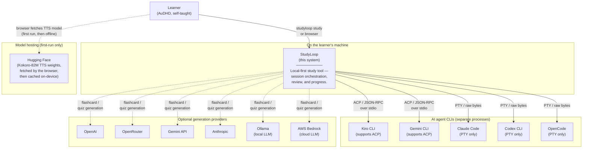

**Trust boundaries** — the learner controls a single-user local StudyLoop
process, but optional providers can create outbound calls. The outbound surfaces
are (a) the agent CLI's own model calls (the agent owns those creds and policy),
(b) optional content generation via OpenAI, OpenRouter, Gemini, Anthropic, AWS
Bedrock, or Ollama on a configured local/remote endpoint, and (c) a first-run
browser fetch of the in-browser TTS model weights from Hugging Face (cached
on-device thereafter; voice synthesis itself is fully local and does not send
review text to a TTS API). StudyLoop does not phone home.

---

## C4 Level 2 — Containers

Inside the StudyLoop boundary the work is split across several long-running processes plus the agent subprocess.

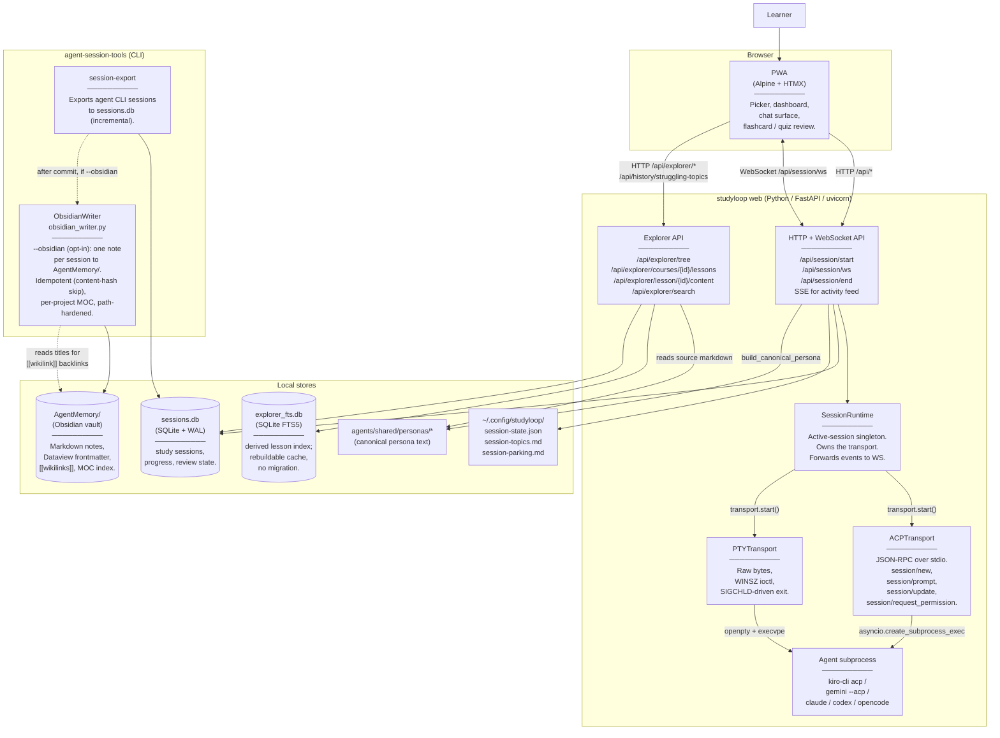

**Key invariants today**:

- **One active session at a time.** `SessionRuntime` is a singleton acquired under `asyncio.Lock`. `/api/session/start` returns 409 if a session is already live.
- **Transport selection is explicit per session.** Body field `transport: "pty" | "ttyd" | "acp"`. The env var `STUDYLOOP_TRANSPORT` can force `pty`/`ttyd` as an operator kill-switch (ACP is body-only).
- **Persona text never reaches the wire on the PTY path** — it's written to a temp file, the agent's launch command embeds the path, and the agent reads it at startup.
- **Persona text DOES travel on the wire on the ACP path** — added 2026-05-28 in commit `bfe9210`. `/api/session/start` returns `persona_text` inline in the JSON body; the browser ships it as the first invisible `session/prompt` after WS open. Hidden client-side: not pushed to `acpMessages`.
- **The PWA owns chat-surface state.** The server never sends server-rendered HTML for chat bubbles — only raw ACP events. Markdown rendering, sanitisation, syntax highlighting, theme palette: all in the browser.

---

## C4 Level 3 — Component (zoomed into the ACP chat surface)

This is the part of the system that the dogfood hotfix touched. It has two halves — the server-side dispatcher and the browser-side Alpine component — connected by the WebSocket frame contract.

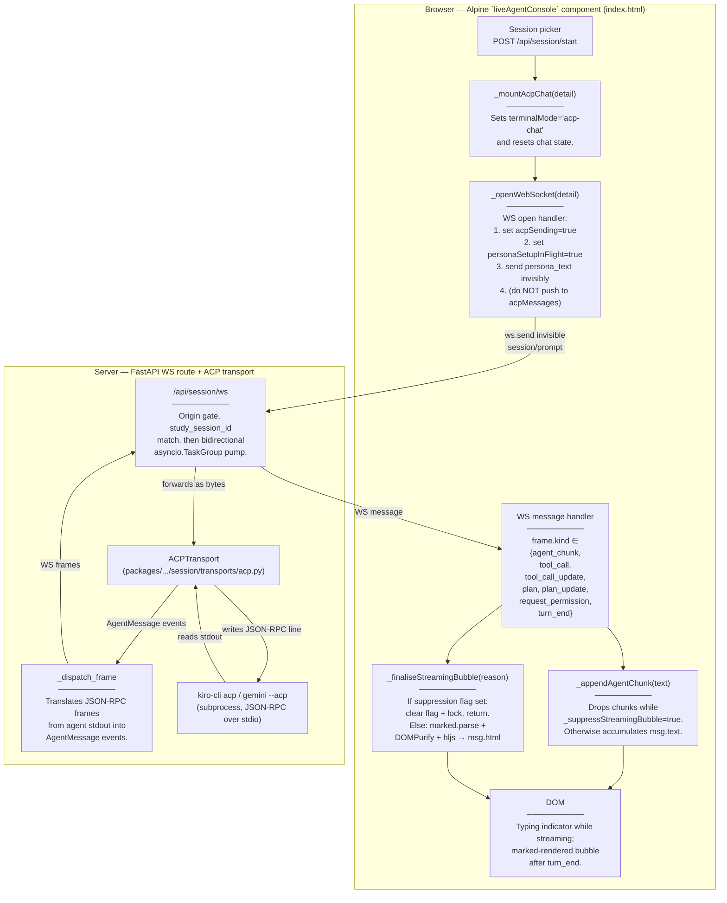

**Persona-injection turn (the part the hotfix wired up)**:

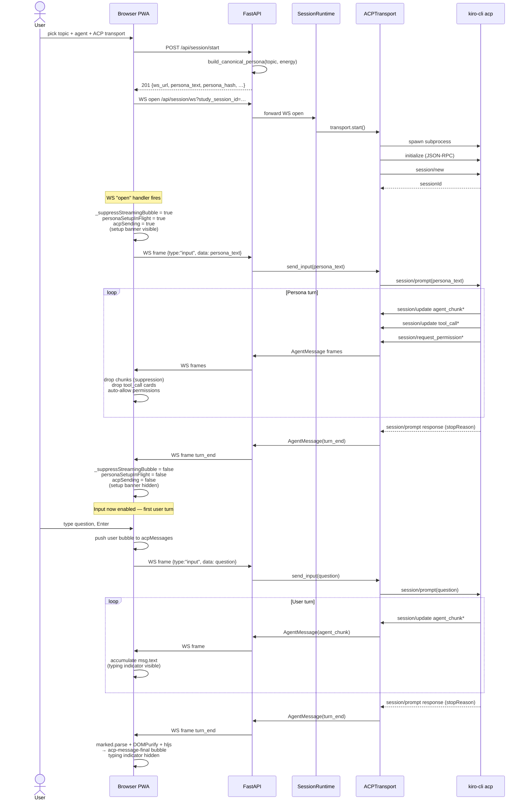

**Why suppression exists**: the persona instructs the agent to read IPC files (`session-state.json`, `session-topics.md`, `session-parking.md`) for context. On a fresh session those reads happen as bash tool calls (Kiro auto-approves them today, but the protocol ALSO supports `request_permission`). Without suppression the user would see `▼ ? completed`/`▼ ? failed` cards before they had a chance to type — confusing UX. The fix:

- `agent_chunk` text: dropped (no ack scrolls past).
- `tool_call`, `tool_call_update`: dropped (no cards rendered).
- `plan`, `plan_update`: dropped (no plan tree rendered).
- `request_permission`: auto-allowed with `allow_once`-equivalent (no permission prompt shown to user).

All four are gated on a single non-reactive flag `this._suppressStreamingBubble`, set true on WS-open persona send, cleared on the persona-turn `turn_end`.

---

## Component → file map (for the chat surface)

| Component | File | Notable lines |
|---|---|---|
| Picker / `study-session-start` event | `packages/studyloop/src/studyloop/web/static/index.html` | ~1138 |
| `_mountAcpChat` | `index.html` | ~1585 |
| `_openWebSocket` (incl. invisible-persona send) | `index.html` | ~1601 |
| WS message dispatcher (frame.kind switch) | `index.html` | ~1670 |
| `_appendAgentChunk` (suppression on streaming) | `index.html` | ~1752 |
| `_finaliseStreamingBubble` (suppression on turn_end) | `index.html` | ~1775 |
| `_renderMarkdown` (marked → DOMPurify → hljs) | `index.html` | ~1787 |
| Setup banner DOM | `index.html` | ~828 |
| Typing indicator + final bubble DOM | `index.html` | ~836 |
| Theme palettes (CSS vars) | `packages/studyloop/src/studyloop/web/static/style.css` | end of file |
| Settings store (palette, dyslexic, light) | `packages/studyloop/src/studyloop/web/static/components.js` | ~43 |
| `/api/session/start` (ACP path) | `packages/studyloop/src/studyloop/web/routes/session.py` | ~687 |
| Persona injection backend | `packages/studyloop/src/studyloop/web/routes/session.py` | ~783 |
| ACPTransport `_dispatch_frame` | `packages/studyloop/src/studyloop/session/transports/acp.py` | — |
| Live Kiro Playwright test (regression fence) | `packages/studyloop/tests/test_web_acp_dogfood_kiro.py` | full file |
| Stub-driven chat-UI e2e | `packages/studyloop/tests/test_web_acp_chat_ui.py` | full file |

---

## Component → file map (for the Obsidian session-memory export)

The export path is a CLI feature in `agent-session-tools`, independent of the web
surface. It runs after `session-export` commits to `sessions.db`, only when
`--obsidian` is passed (or `obsidian.export_enabled: true` in config).

| Component | File | Notes |
|---|---|---|
| `write_vault_notes` / `write_session_to_vault` / `write_moc` / `build_topic_index` | `packages/agent-session-tools/src/agent_session_tools/obsidian_writer.py` | core writer; idempotent, path-traversal hardened |
| `--obsidian*` flags + post-commit hook | `packages/agent-session-tools/src/agent_session_tools/export_sessions.py` | `_run_export`: touched-ID diff (incremental) vs all (`--obsidian-backfill`) |
| `get_obsidian_config` + `obsidian` defaults | `packages/agent-session-tools/src/agent_session_tools/config_loader.py` | reads `obsidian:` section from shared `config.yaml` |
| `ObsidianConfig` dataclass + `Settings.obsidian` | `packages/studyloop/src/studyloop/settings.py` | studyloop-side view of the same section; `vault_path` defaults to `obsidian_base` |
| Install prompt (Step 4) | `packages/studyloop/src/studyloop/cli/_setup.py` | `studyloop setup` offers to enable export |
| `check_obsidian_vault` (+.obsidian/ marker) + `check_obsidian_export` | `packages/studyloop/src/studyloop/doctor/config.py` | `studyloop doctor` health checks |
| Writer tests | `packages/agent-session-tools/tests/test_obsidian_writer.py` | 54 tests incl. idempotency, backfill-vs-incremental, traversal |

---

## C4 Level 3 — Component (zoomed into the Generate panel)

Sister surface to the chat surface. The Generate panel reuses the existing `content/generators/` package as its producer; the new layer is the orchestrator + the active-generation singleton + the REST + WS endpoints + the sidebar UI. **All shipped on `main` as of 2026-05-29** — backend, HTTP surface, and browser side.

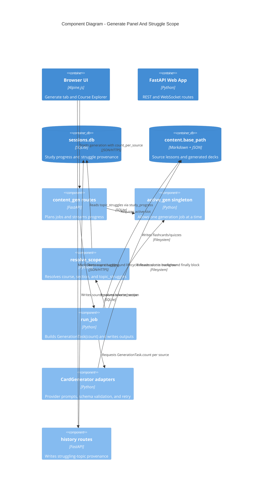

The dynamic flow below shows the same job from the user's click through REST,
background execution, provider prompt generation, and WebSocket progress frames.

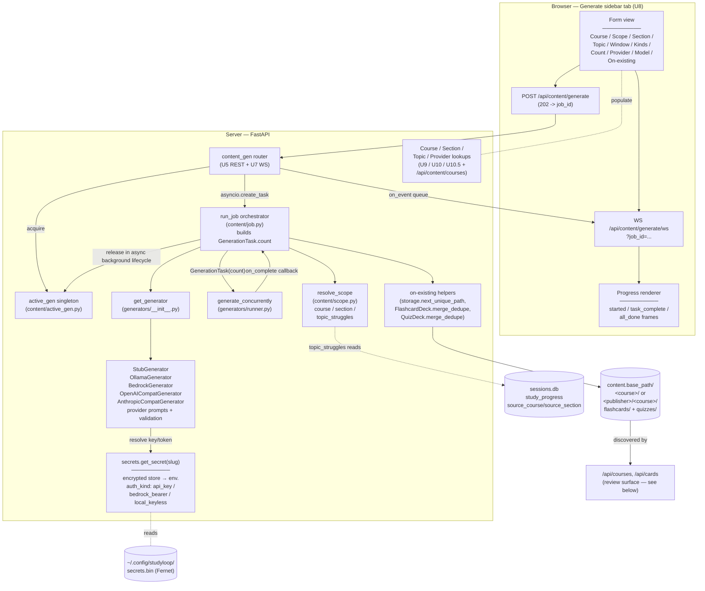

**Job lifecycle (one click of Generate)**:

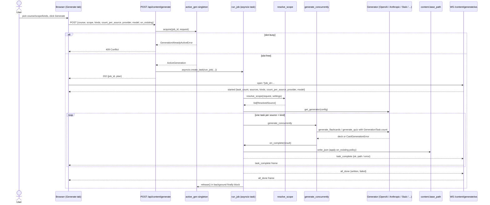

**Why a singleton + queue, not direct streaming**: a single Ollama process (or a rate-limited cloud token budget) doesn't tolerate two concurrent jobs. The singleton is the simplest possible coordinator -- one process, one heavy LLM job at a time. The per-job WS queue lets clients reconnect / resubscribe without losing events that fire during the gap.

---

## Component → file map (for the generation surface)

| Component | File | Notable lines |
|---|---|---|
| Active-generation singleton | `packages/studyloop/src/studyloop/content/active_gen.py` | full file |
| Job orchestrator (`run_job`) | `packages/studyloop/src/studyloop/content/job.py` | full file |
| Scope resolver (`resolve_scope`) | `packages/studyloop/src/studyloop/content/scope.py` | full file |
| Generator factory + Protocol | `packages/studyloop/src/studyloop/content/generators/__init__.py` | full file |
| Provider profile registry | `packages/studyloop/src/studyloop/content/generators/provider_profiles.py` | full file |
| Stub generator | `packages/studyloop/src/studyloop/content/generators/stub.py` | full file |
| OpenAI Chat Completions adapter | `packages/studyloop/src/studyloop/content/generators/openai_compat.py` | full file |
| Anthropic Messages adapter | `packages/studyloop/src/studyloop/content/generators/anthropic_compat.py` | full file |
| Shared retry-with-correction helper | `packages/studyloop/src/studyloop/content/generators/_retry.py` | full file |
| On-existing helpers (merge / unique-path) | `packages/studyloop/src/studyloop/content/{schemas,storage}.py` | `merge_dedupe`, `next_unique_path` |
| `.env` autoload | `packages/studyloop/src/studyloop/__init__.py` | full file |
| Encrypted secret store + auth-kind taxonomy | `packages/studyloop/src/studyloop/secrets.py` | `get_secret`, `set_secret`, `get_auth_kind` |
| Provider auth tests (Bedrock bearer / Ollama) | `packages/studyloop/src/studyloop/provider_auth.py` | full file |
| `live_provider` pytest marker | `packages/studyloop/pyproject.toml` | `[tool.pytest.ini_options]` |
| Live MVD smoke (parametrised over registry) | `packages/studyloop/tests/test_live_provider_smoke.py` | full file |
| MVD source fixture (photosynthesis) | `packages/studyloop/tests/fixtures/mvd_source.md` | full file |

---

## C4 Level 3 — Component (Review surface + Settings → LLM Providers)

The third browser surface: the **Flashcards/Quizzes review list** (where generated
decks are consumed) and the **Settings → LLM Providers** admin panel (where
generation credentials are managed). Both shipped on `main` 2026-06-01.

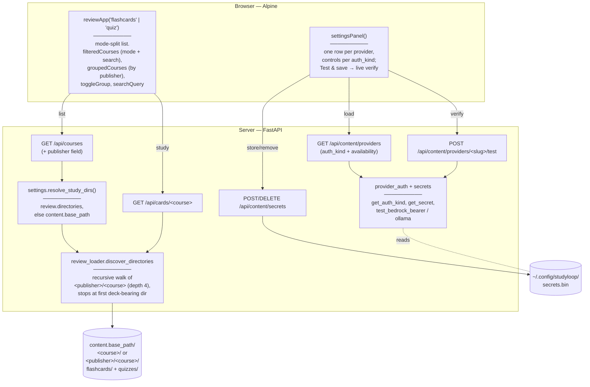

**Key points:**

- **Mode split** lives entirely in the shared `reviewApp` component: each panel is
  instantiated with its `mode` (`'flashcards'` or `'quiz'`), and `filteredCourses`
  gates the list on the matching count before the search filter. The Flashcards
  panel shows only flashcard decks (single Flashcards action); Quizzes mirrors.
- **Scaling** is `groupedCourses` (group `filteredCourses` by the API's new
  `publisher` field) + collapsible group headers + a name search box + compact
  one-line rows.
- **Write root ≠ read root.** CLI generation writes under
  `content.base_path/<course>/{flashcards,quizzes}/`; web generation writes under
  `content.base_path/<publisher>/<course>/{flashcards,quizzes}/` when a publisher
  is supplied. The reviewer reads via `resolve_study_dirs()`, which falls back to
  `content.base_path` when `review.directories` is unset, and
  `discover_directories` walks both layouts. (Before this, an unset
  `review.directories` silently left the panels empty.)
- **`name` is the identity key** for `/api/cards`, `openConfig`, and the SM-2
  review DB. `publisher` is display/grouping only — never keyed on.
- **Settings stores credentials only after a live verification** (auth call for
  api_key, AWS-cred check for Bedrock, real generation for Ollama), encrypted in
  `secrets.bin`. The same store backs the Generate panel's provider availability.

### Component → file map (Review + Settings)

| Component | File | Notable |
|---|---|---|
| Review list + mode-split + grouping/search | `web/static/index.html` (courses views) + `web/static/components.js` | `reviewApp`, `filteredCourses`, `groupedCourses`, `toggleGroup` |
| Settings panel | `web/static/index.html` (`settingsPanel()` block) + `components.js` | per-`auth_kind` rows |
| Course list + publisher field | `packages/studyloop/src/studyloop/services/review.py` | `list_course_summaries` |
| Read-root resolver | `packages/studyloop/src/studyloop/settings.py` | `resolve_study_dirs` |
| Recursive deck discovery | `packages/studyloop/src/studyloop/review_loader.py` | `discover_directories` |
| Course / cards routes | `packages/studyloop/src/studyloop/web/routes/courses.py`, `cards.py` | — |
| Providers / test / secrets routes | `packages/studyloop/src/studyloop/web/routes/content_gen.py` | `list_providers`, `/providers/{slug}/test`, `/secrets` |
| Scale + settings e2e | `tests/test_web_course_list_scale_e2e.py`, `tests/test_web_settings_panel_e2e.py` | geometry + behaviour |

---

## C4 Level 3 — Component (zoomed into in-browser neural TTS)

Shipped 2026-06-01. Voice output is a **browser-only** subsystem — there is no server-side TTS component for the web path. The page downloads a neural model once and synthesises speech on-device (WebGPU/WASM); StudyLoop's FastAPI server only serves the static engine module and the vendored ONNX-runtime WASM. This is the first part of the system that reaches an external network host (Hugging Face) directly from the browser.

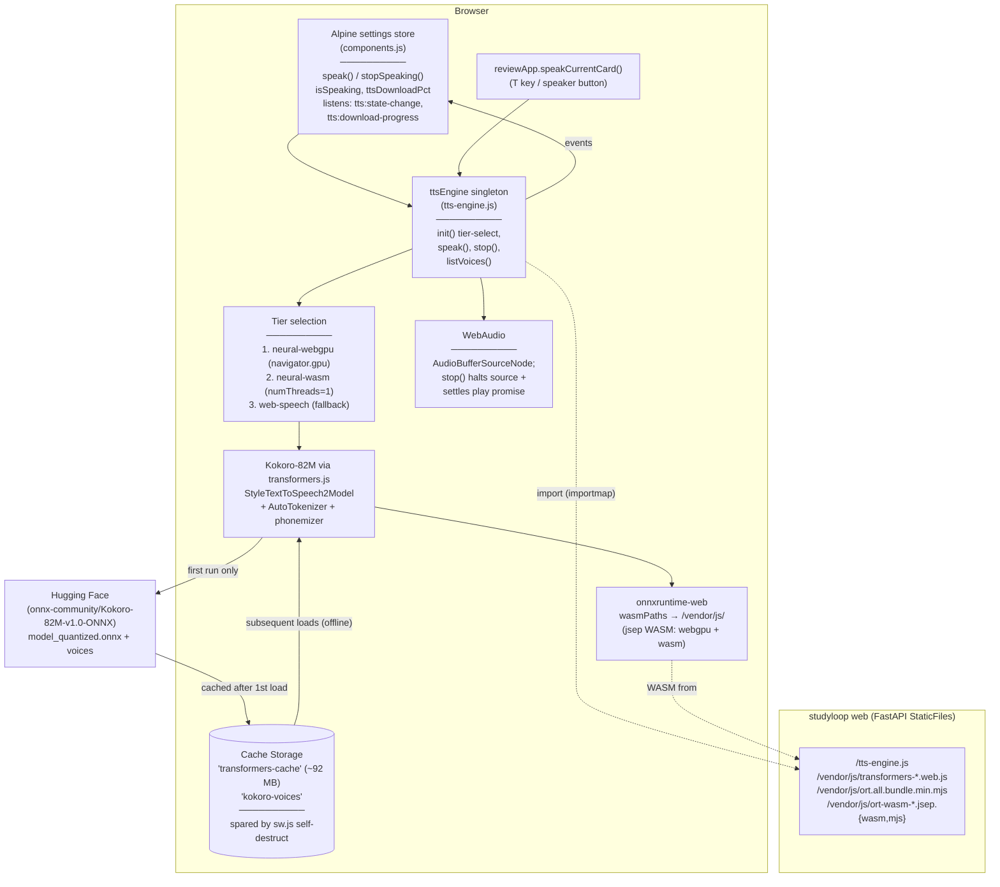

**Key invariants**:

- **No COOP/COEP headers.** `env.backends.onnx.wasm.numThreads = 1` + WebGPU preference means `SharedArrayBuffer` is never requested, so `SecurityHeadersMiddleware` is untouched and the same-origin ttyd iframe (which relies on `X-Frame-Options: SAMEORIGIN`) keeps working. This is a deliberate engine-choice constraint, not an oversight.
- **ORT WASM is pinned to vendored files.** `wasmPaths = '/vendor/js/'` stops transformers.js falling back to the jsdelivr CDN — which both breaks offline use and triggers a JS-glue/WASM version mismatch (`_OrtGetInputName is not a function`). The vendored `ort-wasm-simd-threaded.jsep.wasm` (23 MB, stored via Git LFS) serves both the webgpu and wasm execution providers.
- **Model persists across reloads.** `env.useBrowserCache = true` (the library default) stores the ~92 MB q8 model in Cache Storage. The PWA service worker's self-destruct handler explicitly spares `transformers-cache` and `kokoro-voices`, so a code-asset refresh never forces a re-download.
- **`stop()` is unified across tiers.** It halts the neural `AudioBufferSourceNode` (`.stop()` + `disconnect()`) AND settles the in-flight playback promise *before* suspending the AudioContext — a suspended context freezes the clock so `onended` never fires. Web-speech tier delegates to `speechSynthesis.cancel()`.
- **Browser → Hugging Face is TTS egress only.** First-run model fetch is the
  single direct browser-to-internet call for voice; optional content providers
  may also create outbound calls from the Python server during generation.
  Engine module and WASM assets are same-origin from FastAPI. After first load
  the model is served from Cache Storage and voice works fully offline.

### Component → file map (for the TTS surface)

| Component | File | Notable lines |
|---|---|---|
| TTS engine (singleton, tiers, speak/stop) | `packages/studyloop/src/studyloop/web/static/tts-engine.js` | full file |
| Settings store TTS wiring (speak / stopSpeaking / isSpeaking / download progress) | `packages/studyloop/src/studyloop/web/static/components.js` | ~44–200 |
| `reviewApp.speakCurrentCard()` | `components.js` | ~590 |
| Importmap + module load + stop button + progress bar | `index.html` | head (importmap) + header controls |
| Service-worker model-cache preservation | `packages/studyloop/src/studyloop/web/static/sw.js` | self-destruct handler |
| Vendored libs (LFS for `*.wasm`) | `packages/studyloop/src/studyloop/web/static/vendor/js/` | — |
| TTS contract + stop-control tests | `packages/studyloop/tests/test_web_tts.py` | full file |

---

## C4 Level 3 — Component (zoomed into the Course Explorer)

The Course Explorer is a read-only study-material browser embedded as a third layout column. It shares no reactive state with the session, review, or generate panels; the only write path is the struggle flag via `POST /api/history/struggling-topics`.

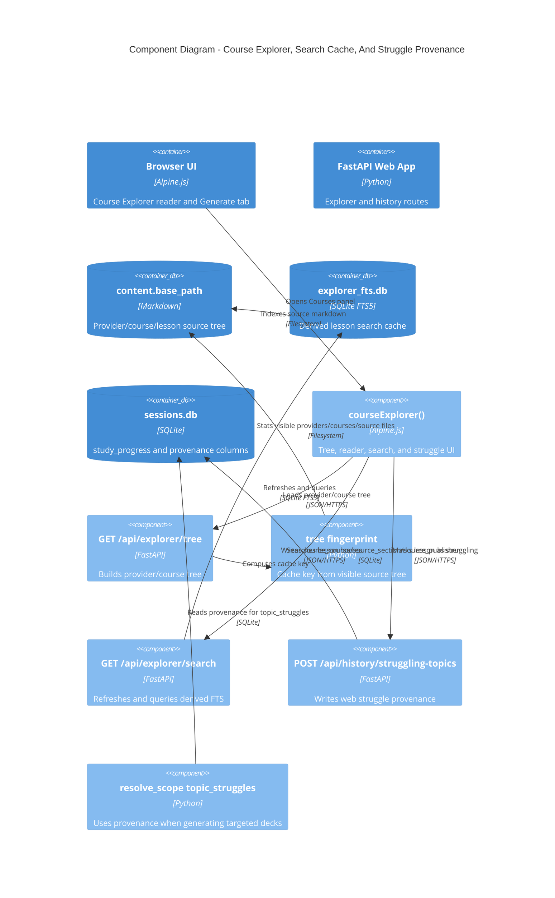

The dynamic flow below shows the browser component and route-level work in more
detail.

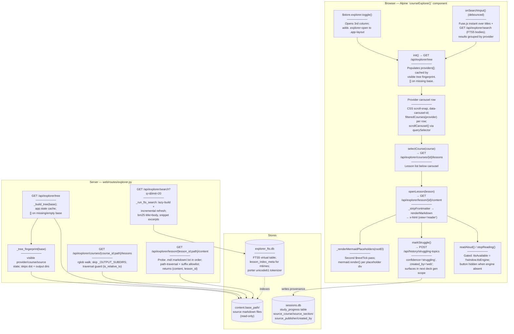

**Key invariants**:

- **Read-only over content.** The explorer API never writes to `content.base_path`. Every content endpoint resolves paths with `is_relative_to(base)` and restricts suffixes to `.md`, `.markdown`, `.txt`.
- **Tree cache is keyed by visible source state.** `GET /api/explorer/tree` stores the provider/course tree on `app.state` behind `_tree_fingerprint(base)`, which walks visible providers, courses, and source files while skipping dot directories and generated output directories. Adding/deleting nested courses refreshes the tree; writing generated decks does not.
- **FTS index is a derived cache.** `explorer_fts.db` lives in `<session_db_dir>/` alongside `sessions.db` but is never opened by the session migration system. It can be deleted and will be rebuilt on the next search call. No schema migration is required.
- **TTS is gated by feature detection.** `ttsAvailable = !!window.ttsEngine`. The "▶ Listen" button is `x-show="ttsAvailable && activeLesson"` — hidden entirely when the `browser-neural-tts` worktree is not merged.
- **Struggle write reuses the existing pipeline.** `POST /api/history/struggling-topics` calls the same `record_progress()` / `get_struggling_topics()` helpers used by the agent session path and writes `source_course`, `source_section`, `source_publisher`, and `created_by='web'`. The Generate panel's "Topic I'm struggling on" scope sees the web-flagged rows with no extra plumbing and can resolve back to the lesson provenance instead of only a generic topic name.

### Component → file map (Course Explorer)

| Component | File | Notes |
|---|---|---|
| `courseExplorer()` Alpine factory | `packages/studyloop/src/studyloop/web/static/components.js` | ~line 932; owns all panel state |
| `renderMarkdown()` | `components.js` | ~line 44; top-level shared fn; marked → DOMPurify → hljs |
| `_stripFrontmatter()` | `components.js` | ~line 107; strips YAML front matter before render |
| `_renderMermaidPlaceholders()` | `components.js` | ~line 171; second-pass mermaid.render() after `$nextTick` |
| `_mdToPlainText()` | `components.js` | ~line 129; strips markdown to plain text for TTS |
| `<aside class="course-explorer-panel">` | `packages/studyloop/src/studyloop/web/static/index.html` | ~line 248; browser + reader views |
| Courses sidebar button + `$store.explorer` | `index.html` | ~line 225 (button), ~line 1686 (store) |
| Mermaid + Fuse.js `<script>` tags | `index.html` | ~line 39 (mermaid), ~line 48 (fuse) |
| `.course-explorer-panel`, `.explorer-*` CSS | `packages/studyloop/src/studyloop/web/static/style.css` | `.app-layout` 3rd column; 0px closed, 320px `.explorer-open`; hidden ≤600px |
| Explorer API router | `packages/studyloop/src/studyloop/web/routes/explorer.py` | all four endpoints; `_tree_fingerprint`; `_fts_lock` for single-writer FTS |
| Migration v22 | `packages/agent-session-tools/src/agent_session_tools/migrations.py` | ~line 736; adds `source_course`, `source_section`, `source_publisher`, `created_by` to `study_progress` |
| `record_progress()` (provenance args) | `packages/studyloop/src/studyloop/history/progress.py` | keyword-only provenance args; back-compat |
| `POST /api/history/struggling-topics` | `packages/studyloop/src/studyloop/web/routes/history.py` | ~line 82; `StruggleRequest` body |
| Vendored mermaid v11.4.1 | `web/static/vendor/js/mermaid-11.4.1.min.js` | `globalThis.mermaid` assignment; `startOnLoad:false` |
| Vendored Fuse.js v7.0.0 | `web/static/vendor/js/fuse-7.0.0.min.js` | `window.Fuse` UMD global |

---

## What's NOT in this diagram

- **The Pomodoro overlay**, OpenDyslexic toggle — orthogonal UI concerns, not part of the session pipeline. (Voice output is now documented in its own C4 L3 component section above.)
- **The Generate panel implementation details beyond the C4 slice above** — provider-specific prompt tuning and deck-quality judging are documented in [Content Pipeline](../content-pipeline.md).
- **MCP servers** — see [MCP](../mcp.md). Currently only the Kiro adapter exposes any MCP integration.
- **Legacy tmux + ttyd** — kept as fallback; documented in [Web UI Guide § Terminal Fallback (ttyd)](../web-ui-guide.md#terminal-fallback-ttyd). Will be retired once ACP + PTY web sessions cover all agents.
