# Current Architecture

> Last updated: 2026-08-23. Reflects the ACP chat-UI feature, Settings → LLM Providers panel, scalable review list, opt-in Obsidian session-memory export, server-side Kokoro TTS (replacing the removed in-browser neural engine), Course Explorer side panel, generation-control honesty (`count_per_source` through `GenerationTask.count`), Explorer tree fingerprint caching, DB/FTS integrity coverage, route-stubbed browser smoke coverage, and the active-learning loop (`studyloop now`, `chat-note`, `practice verify`, `recap today`, `mastery`, `/api/now`, adaptive interleaving).

This document describes the system as it works today, using the [C4 model](https://c4model.com/) at three levels of zoom: Context → Container → Component (focused on the ACP chat, Generate, and Review surfaces).

For the planned direction, see [Target Architecture](target.md).

---

## C4 Level 1 — System Context

StudyLoop is single-user and runs primarily on one host. External systems are
the AI agent CLIs (Kiro, Claude Code, Gemini, Codex, OpenCode), optional
generation providers, and an optional local Kokoro TTS server.

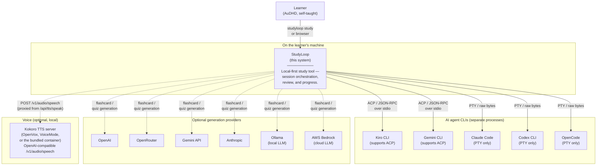

**Trust boundaries** — the learner controls a single-user local StudyLoop
process, but optional providers can create outbound calls. The outbound surfaces
are (a) the agent CLI's own model calls (the agent owns those creds and policy),
(b) optional content generation via OpenAI, OpenRouter, Gemini, Anthropic, AWS
Bedrock, or Ollama on a configured local/remote endpoint, and (c) speech
synthesis, which StudyLoop proxies from its own authenticated `/api/tts/speak`
to whatever `tts.openvox_base_url` names — normally a Kokoro server on loopback,
so review text does not leave the host. StudyLoop does not phone home.

One caveat worth stating where an operator will see it: if the configured server
is VoiceMode's Kokoro, that server itself listens on `0.0.0.0` with no
authentication and was confirmed reachable from another device on the LAN. That
is the server's behaviour, not StudyLoop's — StudyLoop never needs the port
reachable from anywhere but the host. See
[Voice Output](../voice-output.md#kokoro-server-backends).

---

## C4 Level 2 — Containers

Inside the StudyLoop boundary the work is split across several long-running processes plus the agent subprocess.

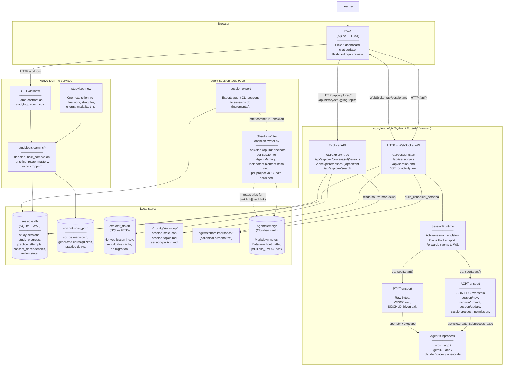

**Key invariants today**:

- **One active session at a time.** `SessionRuntime` is a singleton acquired under `asyncio.Lock`. `/api/session/start` returns 409 if a session is already live.
- **Transport selection is explicit per session.** Body field `transport: "pty" | "ttyd" | "acp"`. The env var `STUDYLOOP_TRANSPORT` can force `pty`/`ttyd` as an operator kill-switch (ACP is body-only).
- **Persona text never reaches the wire on the PTY path** — it's written to a temp file, the agent's launch command embeds the path, and the agent reads it at startup.
- **Persona text DOES travel on the wire on the ACP path** — added 2026-05-28 in commit `bfe9210`. `/api/session/start` returns `persona_text` inline in the JSON body; the browser ships it as the first invisible `session/prompt` after WS open. Hidden client-side: not pushed to `acpMessages`.
- **The PWA owns chat-surface state.** The server never sends server-rendered HTML for chat bubbles — only raw ACP events. Markdown rendering, sanitisation, syntax highlighting, theme palette: all in the browser.

---

## C4 Level 3 — Component (zoomed into the active-learning loop)

This slice turns source notes, review state, and session evidence into one
recommended learning action, then records whether the learner retrieved,
explained, applied, or verified the concept.

```mermaid
flowchart TB
    subgraph Surfaces["CLI and Web Surfaces"]
      NowCLI["studyloop now<br/>--energy --time --modality<br/>--interleave --json --speak"]
      NowAPI["GET /api/now<br/>same JSON contract"]
      ChatNote["studyloop chat-note<br/>markdown/text note → Socratic prompt"]
      WebDiscuss["Course Explorer Discuss<br/>browser note companion"]
      PracticeCLI["studyloop practice verify<br/>checklist/rubric/command attempt"]
      RecapCLI["studyloop recap today<br/>win, repair, due, next action<br/>optional audio file"]
      MasteryCLI["studyloop mastery<br/>graph + weak-links"]
      MasteryWeb["Web Mastery tab<br/>bounded Mermaid graph + weak-link cards"]
      ReviewCLI["studyloop review<br/>--interleave adaptive"]
    end

    subgraph Services["studyloop.learning package"]
      Decision["decision.py<br/>candidate collection + scoring"]
      NoteCompanion["note_companion.py<br/>path guard + heading/code chunks"]
      Practice["practice.py<br/>verification + attempt recording"]
      Recap["recap.py<br/>daily synthesis"]
      Mastery["mastery.py<br/>edge seeding + Mermaid graph"]
      Voice["voice.py<br/>study-speak wrapper + audio export"]
    end

    subgraph BrowserLocal["Browser-local helpers"]
      DiscussPrompt["components.js note companion<br/>mode switch, next nudge,<br/>clipboard evidence command"]
    end

    subgraph Stores["Local Stores"]
      SessionDB[("sessions.db<br/>study_progress<br/>practice_attempts<br/>concept_dependencies")]
      Content[("content.base_path<br/>practice decks + source markdown")]
      Vault[("Obsidian / study paths<br/>markdown notes")]
      LoadedLesson["Loaded lesson text<br/>(browser memory)"]
    end

    NowCLI --> Decision
    NowAPI --> Decision
    ChatNote --> NoteCompanion
    WebDiscuss --> DiscussPrompt
    PracticeCLI --> Practice
    RecapCLI --> Recap
    MasteryCLI --> Mastery
    MasteryWeb --> Mastery
    ReviewCLI --> Decision
    RecapCLI --> Voice
    NowCLI --> Voice
    ChatNote --> Voice

    Decision -->|"reads"| SessionDB
    Decision -->|"reads"| Content
    NoteCompanion -->|"reads"| Vault
    DiscussPrompt --> LoadedLesson
    Practice -->|"reads deck"| Content
    Practice -->|"writes attempts + progress"| SessionDB
    Recap -->|"reads"| SessionDB
    Mastery -->|"reads/writes edges"| SessionDB
    Mastery -->|"seeds from notes"| Content
```

### Dynamic Flow — Final Active-Learning Refinements

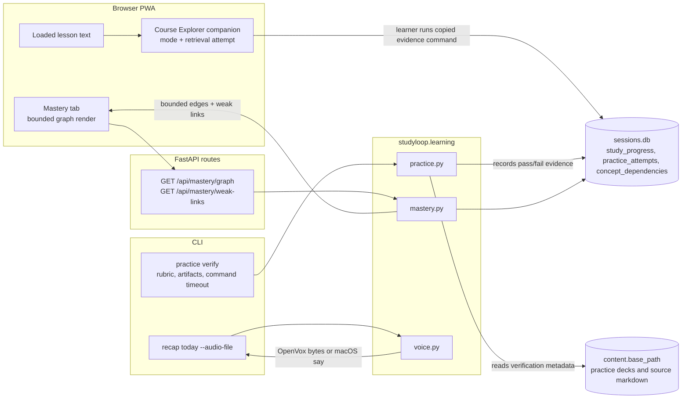

**Key invariants**:

- **One primary recommendation.** `studyloop now` and `/api/now` return one
  primary recommendation plus up to two alternates. This is an executive
  function affordance, not a content browser.
- **Conversation starts as a context pack.** `chat-note` validates an explicit
  note path inside configured study/vault roots, chunks headings and code
  blocks, and prints or speaks a mentor prompt. Web Discuss keeps a browser-local
  guided retrieval/nudge loop in the Course Explorer; it still does not host an
  independent chat backend.
- **Command verification is opt-in.** Practice tasks can carry a verification
  command, but it only runs when `--run-command` is passed. Checklist/rubric
  tasks record notes and expected-artifact status without shell execution.
- **Evidence writes back into scheduling.** Passing practice attempts record
  `confident` progress; failing attempts record `struggling` progress.
  Teach-back/progress records and weak links feed the next `studyloop now`
  decision.
- **Voice is optional.** `--speak` surfaces shell out through `study-speak`.
  `--audio-file` writes a recap file through the Kokoro server or macOS `say`.
  The Web app reads cards through the same server, proxied by
  `/api/tts/speak`.
- **Web graph rendering is bounded.** CLI mastery commands can print the full
  graph, while `/api/mastery/graph` and `/api/mastery/weak-links` accept
  `limit` parameters so the Web tab stays responsive on broad topics. The Web
  tab builds Mermaid from the bounded JSON graph locally rather than issuing a
  second graph request.

### Component → file map (active-learning loop)

| Component | File | Notes |
|---|---|---|
| Decision engine | `packages/studyloop/src/studyloop/learning/decision.py` | candidate sources, scoring, interleaving ratios, JSON contract |
| `studyloop now` | `packages/studyloop/src/studyloop/cli/_now.py` | rich/JSON/speak output |
| `/api/now` | `packages/studyloop/src/studyloop/web/routes/now.py` | web API using the same decision contract |
| Note companion | `packages/studyloop/src/studyloop/learning/note_companion.py` + `cli/_chat_note.py` | safe note loading, prompt packing, `--mode` variants |
| Web Discuss | `packages/studyloop/src/studyloop/web/static/components.js`, `index.html`, `style.css` | in-panel note companion, mode switching, prompt/evidence copy |
| Practice verification | `packages/studyloop/src/studyloop/learning/practice.py` + `cli/_practice.py` | attempt recording, metadata surfacing, progress updates |
| Daily recap | `packages/studyloop/src/studyloop/learning/recap.py` + `cli/_recap.py` | one win, repair target, due item, next action, optional audio file |
| Mastery graph | `packages/studyloop/src/studyloop/learning/mastery.py` + `cli/_mastery.py` + `web/routes/mastery.py` | dependency seeding, Mermaid output, weak links, bounded Web UI API |
| Voice doctor | `packages/studyloop/src/studyloop/doctor/voice.py` | local Kokoro files, `afplay`, Kokoro-server reachability |
| DB migration v24 | `packages/agent-session-tools/src/agent_session_tools/migrations.py` | `practice_attempts`, `concept_dependencies` |

---

## C4 Level 3 — Component (zoomed into the ACP chat surface)

This is the part of the system that the dogfood hotfix touched. It has two halves — the server-side dispatcher and the browser-side Alpine component — connected by the WebSocket frame contract.

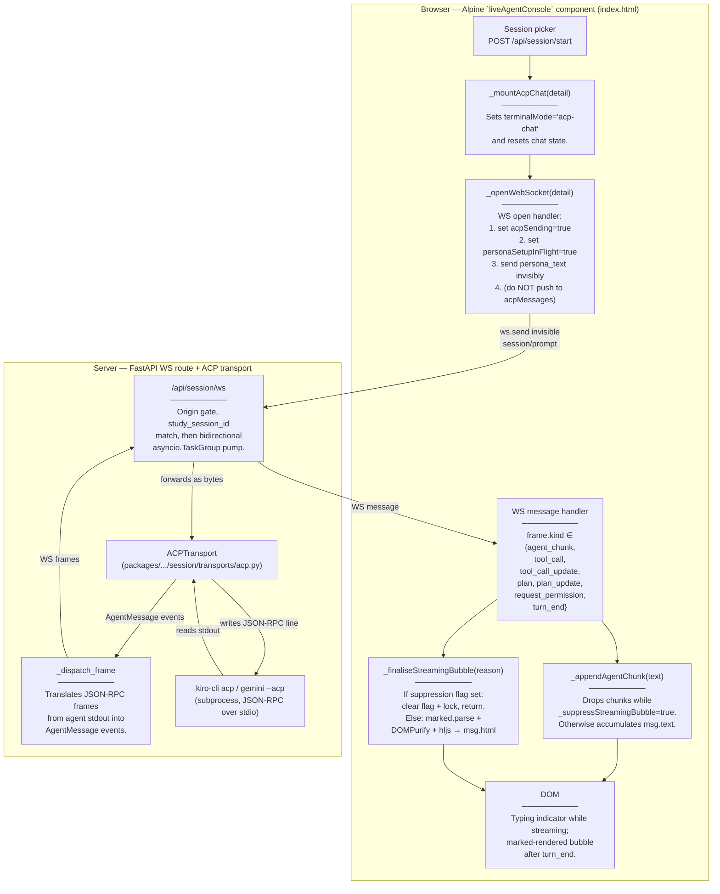

**Persona-injection turn (the part the hotfix wired up)**:

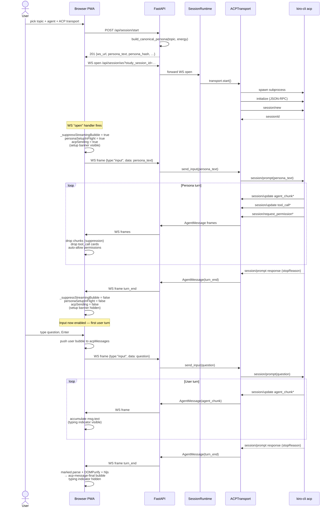

**Why suppression exists**: the persona instructs the agent to read IPC files (`session-state.json`, `session-topics.md`, `session-parking.md`) for context. On a fresh session those reads happen as bash tool calls (Kiro auto-approves them today, but the protocol ALSO supports `request_permission`). Without suppression the user would see `▼ ? completed`/`▼ ? failed` cards before they had a chance to type — confusing UX. The fix:

- `agent_chunk` text: dropped (no ack scrolls past).
- `tool_call`, `tool_call_update`: dropped (no cards rendered).
- `plan`, `plan_update`: dropped (no plan tree rendered).
- `request_permission`: auto-allowed with `allow_once`-equivalent (no permission prompt shown to user).

All four are gated on a single non-reactive flag `this._suppressStreamingBubble`, set true on WS-open persona send, cleared on the persona-turn `turn_end`.

---

## Component → file map (for the chat surface)

| Component | File | Notable lines |
|---|---|---|
| Picker / `study-session-start` event | `packages/studyloop/src/studyloop/web/static/index.html` | ~1138 |
| `_mountAcpChat` | `index.html` | ~1585 |
| `_openWebSocket` (incl. invisible-persona send) | `index.html` | ~1601 |
| WS message dispatcher (frame.kind switch) | `index.html` | ~1670 |
| `_appendAgentChunk` (suppression on streaming) | `index.html` | ~1752 |
| `_finaliseStreamingBubble` (suppression on turn_end) | `index.html` | ~1775 |
| `_renderMarkdown` (marked → DOMPurify → hljs) | `index.html` | ~1787 |
| Setup banner DOM | `index.html` | ~828 |
| Typing indicator + final bubble DOM | `index.html` | ~836 |
| Theme palettes (CSS vars) | `packages/studyloop/src/studyloop/web/static/style.css` | end of file |
| Settings store (palette, dyslexic, light) | `packages/studyloop/src/studyloop/web/static/components.js` | ~43 |
| `/api/session/start` (ACP path) | `packages/studyloop/src/studyloop/web/routes/session.py` | ~687 |
| Persona injection backend | `packages/studyloop/src/studyloop/web/routes/session.py` | ~783 |
| ACPTransport `_dispatch_frame` | `packages/studyloop/src/studyloop/session/transports/acp.py` | — |
| Live Kiro Playwright test (regression fence) | `packages/studyloop/tests/test_web_acp_dogfood_kiro.py` | full file |
| Stub-driven chat-UI e2e | `packages/studyloop/tests/test_web_acp_chat_ui.py` | full file |

---

## Component → file map (for the Obsidian session-memory export)

The export path is a CLI feature in `agent-session-tools`, independent of the web
surface. It runs after `session-export` commits to `sessions.db`, only when
`--obsidian` is passed (or `obsidian.export_enabled: true` in config).

| Component | File | Notes |
|---|---|---|
| `write_vault_notes` / `write_session_to_vault` / `write_moc` / `build_topic_index` | `packages/agent-session-tools/src/agent_session_tools/obsidian_writer.py` | core writer; idempotent, path-traversal hardened |
| `--obsidian*` flags + post-commit hook | `packages/agent-session-tools/src/agent_session_tools/export_sessions.py` | `_run_export`: touched-ID diff (incremental) vs all (`--obsidian-backfill`) |
| `get_obsidian_config` + `obsidian` defaults | `packages/agent-session-tools/src/agent_session_tools/config_loader.py` | reads `obsidian:` section from shared `config.yaml` |
| `ObsidianConfig` dataclass + `Settings.obsidian` | `packages/studyloop/src/studyloop/settings.py` | studyloop-side view of the same section; `vault_path` defaults to `obsidian_base` |
| Install prompt (Step 4) | `packages/studyloop/src/studyloop/cli/_setup.py` | `studyloop setup` offers to enable export |
| `check_obsidian_vault` (+.obsidian/ marker) + `check_obsidian_export` | `packages/studyloop/src/studyloop/doctor/config.py` | `studyloop doctor` health checks |
| Writer tests | `packages/agent-session-tools/tests/test_obsidian_writer.py` | 54 tests incl. idempotency, backfill-vs-incremental, traversal |

---

## C4 Level 3 — Component (zoomed into the Generate panel)

Sister surface to the chat surface. The Generate panel reuses the existing `content/generators/` package as its producer; the new layer is the orchestrator + the active-generation singleton + the REST + WS endpoints + the sidebar UI. **All shipped on `main` as of 2026-05-29** — backend, HTTP surface, and browser side.

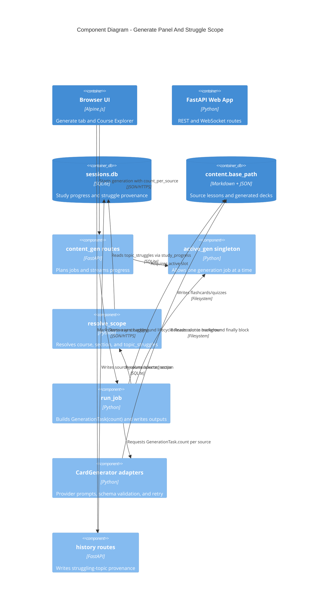

The dynamic flow below shows the same job from the user's click through REST,
background execution, provider prompt generation, and WebSocket progress frames.

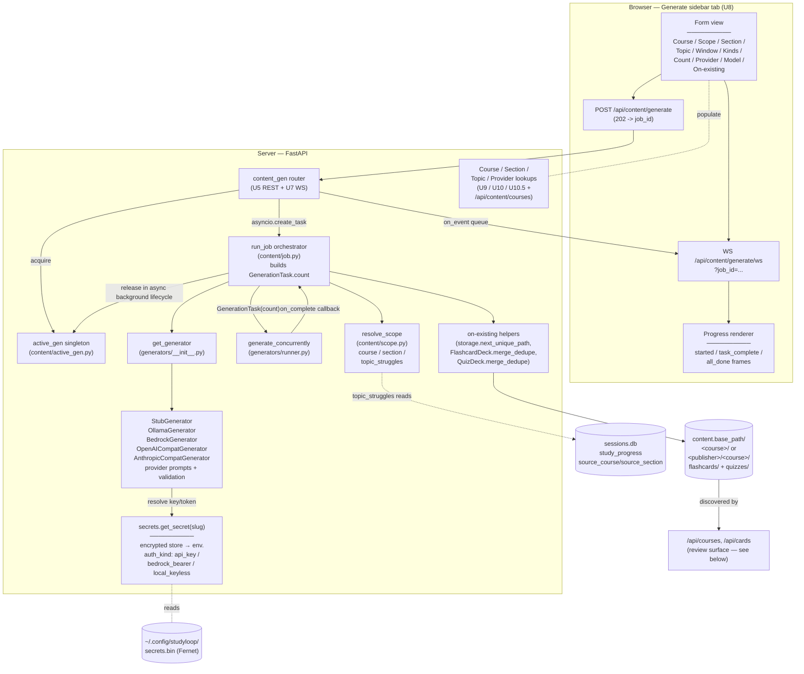

**Job lifecycle (one click of Generate)**:

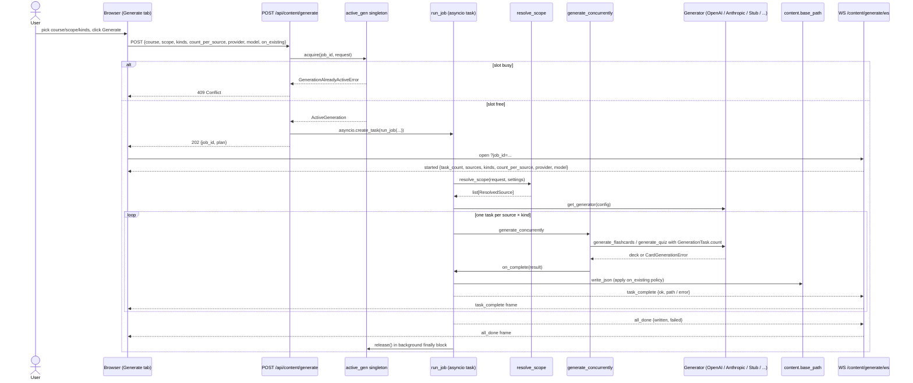

**Why a singleton + queue, not direct streaming**: a single Ollama process (or a rate-limited cloud token budget) doesn't tolerate two concurrent jobs. The singleton is the simplest possible coordinator -- one process, one heavy LLM job at a time. The per-job WS queue lets clients reconnect / resubscribe without losing events that fire during the gap.

---

## Component → file map (for the generation surface)

| Component | File | Notable lines |
|---|---|---|
| Active-generation singleton | `packages/studyloop/src/studyloop/content/active_gen.py` | full file |
| Job orchestrator (`run_job`) | `packages/studyloop/src/studyloop/content/job.py` | full file |
| Scope resolver (`resolve_scope`) | `packages/studyloop/src/studyloop/content/scope.py` | full file |
| Generator factory + Protocol | `packages/studyloop/src/studyloop/content/generators/__init__.py` | full file |
| Provider profile registry | `packages/studyloop/src/studyloop/content/generators/provider_profiles.py` | full file |
| Stub generator | `packages/studyloop/src/studyloop/content/generators/stub.py` | full file |
| OpenAI Chat Completions adapter | `packages/studyloop/src/studyloop/content/generators/openai_compat.py` | full file |
| Anthropic Messages adapter | `packages/studyloop/src/studyloop/content/generators/anthropic_compat.py` | full file |
| Shared retry-with-correction helper | `packages/studyloop/src/studyloop/content/generators/_retry.py` | full file |
| On-existing helpers (merge / unique-path) | `packages/studyloop/src/studyloop/content/{schemas,storage}.py` | `merge_dedupe`, `next_unique_path` |
| `.env` autoload | `packages/studyloop/src/studyloop/__init__.py` | full file |
| Encrypted secret store + auth-kind taxonomy | `packages/studyloop/src/studyloop/secrets.py` | `get_secret`, `set_secret`, `get_auth_kind` |
| Provider auth tests (Bedrock bearer / Ollama) | `packages/studyloop/src/studyloop/provider_auth.py` | full file |
| `live_provider` pytest marker | `packages/studyloop/pyproject.toml` | `[tool.pytest.ini_options]` |
| Live MVD smoke (parametrised over registry) | `packages/studyloop/tests/test_live_provider_smoke.py` | full file |
| MVD source fixture (photosynthesis) | `packages/studyloop/tests/fixtures/mvd_source.md` | full file |

---

## C4 Level 3 — Component (Review surface + Settings → LLM Providers)

The third browser surface: the **Flashcards/Quizzes review list** (where generated
decks are consumed) and the **Settings → LLM Providers** admin panel (where
generation credentials are managed). Both shipped on `main` 2026-06-01.

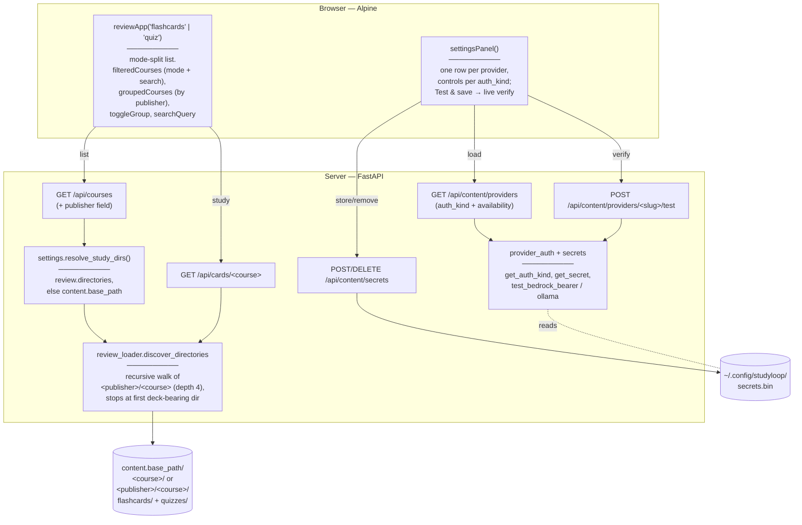

**Key points:**

- **Mode split** lives entirely in the shared `reviewApp` component: each panel is
  instantiated with its `mode` (`'flashcards'` or `'quiz'`), and `filteredCourses`
  gates the list on the matching count before the search filter. The Flashcards
  panel shows only flashcard decks (single Flashcards action); Quizzes mirrors.
- **Scaling** is `groupedCourses` (group `filteredCourses` by the API's new
  `publisher` field) + collapsible group headers + a name search box + compact
  one-line rows.
- **Write root ≠ read root.** CLI generation writes under
  `content.base_path/<course>/{flashcards,quizzes}/`; web generation writes under
  `content.base_path/<publisher>/<course>/{flashcards,quizzes}/` when a publisher
  is supplied. The reviewer reads via `resolve_study_dirs()`, which falls back to
  `content.base_path` when `review.directories` is unset, and
  `discover_directories` walks both layouts. (Before this, an unset
  `review.directories` silently left the panels empty.)
- **`name` is the identity key** for `/api/cards`, `openConfig`, and the SM-2
  review DB. `publisher` is display/grouping only — never keyed on.
- **Settings stores credentials only after a live verification** (auth call for
  api_key, AWS-cred check for Bedrock, real generation for Ollama), encrypted in
  `secrets.bin`. The same store backs the Generate panel's provider availability.

### Component → file map (Review + Settings)

| Component | File | Notable |
|---|---|---|
| Review list + mode-split + grouping/search | `web/static/index.html` (courses views) + `web/static/components.js` | `reviewApp`, `filteredCourses`, `groupedCourses`, `toggleGroup` |
| Settings panel | `web/static/index.html` (`settingsPanel()` block) + `components.js` | per-`auth_kind` rows |
| Course list + publisher field | `packages/studyloop/src/studyloop/services/review.py` | `list_course_summaries` |
| Read-root resolver | `packages/studyloop/src/studyloop/settings.py` | `resolve_study_dirs` |
| Recursive deck discovery | `packages/studyloop/src/studyloop/review_loader.py` | `discover_directories` |
| Course / cards routes | `packages/studyloop/src/studyloop/web/routes/courses.py`, `cards.py` | — |
| Providers / test / secrets routes | `packages/studyloop/src/studyloop/web/routes/content_gen.py` | `list_providers`, `/providers/{slug}/test`, `/secrets` |
| Scale + settings e2e | `tests/test_web_course_list_scale_e2e.py`, `tests/test_web_settings_panel_e2e.py` | geometry + behaviour |

---

## C4 Level 3 — Component (zoomed into server-side TTS)

Voice output is a **proxy**, not a synthesiser. The page asks StudyLoop's own FastAPI app for audio; the app forwards the request to a Kokoro server and returns the bytes. The browser's only job is playback, which is what makes voice work on a tablet.

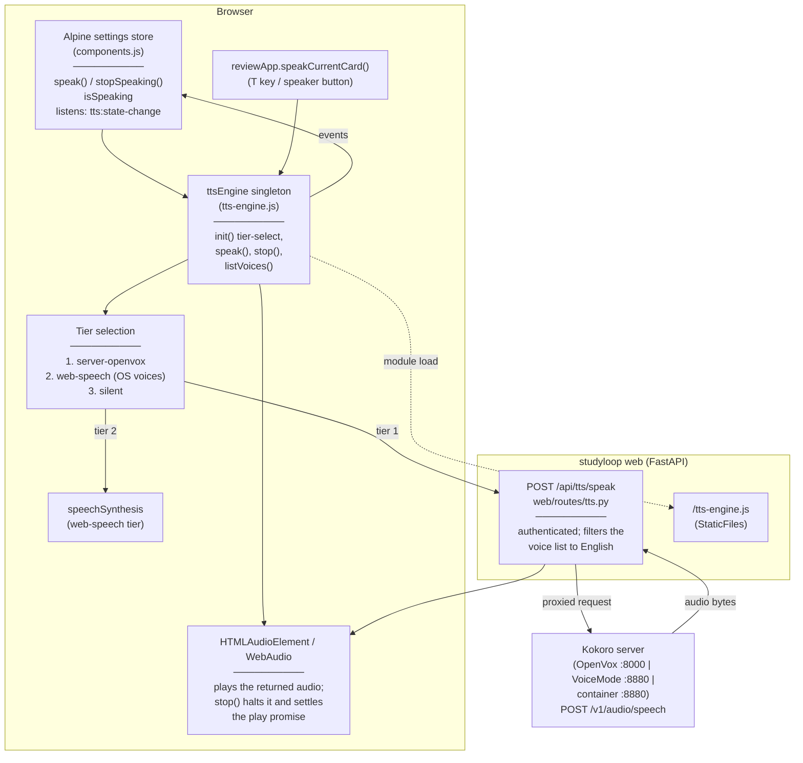

**Key invariants**:

- **The server tier is the best tier, not a degraded one.** `server-openvox` sits at the top of the ladder. Only `web-speech` and `silent` below it are fallbacks.
- **The browser never talks to the TTS server directly.** Everything goes through `/api/tts/speak`, which carries StudyLoop's own authentication. A LAN tablet therefore needs no route to the Kokoro port, which is why binding that port to loopback costs nothing.
- **Any OpenAI-compatible Kokoro server works.** Three were verified with a byte-identical request and the same voice ids: OpenVox (:8000, 2.4–2.5 s warm per sentence), VoiceMode (:8880, 0.37–1.8 s), and the bundled container. `/v1/models` is the only portable health path — the voice-listing URL differs between implementations.
- **The voice list is filtered to English on purpose.** One server offered 67 voices and 41 were kept. The same model speaks Mandarin, Japanese, Spanish, French, Hindi, Italian and Portuguese, and a stray voice id is a *valid request that speaks that language* rather than an error, so an unfiltered list is a silent foot-gun.
- **No model weights, no vendored runtime, no COOP/COEP question.** The in-browser tier (Kokoro-82M via transformers.js on WebGPU/WASM, the vendored ONNX Runtime, the phonemiser, ~27 MB of LFS-tracked runtime) was removed. It measured 6.6x real time on a warmed WebGPU tier, self-downgraded to silence, once spoke Mandarin unprompted, and — decisively — could not run at all over `studyloop web --lan`, because plain HTTP is not a secure context so the browser hides both `navigator.gpu` and Cache Storage. Design notes are kept at `docs/archive/browser-neural-tts-design.md`.
- **`stop()` is unified across tiers.** It halts server-audio playback and settles the in-flight playback promise; the web-speech tier delegates to `speechSynthesis.cancel()`.
- **Voice adds no browser-to-internet egress.** Synthesis is a call from the Python server to a host you configured, normally on loopback. Optional content providers remain the only outbound surface for generation.

### Component → file map (for the TTS surface)

| Component | File | Notable lines |
|---|---|---|
| TTS proxy route + English voice filter | `packages/studyloop/src/studyloop/web/routes/tts.py` | `POST /tts/speak` |
| TTS engine (singleton, tiers, speak/stop) | `packages/studyloop/src/studyloop/web/static/tts-engine.js` | full file |
| Settings store TTS wiring (speak / stopSpeaking / isSpeaking) | `packages/studyloop/src/studyloop/web/static/components.js` | ~44–200 |
| `reviewApp.speakCurrentCard()` | `components.js` | ~590 |
| Module load + stop button + voice selector | `index.html` | header controls |
| Server config (`openvox_*`, `STUDYLOOP_TTS_*`) | `~/.config/studyloop/config.yaml` | `tts:` block |
| Bundled Kokoro container | `docker/kokoro/docker-compose.yml` | full file |
| TTS contract + stop-control tests | `packages/studyloop/tests/test_web_tts.py` | full file |

---

## C4 Level 3 — Component (zoomed into the Course Explorer)

The Course Explorer is a study-material browser embedded as a third layout
column. It shares no reactive state with the session, review, or generate
panels. Server-side content access is read-only except for the explicit
struggle flag via `POST /api/history/struggling-topics`; the **Discuss** action
opens a browser-local note companion from the already-loaded lesson. The
companion can copy prompts and evidence commands to the clipboard, but it does
not call a backend chat endpoint.

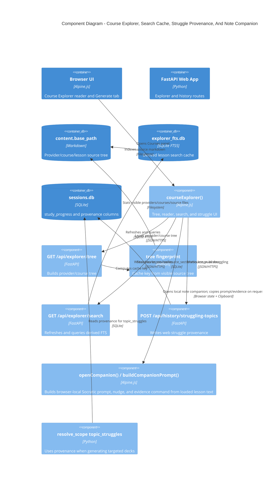

The dynamic flow below shows the browser component and route-level work in more
detail.

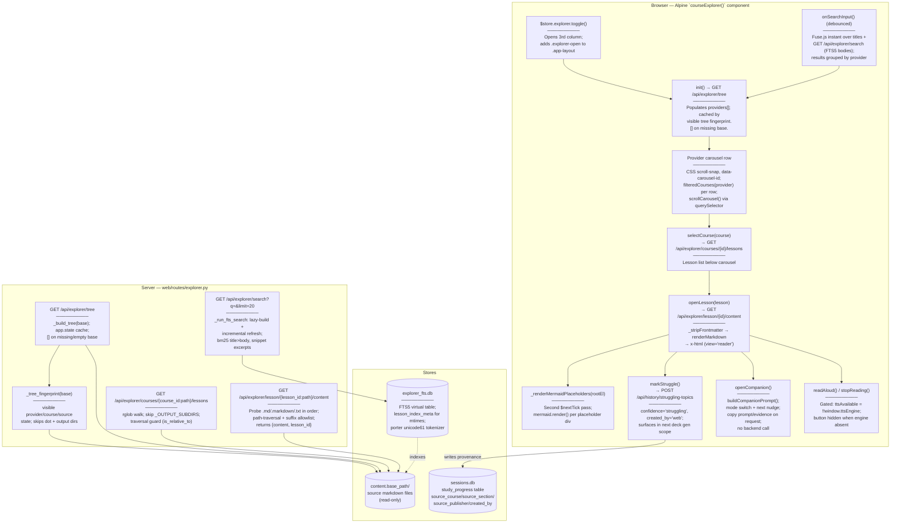

**Key invariants**:

- **Read-only over content.** The explorer API never writes to `content.base_path`. Every content endpoint resolves paths with `is_relative_to(base)` and restricts suffixes to `.md`, `.markdown`, `.txt`.
- **Discuss is browser-local in V1.** `openCompanion()` builds a guided note
  companion in the browser from `readerText` that was already fetched for
  display. `buildCompanionPrompt()` and `buildCompanionFollowup()` provide the
  prompt, mode-specific nudge, and evidence command. Clipboard writes only
  happen when the learner chooses a copy action, and the flow never calls a
  backend chat endpoint or mutates `sessions.db`.
- **Tree cache is keyed by visible source state.** `GET /api/explorer/tree` stores the provider/course tree on `app.state` behind `_tree_fingerprint(base)`, which walks visible providers, courses, and source files while skipping dot directories and generated output directories. Adding/deleting nested courses refreshes the tree; writing generated decks does not.
- **FTS index is a derived cache.** `explorer_fts.db` lives in `<session_db_dir>/` alongside `sessions.db` but is never opened by the session migration system. It can be deleted and will be rebuilt on the next search call. No schema migration is required.
- **TTS is gated by feature detection.** `ttsAvailable = !!window.ttsEngine`. The "▶ Listen" button is `x-show="ttsAvailable && activeLesson"`, so it hides if the engine module fails to load. The engine itself is always shipped; speech reaches a Kokoro server through `/api/tts/speak`, and falls back to the OS voices when no server is reachable.
- **Struggle write reuses the existing pipeline.** `POST /api/history/struggling-topics` calls the same `record_progress()` / `get_struggling_topics()` helpers used by the agent session path and writes `source_course`, `source_section`, `source_publisher`, and `created_by='web'`. The Generate panel's "Topic I'm struggling on" scope sees the web-flagged rows with no extra plumbing and can resolve back to the lesson provenance instead of only a generic topic name.

### Component → file map (Course Explorer)

| Component | File | Notes |
|---|---|---|
| `courseExplorer()` Alpine factory | `packages/studyloop/src/studyloop/web/static/components.js` | ~line 932; owns all panel state |
| `renderMarkdown()` | `components.js` | ~line 44; top-level shared fn; marked → DOMPurify → hljs |
| `_stripFrontmatter()` | `components.js` | ~line 107; strips YAML front matter before render |
| `_renderMermaidPlaceholders()` | `components.js` | ~line 171; second-pass mermaid.render() after `$nextTick` |
| `_mdToPlainText()` | `components.js` | ~line 129; strips markdown to plain text for TTS |
| `openCompanion()` / `buildCompanionPrompt()` / `buildCompanionFollowup()` | `components.js` | opens the in-panel Socratic companion, builds mode-specific prompts and next nudges, and exposes copy actions |
| `<aside class="course-explorer-panel">` | `packages/studyloop/src/studyloop/web/static/index.html` | ~line 248; browser + reader views |
| Courses sidebar button + `$store.explorer` | `index.html` | ~line 225 (button), ~line 1686 (store) |
| Mermaid + Fuse.js `<script>` tags | `index.html` | ~line 39 (mermaid), ~line 48 (fuse) |
| `.course-explorer-panel`, `.explorer-*` CSS | `packages/studyloop/src/studyloop/web/static/style.css` | `.app-layout` 3rd column; 0px closed, 320px `.explorer-open`; hidden ≤600px |
| Explorer API router | `packages/studyloop/src/studyloop/web/routes/explorer.py` | all four endpoints; `_tree_fingerprint`; `_fts_lock` for single-writer FTS |
| Migration v22 | `packages/agent-session-tools/src/agent_session_tools/migrations.py` | ~line 736; adds `source_course`, `source_section`, `source_publisher`, `created_by` to `study_progress` |
| `record_progress()` (provenance args) | `packages/studyloop/src/studyloop/history/progress.py` | keyword-only provenance args; back-compat |
| `POST /api/history/struggling-topics` | `packages/studyloop/src/studyloop/web/routes/history.py` | ~line 82; `StruggleRequest` body |
| Vendored mermaid v11.4.1 | `web/static/vendor/js/mermaid-11.4.1.min.js` | `globalThis.mermaid` assignment; `startOnLoad:false` |
| Vendored Fuse.js v7.0.0 | `web/static/vendor/js/fuse-7.0.0.min.js` | `window.Fuse` UMD global |

---

## What's NOT in this diagram

- **The Pomodoro overlay**, OpenDyslexic toggle — orthogonal UI concerns, not part of the session pipeline. (Voice output is now documented in its own C4 L3 component section above.)
- **The Generate panel implementation details beyond the C4 slice above** — provider-specific prompt tuning and deck-quality judging are documented in [Content Pipeline](../content-pipeline.md).
- **MCP servers** — see [MCP](../mcp.md). Currently only the Kiro adapter exposes any MCP integration.
- **Legacy tmux + ttyd** — the ttyd browser surface is **retired** ([ADR-0005](../adr/0005-retire-ttyd-browser-surface.md)); the web session surfaces are xterm.js over a PTY WebSocket and the ACP chat surface. Background in [Web UI Guide § The retired ttyd iframe](../web-ui-guide.md#the-retired-ttyd-iframe). `tmux` itself remains the terminal session host for `studyloop study`.
