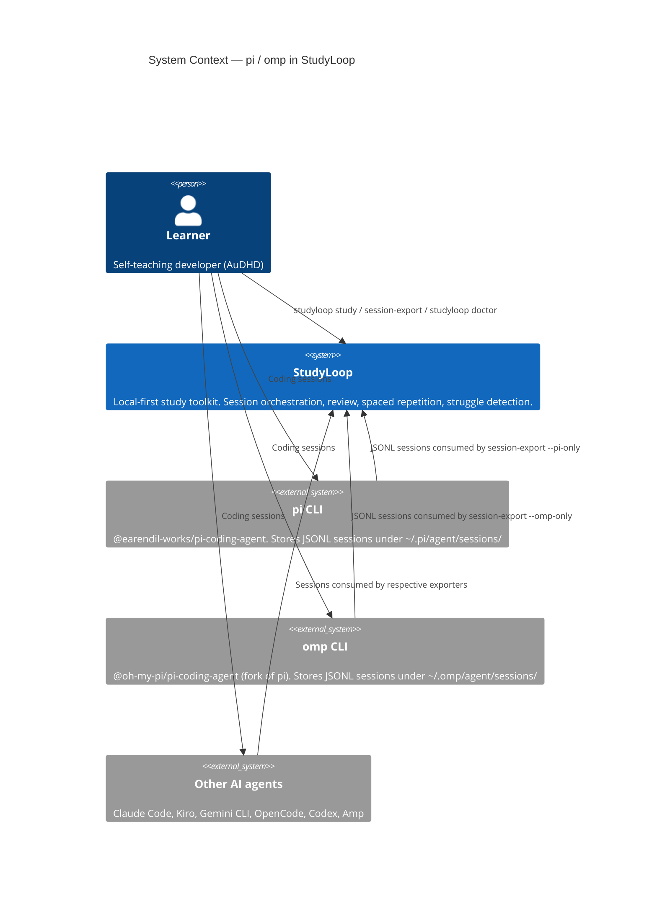
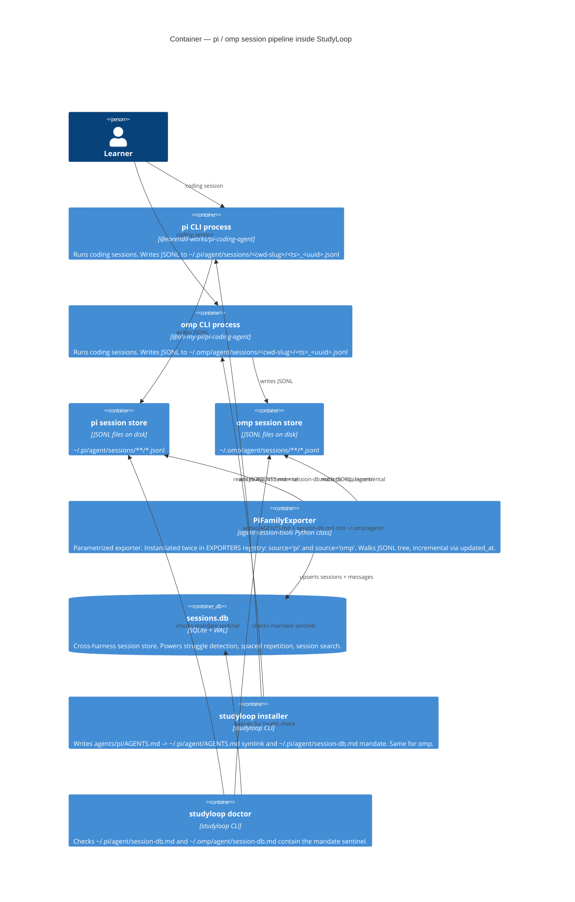
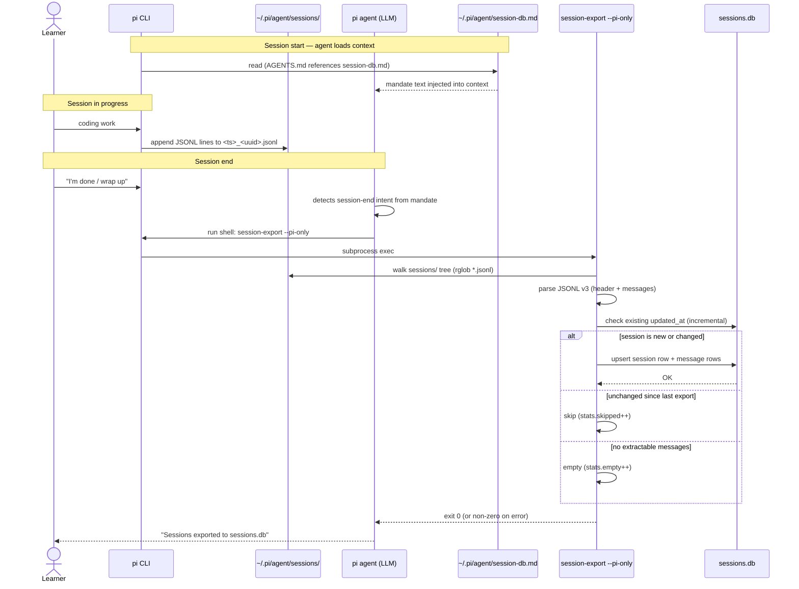

# pi and oh-my-pi Harness Integration

> Last updated: 2026-05-31.

**TL;DR:** pi (`@earendil-works/pi-coding-agent`) and oh-my-pi (omp, `@oh-my-pi/pi-coding-agent`) are two separate JSONL-on-disk coding agents that plug into StudyLoop the same way as Kiro or Gemini — one parametrized exporter handles both, the installer writes their AGENTS.md symlinks and a steering mandate, and the doctor picks them up automatically because they are in `_HARNESS_EXPORT`.

---

## What pi and omp Are

| Property | pi | omp |
|---|---|---|
| Package | `@earendil-works/pi-coding-agent` | `@oh-my-pi/pi-coding-agent` |
| Data dir | `~/.pi/agent/` | `~/.omp/agent/` |
| Session store | `~/.pi/agent/sessions/<cwd-slug>/` | `~/.omp/agent/sessions/<cwd-slug>/` |
| Session format | JSONL v3 (one JSON object per line) | JSONL v3 (identical format) |
| Exit hook API | None | None |
| Detection sentinel | `~/.pi` directory exists | `~/.omp` directory exists |

omp is a fork of pi maintained by the same author. They share the session format exactly; the only difference is the data root.

The `<cwd-slug>` directory name is the working directory path with `/` replaced by `-` (e.g. `/code/personal/tools/StudyLoop` becomes `-code-personal-tools-StudyLoop`).

---

## C4 Level 1 — System Context



---

## C4 Level 2 — Containers



---

## Exporter Design

Both pi and omp use JSONL v3 with this structure:

```
Line 1 (session header):
  {"type":"session","version":3,"id":"<uuid>","timestamp":"<ISO>","cwd":"/abs/path"}

Subsequent lines:
  {"type":"message","id":...,"parentId":...,"timestamp":"<ISO>","message":{...}}
  {"type":"model_change",...}
  {"type":"thinking_level_change",...}
```

The `message` object has:

```
user:       {"role":"user","content":[{"type":"text","text":"..."}],"timestamp":<ms>}
assistant:  {"role":"assistant","content":[...],"model":"...","provider":"...","usage":{...},"timestamp":<ms>}
toolResult: {"role":"toolResult","toolCallId":"...","toolName":"...","content":[...],"isError":bool,"timestamp":<ms>}
```

Because the format is identical, one `PiFamilyExporter` class is parametrized with `source_name` (`"pi"` or `"omp"`) and `root` (the session root `Path`). It is instantiated twice at module level and registered in `EXPORTERS`:

```python
EXPORTERS = {
    ...
    "pi":  PiFamilyExporter("pi",  Path.home() / ".pi/agent/sessions"),
    "omp": PiFamilyExporter("omp", Path.home() / ".omp/agent/sessions"),
}
```

### Incremental detection

Unlike OpenCode (which uses an `updated_at` JSON field), pi/omp sessions are detected via the JSONL file's on-disk `mtime`. The first line of each file carries the session header timestamp, but the safest incremental marker is comparing the stored `updated_at` in the DB against the file's last-modified time (converted to ISO).

`_process_file` returns `(session_data, messages, reason)`. A non-imported session carries a `reason` so the summary is honest and uniform across all exporters:

- `"skipped"` — the stored `updated_at` matches (unchanged since last export).
- `"empty"` — header-only, missing `id`, or no extractable messages.

`export_all` increments `stats.skipped` or `stats.empty` accordingly. This matches the convention used by every other exporter (see [CLI Reference § Results & Incremental Behaviour](../cli-reference.md#results-incremental-behaviour)).

### cwd-slug

The session directory name encodes the working directory: every `/` becomes `-`. The exporter recovers the original path from the session header's `"cwd"` field (line 1 of each JSONL file).

### Timestamp edge case

Some omp session headers omit the `"timestamp"` field. The exporter falls back to: first `message` line timestamp, then the file `mtime`, then `None`. It never crashes on a missing timestamp.

---

## Installer Design

pi and omp are listed in `_AGENT_CHOICES` and `_TOOL_LINKS` inside `installers.py`:

```python
_TOOL_LINKS = {
    ...
    "pi":  (LinkSpec("agents/pi/AGENTS.md",  str(_HOME / ".pi/agent/AGENTS.md")),),
    "omp": (LinkSpec("agents/omp/AGENTS.md", str(_HOME / ".omp/agent/AGENTS.md")),),
}

_AGENT_CHOICES = ("kiro", "claude", "gemini", "opencode", "codex", "amp", "pi", "omp")
```

And in `_HARNESS_EXPORT`:

```python
_HARNESS_EXPORT = {
    ...
    "pi":  _HarnessExport(_HOME / ".pi/agent/session-db.md",  "pi-only"),
    "omp": _HarnessExport(_HOME / ".omp/agent/session-db.md", "omp-only"),
}
```

`studyloop install agents --tool pi` (or `--tool omp`) does two things:

1. Creates `~/.pi/agent/AGENTS.md` as a symlink to `agents/pi/AGENTS.md` in the repo. The AGENTS.md includes a reference to `session-db.md` so the export mandate is pulled into the agent's context at session start.
2. Renders and writes `~/.pi/agent/session-db.md` from the shared mandate template (`agents/shared/session-db-mandate.md`), substituting `SESSION_EXPORT_FLAG` → `pi-only`.

Detection uses directory presence: if `~/.pi` exists, pi is considered available; if `~/.omp` exists, omp is available.

---

## Why Steering Mandate Instead of a Native Exit Hook

pi and omp do not expose an extension API equivalent to Claude Code's `Stop` hook. There is no shell wrapper or plugin point that fires reliably at session end.

The solution is the same as for Kiro and Gemini: a **steering mandate** — a markdown file loaded into the agent's context that instructs the agent to run `session-export --pi-only` (or `--omp-only`) when the user wraps up. The agent executes the shell command as part of its normal tool-use capability.

```
Claude Code  →  Stop hook (automatic, zero user action)
Kiro         →  steering mandate (agent-driven, best-effort)
Gemini       →  steering mandate (agent-driven, best-effort)
pi           →  steering mandate (agent-driven, best-effort)
omp          →  steering mandate (agent-driven, best-effort)
```

The mandate file contains the sentinel comment `<!-- studyloop:session-export-mandate -->` which both the installer (idempotency check) and the doctor (health check) key on.

---

## Doctor Coverage

`check_harness_export()` in `doctor/harness.py` iterates `detect_available_agent_tools()`. Because pi and omp are added to both `_HARNESS_EXPORT` and `detect_available_agent_tools()`, they are automatically included in doctor output — no special-casing needed in `harness.py`.

If `~/.pi` exists but `~/.pi/agent/session-db.md` is missing or lacks the sentinel, doctor reports a yellow warning with `fix_auto=True`. Running `studyloop doctor --fix` writes the mandate.

---

## CLI Flags

```bash
# Export only pi sessions
session-export --pi-only

# Export only omp sessions
session-export --omp-only

# Export pi and omp together (along with other sources)
session-export --sources pi omp

# Export all sources (pi and omp included automatically when present)
session-export
```

The flags appear in `SOURCE_CHOICES` and the `only_flags` dict inside the `export()` command function in `export_sessions.py`. They are mutually exclusive with each other and all other `--*-only` flags.

> The `[project.scripts]` entry point targets a thin `main()` wrapper that calls `app()`, **not** the `@app.command()`-decorated `export()` function. Pointing the entry point at a decorated command object bypasses Typer's argument parser entirely — every flag silently falls back to its default. A regression test (`TestEntryPointParsesArgv`) guards this wiring.

---

## End-of-Session Export Sequence

This diagram shows the flow under the steering-mandate model (no native exit hook).



---

## File Map

| Component | File |
|---|---|
| Exporter class (shared pi + omp) | `packages/agent-session-tools/src/agent_session_tools/exporters/pi.py` |
| Exporter registry | `packages/agent-session-tools/src/agent_session_tools/exporters/__init__.py` |
| Export CLI (flags + source choices) | `packages/agent-session-tools/src/agent_session_tools/export_sessions.py` |
| Installer (tool links + harness export entries) | `packages/studyloop/src/studyloop/installers.py` |
| Doctor harness check | `packages/studyloop/src/studyloop/doctor/harness.py` |
| Shared mandate template | `agents/shared/session-db-mandate.md` |
| pi AGENTS.md (repo source) | `agents/pi/AGENTS.md` |
| omp AGENTS.md (repo source) | `agents/omp/AGENTS.md` |
| pi mandate (installed) | `~/.pi/agent/session-db.md` |
| omp mandate (installed) | `~/.omp/agent/session-db.md` |

---

## Related Docs

- [Current Architecture](current.md) — full C4 context for all supported harnesses
- [Troubleshooting: pi / omp](../troubleshooting/pi-omp.md) — sessions not appearing, mandate missing, cwd-slug issues
- [Agent Installation Guide](../agent-install.md) — per-harness install steps
- [CLI Reference](../cli-reference.md) — `session-export` flags
