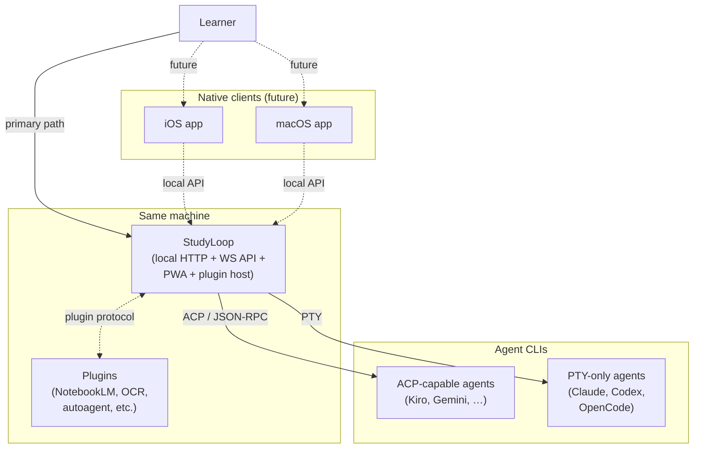
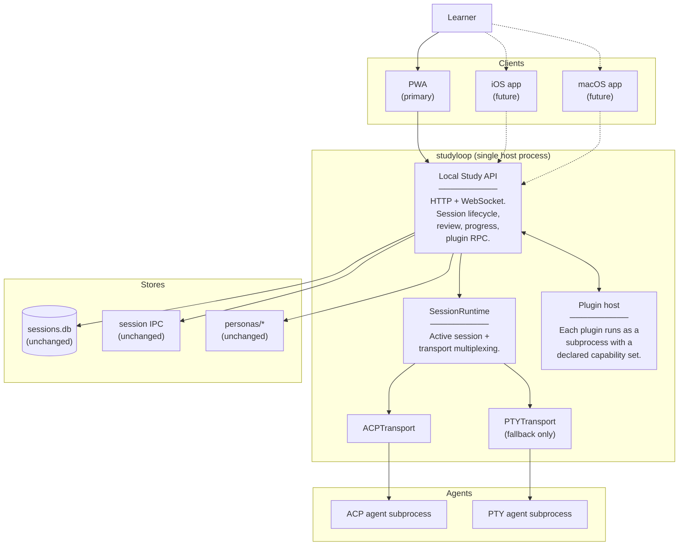

# Target Architecture

> Direction the project is moving toward. Living document — updated as decisions land. For the system as it works today, see [Current Architecture](current.md).

---

## Direction in one paragraph

StudyLoop is moving from a tmux + assistant-CLI core to a **local-first, web-first, plugin-based** study platform. The web/PWA replaces tmux as the primary learner UI. ACP becomes the preferred transport (currently Kiro + Gemini). PTY remains the fallback for agents that don't speak ACP. ttyd is retired once ACP + PTY web sessions cover every agent. Native macOS / iOS clients use the same local HTTP + WebSocket API later.

---

## C4 Level 1 — Target Context

The external picture barely changes — same learner, same agent CLIs. The difference is what the learner *interacts with*: a unified PWA (and later native clients) instead of tmux.

---

## C4 Level 2 — Target Containers

The diagram is structurally similar to today, with three changes:

1. **tmux + ttyd retired.** The PWA owns the live session presentation directly.
2. **A plugin host appears.** NotebookLM, OCR, autoagent, etc. are first-class plugins, not bolted-on cli sub-commands.
3. **A stable local API surface.** Today's `/api/session/*` becomes the contract that future native clients build on.

---

## Migration runway

| Now (2026-05) | Near-term | Target |
|---|---|---|
| tmux is the primary live-session UI | PWA chat surface for ACP agents (shipped); ttyd still used for Claude/Codex/OpenCode | PWA covers every agent; tmux + ttyd retired |
| PTY transport works in the browser via ttyd iframe | PTY transport adapted to stream raw bytes over WebSocket (xterm.js mount, no ttyd) | All agents drive a chat surface with a uniform contract |
| Plugins are sub-commands in the CLI | Plugin host process boundary defined; first plugin (NotebookLM) extracted | Plugins are isolated subprocesses with declared capabilities; opt-in install |
| `/api/session/*` is internal | Same routes, same shape, but documented as a stable contract | Native clients consume it directly (same auth model: localhost or LAN with HTTP Basic) |
| Persona delivery is transport-specific (file for PTY, prompt for ACP) | Same | Persona becomes a first-class capability of the transport — adapter declares which delivery mode it supports, runtime decides |

---

## Decisions still open

- **Plugin protocol**: subprocess + JSON-RPC over stdio (mirrors ACP) vs. embedded Python (faster, less isolation). Leaning toward subprocess parity with ACP for consistency.
- **Native client auth**: localhost-only by default (no auth) vs. token-based even on localhost (defence in depth). The LAN path already enforces HTTP Basic.
- **Multi-session support**: today is strictly single-session. Multi-session would require redesigning the singleton in `session/active.py` and the WS routing key.
- **Resume on the ACP path**: the PTY path passes `previous_notes` into `build_canonical_persona`. The ACP path doesn't yet — a resumed ACP session gets a bare persona. Need a decision on whether to pull recent struggles/wins from `sessions.db` and embed them in the persona text.
- **Theme persistence across devices**: today the palette selector is `localStorage`-only. If the PWA is installed on multiple devices the user re-picks every time. Sync would require a server-side preferences store.

---

## What target architecture is NOT trying to do

- **Not a multi-tenant SaaS.** Single user, single host, full data ownership.
- **Not a replacement for the agent CLIs.** StudyLoop orchestrates; the agent does the thinking.
- **Not a full IDE.** The chat surface is for study/mentoring conversations, not arbitrary coding.
- **Not a flashcard-first product.** Flashcards and quizzes support live mentoring, not the other way around — see [Architecture entry doc § Architecture Decision Summary](../architecture.md#architecture-decision-summary).
