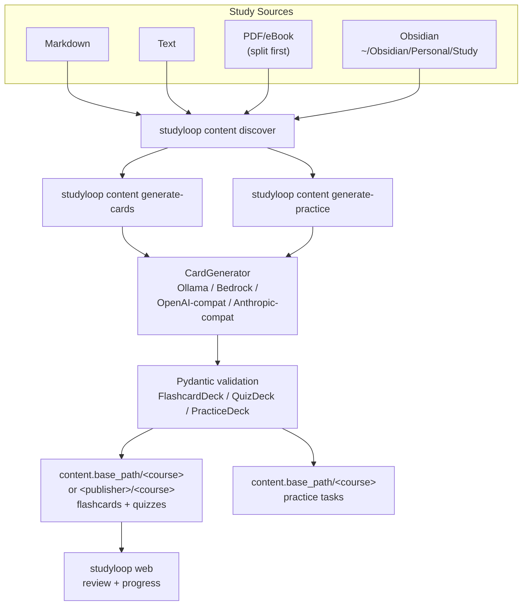
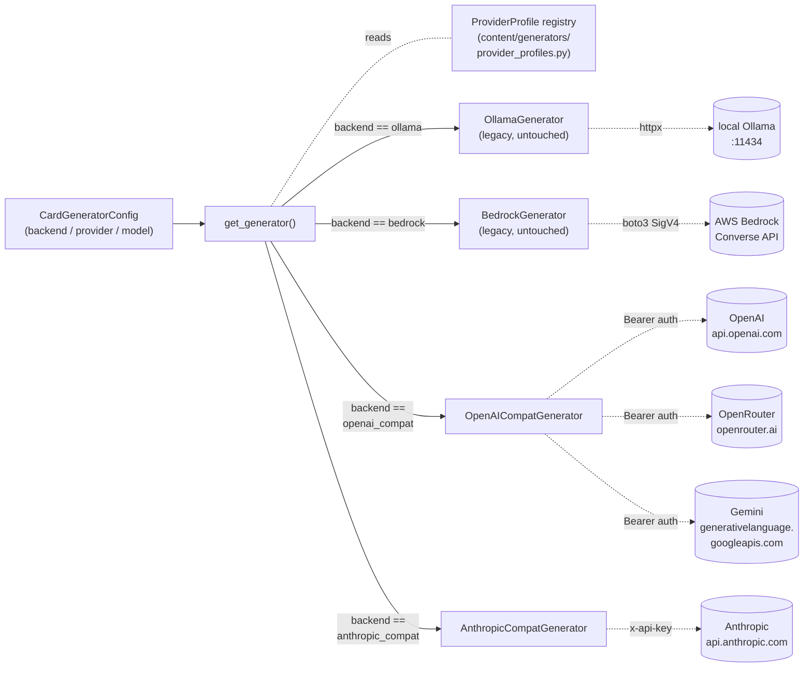
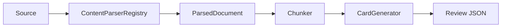

# Content Pipeline

The content pipeline turns study sources into review artefacts that support interactive mentor sessions.

The primary path is local:

```bash
studyloop content generate-cards ~/Obsidian/Personal/Study/Python --course python
studyloop content generate-practice ~/Obsidian/Personal/Study/Python --course python
studyloop web
```

NotebookLM is not required for flashcards, quizzes, practice tasks, study sessions, review, or session history.

## Current Flow



The web Generate panel uses the same producer stack, but the scope is resolved
from browser form state before any provider call:

```text
source markdown -> resolve_scope -> GenerationTask(count) -> provider prompt -> flashcards/quizzes -> review surface
```

`count_per_source` is copied from the browser request into each
`GenerationTask.count`. The provider adapters include that count in the
flashcard/quiz prompt and validate the returned JSON before writing. Treat it as
a requested target per source and per artefact kind. Live providers must still
follow the prompt and schema; StudyLoop fails visibly instead of writing
placeholder decks. The Generate panel reports the requested count, provider, and model in
the plan/progress view so mismatches are visible during a run.

## Pluggable Provider Abstraction

The live content providers — OpenAI, OpenRouter, Gemini, Anthropic,
**AWS Bedrock**, and **Ollama** — share one factory:
`studyloop.content.generators.get_generator(config)` and one registry
(`provider_profiles.py`). This Gemini entry is a card-generation API provider;
Gemini CLI is not a supported StudyLoop mentor harness. Bedrock and Ollama are
first-class registry entries, while two generic adapters carry the HTTP-backed
providers:



### Provider profile registry

The registry is data, not code. Each entry binds a slug to an adapter class, base URL, auth, and curated model list. The **auth kind** drives how the Settings panel renders that provider's controls and how availability is computed:

| Slug | Adapter | Base URL | Auth kind | Auth source | Notes |
|---|---|---|---|---|---|
| `openai` | OpenAI-compat | `api.openai.com/v1` | `api_key` | `OPENAI_API_KEY` | Includes thinking models (o3-mini) |
| `openrouter` | OpenAI-compat | `openrouter.ai/api/v1` | `api_key` | `OPENROUTER_API_KEY` | Single key, many backing models |
| `gemini` | OpenAI-compat | `generativelanguage.googleapis.com/v1beta/openai` | `api_key` | `GEMINI_API_KEY` | Google's OpenAI-compat shim |
| `anthropic` | Anthropic-compat | `api.anthropic.com` | `api_key` | `ANTHROPIC_API_KEY` | Includes Claude Haiku/Sonnet/Opus |
| `bedrock` | Bedrock (boto3/Converse) | — | `bedrock_bearer` | AWS profile/SigV4, or optional `AWS_BEARER_TOKEN_BEDROCK` | Model IDs are cross-region **inference profiles** (e.g. `us.anthropic.claude-sonnet-4-6`), verified per account |
| `ollama` | Ollama (local) | `http://localhost:11434` | `local_keyless` | none | Base URL stored as the `ollama_base_url` secret; available iff the endpoint responds |

**Adding a new provider** = one row in `PROFILES` + a curated model list + (optionally) one row in `.env.example`. No new generator code, no new tests beyond the live-smoke parametrise list expanding automatically.

> **Bedrock model IDs are account-specific.** The curated list uses cross-region inference-profile IDs (e.g. `us.anthropic.claude-sonnet-4-6`), **not** the raw dated foundation-model IDs (`...-20251101-v1:0`), which raise `ValidationException: provided model identifier is invalid` in many accounts. Verify available profiles with `aws bedrock list-inference-profiles --region <r>` before relying on a given ID.

### Credential resolution (encrypted store first)

`secrets.get_secret(slug)` resolves credentials in this order:

1. **Encrypted store** — `~/.config/studyloop/secrets.bin` (Fernet token; key seed in `~/.config/studyloop/.secrets-key`, mode `0600`). Written by the **Settings → LLM Providers** panel after a live verification. This is the recommended path and is honoured by every adapter.
2. **Environment / `.env`** — the `Auth source` env var above.

This means a key added in the web UI takes effect immediately, with no `.env` edit and no shell export.

### Anthropic-compat adapter robustness

The `AnthropicCompatGenerator` carries three robustness behaviours so a flaky
Anthropic-compatible endpoint cannot silently break generation. They are
Messages-protocol safeguards that protect the `anthropic` provider and any
future compatible endpoint.

- **Schema-correction retries carry a `tool_result` block**, never a plain-text user turn — the Messages protocol requires the user turn after an assistant `tool_use` to be a `tool_result` for that id; strict shims reject the plain-text form (error 2013, `tool call result does not follow tool call`).
- **Inline-XML tool calls are parsed as a fallback** — if a shim narrates the tool call as `<…:tool_call><invoke …><parameter …>` text instead of a native `tool_use` block, the adapter extracts it rather than failing.
- **Transient bad emissions are retried** — the shared `call_with_correction` loop retries an unparseable response within its budget, so one malformed reply doesn't hard-fail the job.

### Curation policy

Models in the registry must satisfy three constraints:

1. **Tool-use / structured-output mode** supported. JSON-mode-only models are rejected because the deck schema needs the strict tool-call constraint.
2. **Cost-per-deck viability**: `cheap` tier targets <$0.05 per deck, `balanced` <$0.25, `premium` uncapped.
3. **Currency**: not deprecated, no sunset announcement pending.

The `thinking` flag on a model entry triggers a 3× `request_timeout` multiplier in both adapters, plus the Anthropic adapter sends `thinking: { type: enabled, budget_tokens: 2000 }` automatically.

### `.env` loading

`studyloop/__init__.py` calls `dotenv.load_dotenv(override=False)` on package import. Project-root `.env` is loaded; explicitly-exported shell vars always win. Keys are documented in `.env.example`. **Note:** for API-key providers the encrypted store (above) is checked *before* the environment, so the Settings panel is the preferred way to set keys; `.env` remains a valid fallback for headless/CI use.

### Adapter wire-shape divergences (the genuine differences)

| Concern | OpenAI Chat Completions | Anthropic Messages |
|---|---|---|
| Auth header | `Authorization: Bearer ${key}` | `x-api-key: ${key}` + `anthropic-version: 2023-06-01` |
| System prompt | message with `role: system` | top-level `system` field |
| Tool call shape | `tool_choice: {type:"function", function:{name}}` + `tools: [{type:"function", function:{name,parameters:<schema>}}]` | `tool_choice: {type:"tool", name}` + `tools: [{name, description, input_schema}]` |
| Tool result location | `message.tool_calls[0].function.arguments` (often a JSON string) | One `content[]` block with `type:"tool_use", input:{...}` |
| Thinking model fields | none (timeout multiplier only) | `thinking: {type:"enabled", budget_tokens:N}` |
| `max_tokens` requirement | optional | **required** (defaulted to 4096) |
| Schema validation retry | shared `call_with_correction` helper -- both adapters share the same retry-with-correction loop |

## Default Study Location

The default study material source is:

```text
~/Obsidian/Personal/Study
```

Recommended structure:

```text
~/Obsidian/Personal/Study/
├── Python/
├── Data-Engineering/
├── SQL/
└── Courses/
    ├── Udemy/
    │   └── Ultimate_AWS_Data_Engineering_Bootcamp_with_Real_World_Labs/
    └── ArjanCodes/
        └── ...
```

## Commands

### Discover Sources

```bash
studyloop content discover
studyloop content discover ~/Obsidian/Personal/Study/Python
studyloop content discover --json
```

### Generate Flashcards And Quizzes

```bash
studyloop content generate-cards ~/Obsidian/Personal/Study/Python --course python
studyloop content generate-cards ~/Obsidian/Personal/Study/Courses/Udemy/MyCourse --course my-course
```

Generate only one artefact type:

```bash
studyloop content generate-cards ~/Obsidian/Personal/Study/Python --course python --no-quiz
studyloop content generate-cards ~/Obsidian/Personal/Study/Python --course python --no-flashcards
```

### Generate Hands-On Practice Tasks

```bash
studyloop content generate-practice ~/Obsidian/Personal/Study/Python --course python
```

Practice decks are written to `content.base_path/<course>/practice/` as `*-practice.json`.
Generated tasks can include verification metadata for `studyloop practice verify`:
command/rubric/checklist kind, success criteria, expected artifacts, rubric
checks, evidence prompts, setup command, and timeout.

### Split PDFs

```bash
studyloop content split "book.pdf" -o chapters/
studyloop content split "book.pdf" --ranges "1-30,31-60,61-90"
```

After splitting, generate from extracted Markdown/text chunks where available. PDF parsing/chapter extraction should move behind a `ContentParser` plugin in the target architecture.

### Import Existing Review JSON

```bash
studyloop content import-review ~/Downloads/generated-review --course python --dry-run
studyloop content import-review ~/Downloads/generated-review --course python
```

## Output Format

Flashcards:

```json
{
  "title": "Python Collections",
  "cards": [
    {
      "front": "When would you use deque instead of list?",
      "back": "Use deque when you need efficient append/pop from both ends."
    }
  ]
}
```

Quizzes:

```json
{
  "title": "Python Collections",
  "questions": [
    {
      "question": "Which structure is best for O(1) left append?",
      "hint": "Think double-ended queue.",
      "answerOptions": [
        {
          "text": "deque",
          "isCorrect": true,
          "rationale": "deque.appendleft is O(1)."
        },
        {
          "text": "list",
          "isCorrect": false,
          "rationale": "list.insert(0, value) is O(n)."
        }
      ]
    }
  ]
}
```

## Configuration

```yaml
content:
  base_path: ~/Obsidian/Personal/Study   # where generated decks are WRITTEN
  study_paths:
    - ~/Obsidian/Personal/Study

card_generator:
  backend: ollama
  max_workers: 4
  ollama:
    base_url: http://localhost:11434
    model: qwen2.5:7b

# Optional: where the review panels READ decks from. If omitted, the panels
# fall back to content.base_path, so generated decks are discoverable with no
# extra config. Set this only to point the reviewer at additional roots.
# review:
#   directories:
#     - ~/Obsidian/Personal/Study
```

> **Write root vs read root.** The CLI command `studyloop content generate-cards`
> writes decks under `content.base_path/<course>/{flashcards,quizzes}/`. The web
> Generate panel writes under
> `content.base_path/<publisher>/<course>/{flashcards,quizzes}/` when a publisher
> is supplied. The CLI command `studyloop content generate-practice` writes
> hands-on practice decks under `content.base_path/<course>/practice/`. The
> review panels discover flashcards and quizzes via `review.directories`; when
> that key is unset, `settings.resolve_study_dirs()` falls back to
> `content.base_path`, and discovery walks both layouts. (Earlier, an unset
> `review.directories` left the panels empty even though decks were on disk —
> that fallback is now automatic.)

## Target Parser Architecture



Planned parsers:

- Markdown
- text
- PDF
- eBook/EPUB chapter splitting
- OCR/images
- Word
- Excel
- PowerPoint
- website to Markdown
- Obsidian vault parser with wikilinks/backlinks

## Optional Legacy NotebookLM Path

NotebookLM commands may still exist for historical audio/video workflows, but they are not the default path and should move behind an optional plugin.

Use local generation unless you explicitly need NotebookLM-specific audio/video artefacts.
