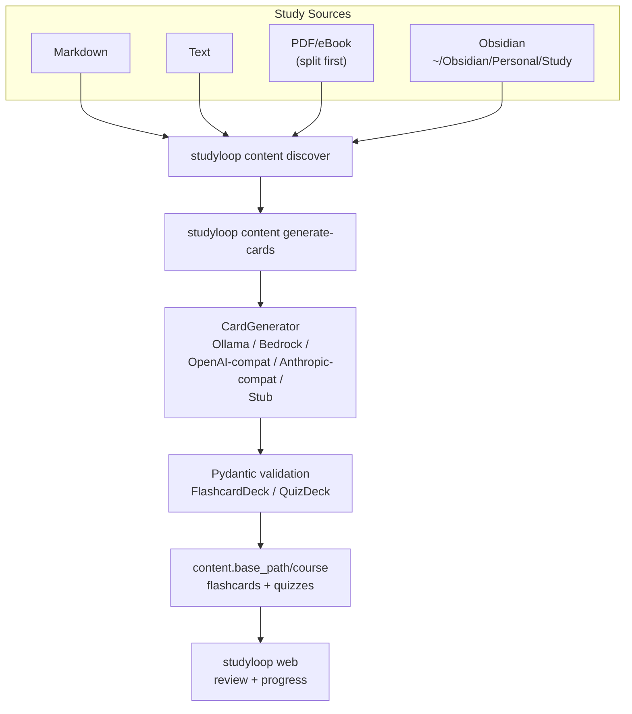
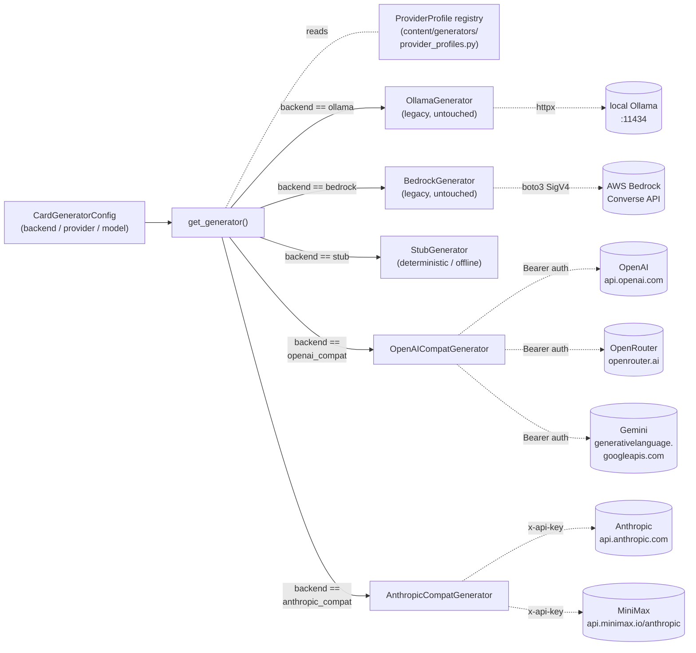
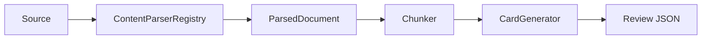

# Content Pipeline

The content pipeline turns study sources into review artefacts that support interactive mentor sessions.

The primary path is local:

```bash
studyloop content generate-cards ~/Obsidian/Personal/Study/Python --course python
studyloop web
```

NotebookLM is not required for flashcards, quizzes, study sessions, review, or session history.

## Current Flow



## Pluggable Provider Abstraction

Five real providers (OpenAI, OpenRouter, Gemini, MiniMax, Anthropic) plus the legacy Ollama/Bedrock paths and the test-only Stub backend all share one factory: `studyloop.content.generators.get_generator(config)`. Two generic adapter classes carry every HTTP-backed provider:



### Provider profile registry

The registry is data, not code. Each entry binds a slug to an adapter class, base URL, env var, and curated model list:

| Slug | Adapter | Base URL | Auth env | Notes |
|---|---|---|---|---|
| `openai` | OpenAI-compat | `api.openai.com/v1` | `OPENAI_API_KEY` | Includes thinking models (o3-mini) |
| `openrouter` | OpenAI-compat | `openrouter.ai/api/v1` | `OPENROUTER_API_KEY` | Single key, many backing models |
| `gemini` | OpenAI-compat | `generativelanguage.googleapis.com/v1beta/openai` | `GEMINI_API_KEY` | Google's OpenAI-compat shim |
| `minimax` | **Anthropic-compat** | `api.minimax.io/anthropic` | `MINIMAX_API_KEY` | Speaks the Messages API natively |
| `anthropic` | Anthropic-compat | `api.anthropic.com` | `ANTHROPIC_API_KEY` | Includes Claude Haiku/Sonnet/Opus |

**Adding a new provider** = one row in `PROFILES` + a curated model list + (optionally) one row in `.env.example`. No new generator code, no new tests beyond the live-smoke parametrise list expanding automatically.

### Curation policy

Models in the registry must satisfy three constraints:

1. **Tool-use / structured-output mode** supported. JSON-mode-only models are rejected because the deck schema needs the strict tool-call constraint.
2. **Cost-per-deck viability**: `cheap` tier targets <$0.05 per deck, `balanced` <$0.25, `premium` uncapped.
3. **Currency**: not deprecated, no sunset announcement pending.

The `thinking` flag on a model entry triggers a 3× `request_timeout` multiplier in both adapters, plus the Anthropic adapter sends `thinking: { type: enabled, budget_tokens: 2000 }` automatically.

### `.env` loading

`studyloop/__init__.py` calls `dotenv.load_dotenv(override=False)` on package import. Project-root `.env` is loaded; explicitly-exported shell vars always win. Keys are documented in `.env.example`.

### Adapter wire-shape divergences (the genuine differences)

| Concern | OpenAI Chat Completions | Anthropic Messages |
|---|---|---|
| Auth header | `Authorization: Bearer ${key}` | `x-api-key: ${key}` + `anthropic-version: 2023-06-01` |
| System prompt | message with `role: system` | top-level `system` field |
| Tool call shape | `tool_choice: {type:"function", function:{name}}` + `tools: [{type:"function", function:{name,parameters:<schema>}}]` | `tool_choice: {type:"tool", name}` + `tools: [{name, description, input_schema}]` |
| Tool result location | `message.tool_calls[0].function.arguments` (often a JSON string) | One `content[]` block with `type:"tool_use", input:{...}` |
| Thinking model fields | none (timeout multiplier only) | `thinking: {type:"enabled", budget_tokens:N}` |
| `max_tokens` requirement | optional | **required** (defaulted to 4096) |
| Schema validation retry | shared `call_with_correction` helper -- both adapters share the same retry-with-correction loop |

## Default Study Location

The default study material source is:

```text
~/Obsidian/Personal/Study
```

Recommended structure:

```text
~/Obsidian/Personal/Study/
├── Python/
├── Data-Engineering/
├── SQL/
└── Courses/
    ├── Udemy/
    │   └── Ultimate_AWS_Data_Engineering_Bootcamp_with_Real_World_Labs/
    └── ArjanCodes/
        └── ...
```

## Commands

### Discover Sources

```bash
studyloop content discover
studyloop content discover ~/Obsidian/Personal/Study/Python
studyloop content discover --json
```

### Generate Flashcards And Quizzes

```bash
studyloop content generate-cards ~/Obsidian/Personal/Study/Python --course python
studyloop content generate-cards ~/Obsidian/Personal/Study/Courses/Udemy/MyCourse --course my-course
```

Generate only one artefact type:

```bash
studyloop content generate-cards ~/Obsidian/Personal/Study/Python --course python --no-quiz
studyloop content generate-cards ~/Obsidian/Personal/Study/Python --course python --no-flashcards
```

### Split PDFs

```bash
studyloop content split "book.pdf" -o chapters/
studyloop content split "book.pdf" --ranges "1-30,31-60,61-90"
```

After splitting, generate from extracted Markdown/text chunks where available. PDF parsing/chapter extraction should move behind a `ContentParser` plugin in the target architecture.

### Import Existing Review JSON

```bash
studyloop content import-review ~/Downloads/generated-review --course python --dry-run
studyloop content import-review ~/Downloads/generated-review --course python
```

## Output Format

Flashcards:

```json
{
  "title": "Python Collections",
  "cards": [
    {
      "front": "When would you use deque instead of list?",
      "back": "Use deque when you need efficient append/pop from both ends."
    }
  ]
}
```

Quizzes:

```json
{
  "title": "Python Collections",
  "questions": [
    {
      "question": "Which structure is best for O(1) left append?",
      "hint": "Think double-ended queue.",
      "answerOptions": [
        {
          "text": "deque",
          "isCorrect": true,
          "rationale": "deque.appendleft is O(1)."
        },
        {
          "text": "list",
          "isCorrect": false,
          "rationale": "list.insert(0, value) is O(n)."
        }
      ]
    }
  ]
}
```

## Configuration

```yaml
content:
  base_path: ~/study-materials
  study_paths:
    - ~/Obsidian/Personal/Study

card_generator:
  backend: ollama
  max_workers: 4
  ollama:
    base_url: http://localhost:11434
    model: qwen2.5:7b
```

## Target Parser Architecture



Planned parsers:

- Markdown
- text
- PDF
- eBook/EPUB chapter splitting
- OCR/images
- Word
- Excel
- PowerPoint
- website to Markdown
- Obsidian vault parser with wikilinks/backlinks

## Optional Legacy NotebookLM Path

NotebookLM commands may still exist for historical audio/video workflows, but they are not the default path and should move behind an optional plugin.

Use local generation unless you explicitly need NotebookLM-specific audio/video artefacts.
