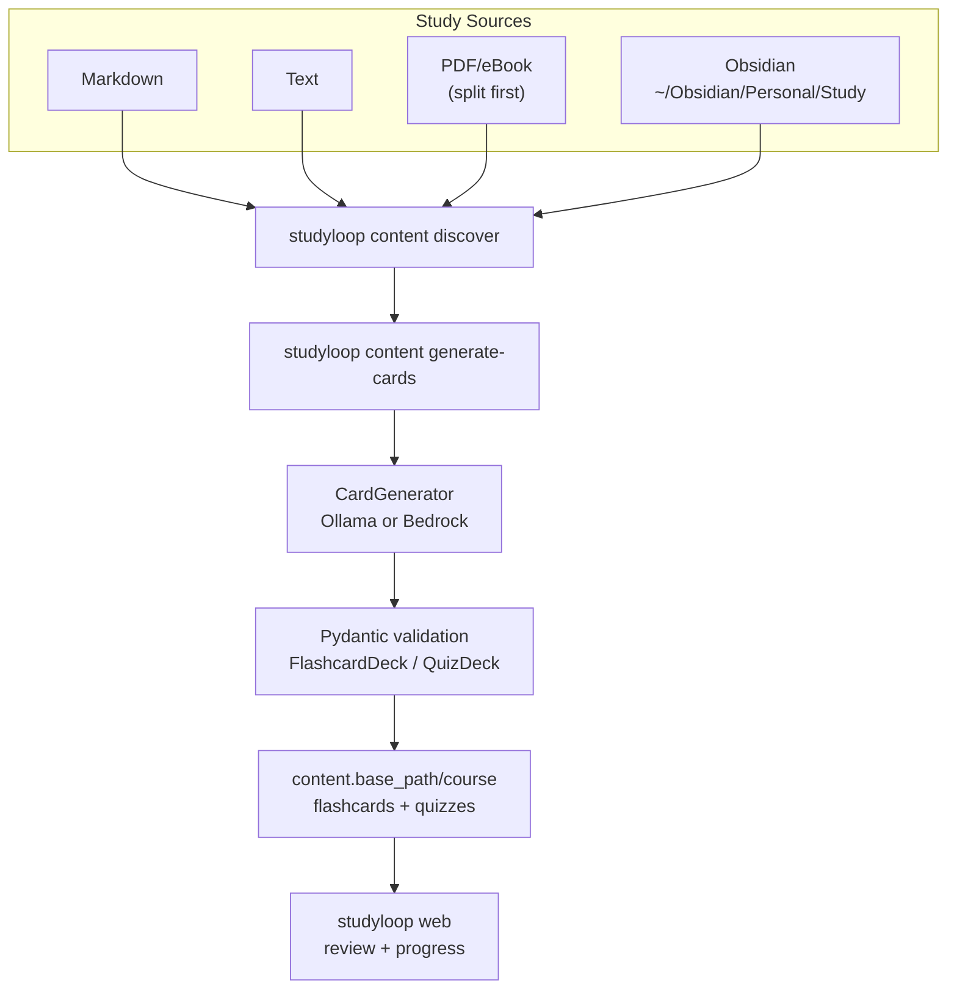
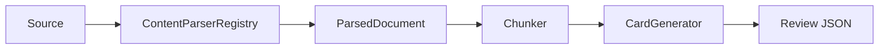

# Content Pipeline

The content pipeline turns study sources into review artefacts that support interactive mentor sessions.

The primary path is local:

```bash
studyloop content generate-cards ~/Obsidian/Personal/Study/Python --course python
studyloop web
```

NotebookLM is not required for flashcards, quizzes, study sessions, review, or session history.

## Current Flow



## Default Study Location

The default study material source is:

```text
~/Obsidian/Personal/Study
```

Recommended structure:

```text
~/Obsidian/Personal/Study/
├── Python/
├── Data-Engineering/
├── SQL/
└── Courses/
    ├── Udemy/
    │   └── Ultimate_AWS_Data_Engineering_Bootcamp_with_Real_World_Labs/
    └── ArjanCodes/
        └── ...
```

## Commands

### Discover Sources

```bash
studyloop content discover
studyloop content discover ~/Obsidian/Personal/Study/Python
studyloop content discover --json
```

### Generate Flashcards And Quizzes

```bash
studyloop content generate-cards ~/Obsidian/Personal/Study/Python --course python
studyloop content generate-cards ~/Obsidian/Personal/Study/Courses/Udemy/MyCourse --course my-course
```

Generate only one artefact type:

```bash
studyloop content generate-cards ~/Obsidian/Personal/Study/Python --course python --no-quiz
studyloop content generate-cards ~/Obsidian/Personal/Study/Python --course python --no-flashcards
```

### Split PDFs

```bash
studyloop content split "book.pdf" -o chapters/
studyloop content split "book.pdf" --ranges "1-30,31-60,61-90"
```

After splitting, generate from extracted Markdown/text chunks where available. PDF parsing/chapter extraction should move behind a `ContentParser` plugin in the target architecture.

### Import Existing Review JSON

```bash
studyloop content import-review ~/Downloads/generated-review --course python --dry-run
studyloop content import-review ~/Downloads/generated-review --course python
```

## Output Format

Flashcards:

```json
{
  "title": "Python Collections",
  "cards": [
    {
      "front": "When would you use deque instead of list?",
      "back": "Use deque when you need efficient append/pop from both ends."
    }
  ]
}
```

Quizzes:

```json
{
  "title": "Python Collections",
  "questions": [
    {
      "question": "Which structure is best for O(1) left append?",
      "hint": "Think double-ended queue.",
      "answerOptions": [
        {
          "text": "deque",
          "isCorrect": true,
          "rationale": "deque.appendleft is O(1)."
        },
        {
          "text": "list",
          "isCorrect": false,
          "rationale": "list.insert(0, value) is O(n)."
        }
      ]
    }
  ]
}
```

## Configuration

```yaml
content:
  base_path: ~/study-materials
  study_paths:
    - ~/Obsidian/Personal/Study

card_generator:
  backend: ollama
  max_workers: 4
  ollama:
    base_url: http://localhost:11434
    model: qwen2.5:7b
```

## Target Parser Architecture



Planned parsers:

- Markdown
- text
- PDF
- eBook/EPUB chapter splitting
- OCR/images
- Word
- Excel
- PowerPoint
- website to Markdown
- Obsidian vault parser with wikilinks/backlinks

## Optional Legacy NotebookLM Path

NotebookLM commands may still exist for historical audio/video workflows, but they are not the default path and should move behind an optional plugin.

Use local generation unless you explicitly need NotebookLM-specific audio/video artefacts.
