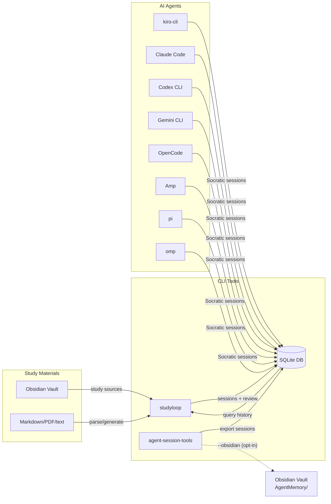

# StudyLoop

**TL;DR:** A local-first, AuDHD-aware study toolkit for live Socratic mentoring, body-doubling, cross-assistant session memory, and supporting spaced repetition.

---

## Quick Start

```bash
# 1. Install and configure
git clone https://github.com/Hookey-Street-Software/StudyLoop.git studyloop
cd studyloop
./scripts/install.sh
studyloop setup
studyloop doctor --fix

# 2. Start an interactive study session
studyloop study
# or specify a topic directly
studyloop study "Python" --mode co-study
# or launch your preferred assistant directly:
# kiro-cli chat --agent study-mentor
# claude      # then /agent socratic-mentor
# codex       # in the project root with AGENTS.md present

# 3. Optional: generate and review flashcards/quizzes
studyloop content generate-cards ~/Obsidian/Personal/Study/Python --course python
studyloop review
```

!!! tip "First time?"
    Head to the [Setup Guide](setup-guide.md), then follow [Your First Week](first-week.md) for a minimal daily path. Configure agents via [Agent Installation](agent-install.md) when you are ready to go deeper.

---

## How It Works



---

## What's Inside

| Tool | Purpose |
|------|---------|
| **studyloop** | Interactive study sessions, local content generation, spaced repetition, struggle detection, win tracking |
| **agent-session-tools** | Export and search AI sessions from Claude Code, Codex, Kiro, Gemini, Aider, pi, omp, and more |
| **AI Agents** | Socratic mentors that adapt to your energy, emotional state, and sensory environment |

!!! energy-check "Designed for AuDHD brains"
    Every session starts with an energy + emotional state check. Low energy? Shorter chunks, more scaffolding. Shutdown? No teaching — just presence. Read the [AuDHD Philosophy](audhd-learning-philosophy.md) to understand why.

---

## Key Sections

- **[Your First Week](first-week.md)** — day-by-day path: live study first, then review and export
- **[Content Pipeline](content-pipeline.md)** — local review artefact generation from study sources
- **[Architecture](architecture.md)** — current and target architecture docs
- **[Target Architecture](architecture/target.md)** — plugin architecture, ACP/PTY live sessions, macOS/iOS direction
- **[TUI Sidebar Guide](tui-guide.md)** — Terminal sidebar layout, timer modes, key bindings
- **[Web UI Guide](web-ui-guide.md)** — live sessions, session dashboard, terminal fallback, review UI
- **[Session Protocol](session-protocol.md)** — How every study session flows, from arrival to close
- **[CLI Reference](cli-reference.md)** — Full command reference for `studyloop` and `session-query`
- **[Repository Standards](standards/repo-standards.md)** — naming, doc, and structure standards
- **[AuDHD Framework](audhd-framework.md)** — The cognitive support framework behind the agents
- **[AuDHD Learning Loop Implementation](audhd-learning-loop-implementation.md)** — How teach-back, evidence scheduling, due review, and hands-on practice turn notes into learning
- **[Network Bridges](network-bridges.md)** — Network→Data Engineering analogies for infrastructure people
- **[Roadmap](roadmap.md)** — What's coming next

!!! micro-celebration "You're here"
    Reading docs is the first step. That counts.
