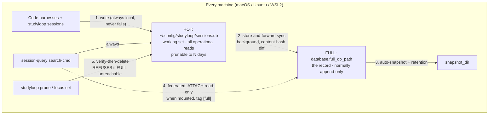

# Session-DB Tiering

How StudyLoop keeps every code-harness conversation forever without the
local database growing forever.

## Architecture



| Tier | Path | Role |
|------|------|------|
| **Hot** | `database.path` (always local) | Spool + working set. Every exporter writes here unconditionally. All operational reads (`struggles`, `resume`, `now`, web, MCP). Prunable. |
| **Full** | `database.full_db_path` (e.g. external volume) | The record. Complete history, maintained by the background content-hash sync. Read opportunistically by federated search; verification anchor for prune. |
| **Snapshots** | `database.snapshot_dir` | Point-in-time `VACUUM INTO` copies of the full DB, auto-created every `snapshot_interval_days` after a sync, rotated to `snapshot_retention`. Protect the record from corruption that sync would faithfully propagate. |

The full DB is **per-machine**. Cross-machine consolidation is
`session-sync`'s job: `--tier hot` (default) moves the recent working set
between hosts (prune-aware — locally pruned sessions are not resurrected);
`--tier full` consolidates the records (requires `full_db` on the host
entry in config.yaml).

## Configuration

```yaml
database:
  path: ~/.config/studyloop/sessions.db          # hot — keep local
  full_db_path: /Volumes/<external-drive>/StudyLoop/DB/sessions_full.db
  snapshot_dir: /Volumes/<external-drive>/StudyLoop/Backups
  snapshot_retention: 7
  snapshot_interval_days: 7                      # 0 = manual only
  sync_mode: always                              # or: daily
  backup_dir: ~/.config/studyloop/backups        # hot maintenance backups
  backup_retention: 5
  backup_max_mb: 1024

hosts:
  macmini:
    user: alex
    sessions_db: ~/.config/studyloop/sessions.db
    full_db: /Volumes/<external-drive>/StudyLoop/DB/sessions_full.db  # for --tier full
    ip_address: {primary: 192.168.1.10}
```

Leaving `full_db_path` empty disables tiering entirely — everything
behaves as a single local DB.

## Key operations

```bash
session-maint sync-full         # incremental hot -> full (idempotent, locked)
session-maint snapshot          # manual point-in-time snapshot of the full DB
session-maint fts-check --fix   # check/repair the FTS index invariant
session-maint compact SRC DEST  # rescue a bloated DB into a clean one
studyloop prune --days 30 --apply     # trim old, verified sessions from hot
studyloop focus set "python" "sql"    # set focus; pulls focus history, prunes stale
studyloop focus apply                 # retry deferred refocus data movement
session-query search-cmd "topic"      # federated (hot + full); --local-only to skip
session-sync sync HOST                # hot tier, prune-aware
session-sync sync HOST --tier full    # consolidate records across machines
```

## Safety invariants

1. **Writes never depend on a mount.** Exports land in the hot DB
   unconditionally; sync forwards to the record when the volume is there.
   The diff is stateless (content-hash), so a week offline is caught up by
   the first sync after remount.
2. **Prune is mechanically unable to lose data.** A session is deleted
   only when the full DB holds the same id with a matching content hash
   and at least as many messages. Full DB unreachable → prune refuses.
3. **Learning tables are never pruned** (`study_progress`, `concepts`,
   `card_reviews`, ...). Spaced repetition and mastery never degrade.
4. **FTS is an audited invariant**: `count(messages_fts) ==
   count(messages WHERE content IS NOT NULL)`, checked on every
   `studyloop doctor` run. History: a non-idempotent export path once
   grew this index to 45GB (586 duplicate copies of 32MB of text), and
   `INSERT OR REPLACE` imports leaked orphans because SQLite's REPLACE
   does not fire delete triggers. Both paths are fixed; the doctor check
   catches any regression the day it starts.

## Failure behaviour

| Failure | Behaviour |
|---------|-----------|
| Volume unmounted at export | Export succeeds locally; sync skips; auto catch-up on next trigger |
| Volume unmounted at search | Silent fallback to local-only results |
| Volume unmounted at prune/refocus | Refuses / defers (`focus apply` retries) |
| Sync crash mid-run | Single transaction; rollback; next run redoes the same diff |
| Concurrent triggers | Lockfile serialises; losers skip |
| Full DB corrupted | Restore newest snapshot, re-run `sync-full` |

## Restore procedures

**Hot DB lost** (disk failure, new machine):

```bash
# 1. Copy the record into place
cp /Volumes/<external-drive>/StudyLoop/DB/sessions_full.db ~/.config/studyloop/sessions.db
# 2. Trim it back to a working set
studyloop prune --days 30 --apply
# 3. Verify
studyloop doctor
```

With `sync_mode: always` the loss window is seconds — whatever the last
background sync missed.

**Full DB corrupted or lost:**

```bash
# Restore the newest snapshot
cp /Volumes/<external-drive>/StudyLoop/Backups/sessions_full_snapshot_<newest>.db \
   /Volumes/<external-drive>/StudyLoop/DB/sessions_full.db
# Refill the gap since that snapshot from the hot DB
session-maint sync-full
```

**Bloated DB (FTS duplication, historic bug):**

```bash
session-maint compact /path/to/bloated.db /path/to/clean.db
# verify counts in the output, then replace/retire the bloated file
```
