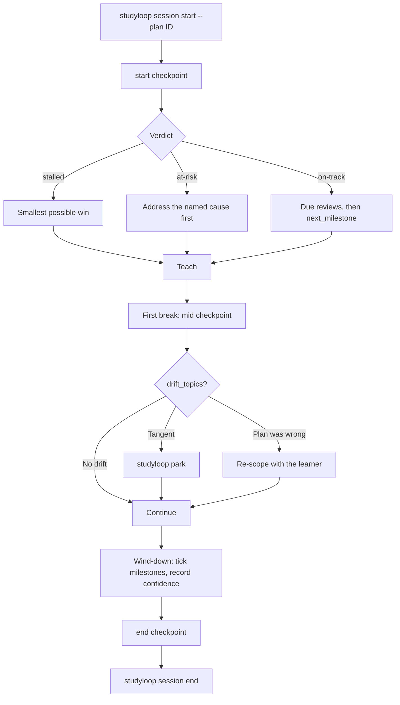

# Study Plans

A study plan is a structured Markdown document that says **why** you are
learning something, **what** counts as done, and **which** checkable steps get
you there. StudyLoop then evaluates it against what you actually did — at the
start of a session, mid-session, and once the session ends.

The `study-plan-architect` agent builds plans with you through an interview. The
Socratic mentor reads them during sessions. Both go through `studyloop plan`.

## File-first, index-second

The Markdown document is the source of truth:

```
<state_dir>/study-plans/<plan-id>.md      # default: ~/.local/share/studyloop/study-plans
```

Override with `STUDYLOOP_PLANS_DIR`. Find the active directory with
`studyloop plan path`.

The sessions DB holds two things, added by `agent-session-tools` migration 26:

| Table | Kind | Rebuildable? |
|---|---|---|
| `study_plans` | Derived index — the queryable projection used by the web UI and the `now` decision engine | Yes — `studyloop plan reindex` |
| `study_plan_checkpoints` | Append-only evaluation log, keyed to `study_sessions.study_id` | No — this is durable history |

The consequence that matters: **losing the database never loses a plan.** The
documents are plain files, so they are diffable, greppable, and editable without
StudyLoop running. Checkpoint history is deliberately kept when a plan is
deleted, and carries no foreign key on `study_id` so it outlives session pruning
(see [Session-DB Tiering](session-db-tiering.md)).

## The document format

```markdown
---
id: ship-a-glue-etl-job
title: Ship a Glue ETL Job
status: active
created: 2026-08-01T09:00:00+00:00
updated: 2026-08-03T18:30:00+00:00
topics:
  - data-engineering
  - python
energy_floor: 4
target_date: 2026-09-30
review_cadence_days: 5
---

# Ship a Glue ETL Job

## Mission

### Why

Own the nightly customer-events pipeline without pairing.

### Success looks like

- Deploy a Glue job unaided
- Explain the job bookmark to a colleague

### Constraints

- 4 evenings a week, 30 minutes each

### Out of scope

- EMR tuning

## Milestones

- [x] **Understand Glue job anatomy** — read the dev guide first `(concepts: glue job, job bookmark)`
- [ ] **Write the transform** `(concepts: dynamicframe)`
- [ ] **Schedule and monitor it** `(concepts: cloudwatch)`

## Learning Records

### LR-0001 — Bookmarks are per-job, not per-run

Assumed a bookmark tracked each run. It tracks the job. Explains why the
re-run processed nothing.

## Resources

- [Glue dev guide](https://docs.aws.amazon.com/glue/) — primary source

## Checkpoints

| When | Phase | Verdict | Summary | Session |
| --- | --- | --- | --- | --- |
| 2026-08-03T18:00:00+00:00 | start | on-track | 33% complete and moving. | abc-123 |

## Notes

Prefers diagrams over prose.
```

### Frontmatter

| Field | Meaning |
|---|---|
| `id` | Plan id; also the filename stem |
| `status` | `draft`, `active`, `paused`, `complete`, `abandoned` |
| `topics` | Join key for spaced repetition and session matching |
| `energy_floor` | Minimum energy (1-10) this plan needs; below it, review instead |
| `target_date` | Optional. Leave blank rather than inventing one — a fake date produces a fake `at-risk` verdict |
| `review_cadence_days` | How often the plan itself should be re-checked |

### Why `(concepts: ...)` matters

That suffix is the join key against `study_progress`. It is what lets an
evaluation distinguish a milestone that was **learned** from one that was merely
**ticked**: if a milestone is marked done but none of its concepts carry
confidence evidence, the plan is flagged `at-risk` with the milestone named.

Omit the concepts and that check silently stops working — the plan keeps looking
healthy while drifting from reality. This is the single most valuable line of
metadata in the document.

### Empty sections

Unfilled sections render an explicit italic placeholder (`_No notes._`) rather
than vanishing, so a gap is visible in the UI. The parser reads those
placeholders back as *absent*, so an empty plan is never mistaken for a
populated one. Round-trip fidelity is a tested invariant: saving a plan you have
not changed rewrites the file byte-for-byte identically.

## The three checkpoints



| Phase | When | Question it answers |
|---|---|---|
| `start` | Before the first teaching turn | Is this still the right thing, and what is next? |
| `mid` | At the first natural break | Is this session drifting off the plan? |
| `end` | During wind-down | What moved, and what does the plan owe next time? |

`studyloop session start --plan ID` and `studyloop session end` record the
`start` and `end` checkpoints automatically, so a session against a plan cannot
begin without first checking the plan against reality. Both are best-effort: a
broken plan document produces a warning, never a blocked session.

### Evidence sources

Evaluation reads both table families in `sessions.db`:

| Family | Tables | Used for |
|---|---|---|
| StudyLoop (active-learning store) | `study_progress`, `study_sessions` | Per-concept confidence, due reviews, struggle signal, session cadence |
| Session-DB (conversation archive) | `messages`, `messages_fts` | What was actually discussed, recurring questions, drift detection |

Every reader is individually guarded. A missing table becomes a `warnings` entry
and a **partial** evaluation rather than an exception — normal on a fresh
install.

### Verdicts

| Verdict | Means | Do |
|---|---|---|
| `on-track` | Progressing, nothing contradicting | Continue with `next_milestone` |
| `at-risk` | Struggle signal, milestones ticked without evidence, or the target date is slipping | Address the named cause before new material |
| `stalled` | No plan activity for 14+ days | Smallest possible win; consider re-scoping |
| `complete` | Every milestone ticked | Close the plan, or extend with a follow-on mission |

An `at-risk` verdict describes the *plan*, never the learner.

## How a plan drives Today

Checkpoints answer "is this plan on track?". The `now` decision engine
(`learning/decision.py`) answers the adjacent question — "so what do I do in the
next 25 minutes?" — and an active plan is what makes that answer a **plan step**
rather than a guess assembled from whatever the databases happen to hold.

Two mechanisms, both skipped entirely when no plan is `active`:

**1. The plan is a candidate source.** Each active plan contributes one
candidate per concept of its `next_milestone()` — the first unchecked milestone,
i.e. the zone of proximal development. A milestone with no `(concepts: ...)`
suffix still contributes, falling back to its title, so an untagged plan is
never silently dropped. These candidates carry `source =
study_plan:<plan-id>:<milestone-slug>` and a reason quoting the plan's mission.

**2. The plan biases every other source.** Due cards, struggle repairs, and
continuity threads that the plan's topics or concepts claim are boosted;
everything else is nudged down. So a due review *that is plan work* still wins —
correctly, because it is on-plan — while an unrelated backlog cannot bury the
plan.

### Score bands

The boost is sized against the bands the heuristic sources already occupy —
too small and the plan silently loses to a pile of due cards, which looks
identical to having no plan integration at all:

| Source | Score | Meaning |
|---|---|---|
| `_due_progress_candidates` | 100–190 | 100 + days overdue + confidence penalty |
| **plan next milestone** | **120** | the committed next step |
| `_due_card_candidates` | 96–116 | "N spaced-repetition cards are due" |
| `_struggle_candidates` | 70–124 | recorded struggling / learning |
| `_continuity_candidates` | 58 | last session's open threads |
| `_transfer_candidates` | 52 | weak prerequisite links |
| `_practice_candidates` | 48 | a practice file exists |

Plus `+20` on-plan / `−10` off-plan, deliberately the same magnitude as the
`studyloop focus` filter (`+22`/`−12`) because it is the same kind of signal: a
declared attention boundary.

The intended outcome: **120 clears the entire due-card band**, so a queue of 20
cards can never outrank the step you committed to — but a concept that is
genuinely decaying (20+ days overdue, or recorded as struggling) still wins,
because evidence of *forgetting* outranks the plan while a queue length does
not.

### Provenance

The winning action carries `metadata.plan_id`, `metadata.plan_title`, and
`metadata.milestone` through the `now` JSON contract, and the Today card renders
**From study plan: `<title>` · `<milestone>`** so the recommendation is never
unexplained.

### With no active plan

Nothing changes. A plan is never mandatory: with no `active` plan, no candidates
are added, no scores are adjusted, and Today behaves exactly as it did before.
The one exception is the fallback — an active plan with *no* milestones, or with
every milestone ticked, replaces the generic "one tiny recall loop" starter with
a plan-shaped prompt (break the mission into milestones / close out the plan).

## CLI

```bash
studyloop plan list [--status active] [--json]
studyloop plan show ID [--markdown] [--json]
studyloop plan interview [--json]          # questions + evidence-based seeds
studyloop plan new --title T --why W --success S --topic T --milestone "M (concepts: a)"
studyloop plan status ID active            # refused while unevaluable
studyloop plan evaluate ID --phase start|mid|end [--record] [--study-id X] [--json]
studyloop plan milestone ID INDEX --done/--undone
studyloop plan reindex                     # rebuild the derived index
studyloop plan path                        # where documents live

studyloop session start -t "topic" --plan ID   # records a start checkpoint
studyloop session end                          # records an end checkpoint
```

`studyloop plan status ID active` and `plan new --activate` exit non-zero and
print the blockers when the plan has no mission, no success criteria, or no
milestones.

## REST API

| Method | Path | Purpose |
|---|---|---|
| `GET` | `/api/plans` | List plan summaries; `?status=` filters |
| `GET` | `/api/plans/interview` | Interview questions + evidence-based seed |
| `GET` | `/api/plans/{id}` | Parsed structure, raw Markdown, and readiness |
| `GET` | `/api/plans/{id}/markdown` | Raw document as `text/plain` |
| `GET` | `/api/plans/{id}/history` | Durable checkpoint log from the DB |
| `GET` | `/api/plans/{id}/evaluate?phase=` | Evaluate **without** recording — safe to poll |
| `POST` | `/api/plans/{id}/evaluate` | Run and record a checkpoint (`201`) |
| `POST` | `/api/plans` | Create from `{title, answers}` or `{markdown}` (`201`) |
| `PATCH` | `/api/plans/{id}` | Update metadata, milestones, or the whole document |
| `POST` | `/api/plans/{id}/milestones/{index}/toggle` | Flip one milestone |
| `DELETE` | `/api/plans/{id}` | Delete the document; checkpoint history is retained |

`PATCH` with `{"status": "active"}` returns **422** with `blockers` when the plan
is not ready, and leaves the status unchanged. Plan ids are validated against
path traversal before any filesystem access.

## MCP tools

For agents that speak MCP rather than shelling out: `plan_list`, `plan_get`,
`plan_interview`, `plan_create`, `plan_evaluate`, `plan_set_milestone`,
`plan_set_status`. Same semantics as the CLI, including the activation refusal.

## Web UI

The **left pane** carries a Study Plan section: the nav button plus a list of
existing plans, each showing status, milestone count, and a progress bar.
Selecting one opens it in the main view.

The main view renders the document through the same
`marked → DOMPurify → highlight.js / mermaid` pipeline as the Course Explorer, so
headings, GFM task lists, the checkpoint table, inline code, and mermaid diagrams
all render properly. Frontmatter is stripped from the render — it is metadata,
already surfaced as header chips.

Around the document: the three evaluation buttons, a **Record checkpoint**
action, **Copy for agent** (copies the evaluation Markdown), interactive
milestone checkboxes, and the readiness panel explaining why a draft cannot yet
go active.

## Agents

| Harness | Agent | Start with |
|---|---|---|
| Claude Code | `study-plan-architect` | `/agent study-plan-architect` |
| Kiro CLI | `study-plan-architect` | `kiro-cli chat --agent study-plan-architect` |
| Gemini CLI | `study-plan-architect` | auto-detected |
| OpenCode | `study-plan-architect` | Tab to switch agent |
| Codex / pi / omp | `AGENTS.md` | Study Plans section |

Install with `studyloop install agents`. The shared methodology lives in
`agents/shared/study-plan-protocol.md`.

## Lineage

The plan shape is adapted from Matt Pocock's
[`teach` skill](https://github.com/mattpocock/skills/tree/main/skills/productivity/teach):
mission-first, learning records as ADRs for learning, and primary sources over
recalled knowledge.

The deliberate difference: `teach` uses a multi-file workspace (`MISSION.md`,
`learning-records/`, `RESOURCES.md`, `lessons/`). StudyLoop collapses that into
**one document per plan** so it renders as a single page in the web UI, stays
diffable in git, and can be evaluated as a unit against the databases.

## Troubleshooting

| Symptom | Cause | Fix |
|---|---|---|
| A plan does not appear | Wrong plans directory | `studyloop plan path` — check `STUDYLOOP_PLANS_DIR` |
| Web UI list is stale | Derived index out of date | `studyloop plan reindex` |
| `... unavailable — evaluation is partial` | Study tables missing on a fresh install | Run a session and record progress; the warning clears once evidence exists |
| Milestones never flagged as unverified | No `(concepts: ...)` on milestones | Add concepts — that is the evidence join key |
| Cannot activate a plan | Missing mission, success criteria, or milestones | Read the printed blockers; `studyloop plan show ID` lists them |
| One plan missing from the list | That document failed to parse | It is skipped with a warning; check its frontmatter is valid YAML |
