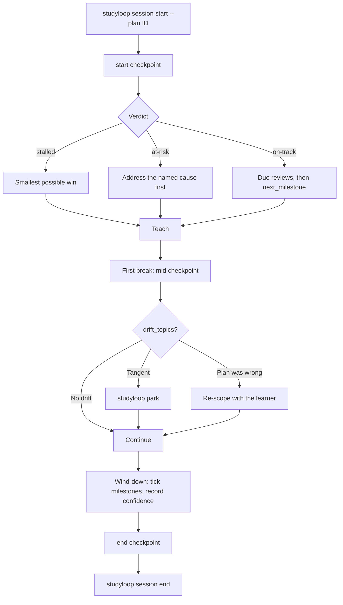
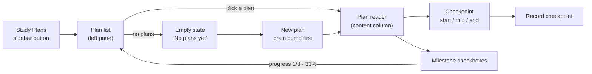

# Study Plans

A study plan is a structured Markdown document that says **why** you are
learning something, **what** counts as done, and **which** checkable steps get
you there. StudyLoop then evaluates it against what you actually did — at the
start of a session, mid-session, and once the session ends.

The `study-plan-architect` agent builds plans with you through an interview. The
Socratic mentor reads them during sessions. Both go through `studyloop plan`.

## File-first, index-second

The Markdown document is the source of truth:

```
<state_dir>/study-plans/<plan-id>.md      # default: ~/.local/share/studyloop/study-plans
```

Override with `STUDYLOOP_PLANS_DIR`. Find the active directory with
`studyloop plan path`.

The sessions DB holds two things, added by `agent-session-tools` migration 26:

| Table | Kind | Rebuildable? |
|---|---|---|
| `study_plans` | Derived index — the queryable projection used by the web UI and the `now` decision engine | Yes — `studyloop plan reindex` |
| `study_plan_checkpoints` | Append-only evaluation log, keyed to `study_sessions.study_id` | No — this is durable history |

The consequence that matters: **losing the database never loses a plan.** The
documents are plain files, so they are diffable, greppable, and editable without
StudyLoop running. Checkpoint history is deliberately kept when a plan is
deleted, and carries no foreign key on `study_id` so it outlives session pruning
(see [Session-DB Tiering](session-db-tiering.md)).

## The document format

```markdown
---
id: ship-a-glue-etl-job
title: Ship a Glue ETL Job
status: active
created: 2026-08-01T09:00:00+00:00
updated: 2026-08-03T18:30:00+00:00
topics:
  - data-engineering
  - python
energy_floor: 4
target_date: 2026-09-30
review_cadence_days: 5
---

# Ship a Glue ETL Job

## Mission

### Why

Own the nightly customer-events pipeline without pairing.

### Success looks like

- Deploy a Glue job unaided
- Explain the job bookmark to a colleague

### Constraints

- 4 evenings a week, 30 minutes each

### Out of scope

- EMR tuning

## Milestones

- [x] **Understand Glue job anatomy** — read the dev guide first `(concepts: glue job, job bookmark)`
- [ ] **Write the transform** `(concepts: dynamicframe)`
- [ ] **Schedule and monitor it** `(concepts: cloudwatch)`

## Learning Records

### LR-0001 — Bookmarks are per-job, not per-run

Assumed a bookmark tracked each run. It tracks the job. Explains why the
re-run processed nothing.

## Resources

- [Glue dev guide](https://docs.aws.amazon.com/glue/) — primary source

## Checkpoints

| When | Phase | Verdict | Summary | Session |
| --- | --- | --- | --- | --- |
| 2026-08-03T18:00:00+00:00 | start | on-track | 33% complete and moving. | abc-123 |

## Notes

Prefers diagrams over prose.
```

### Frontmatter

| Field | Meaning |
|---|---|
| `id` | Plan id; also the filename stem |
| `status` | `draft`, `active`, `paused`, `complete`, `abandoned` |
| `topics` | Join key for spaced repetition and session matching |
| `energy_floor` | Minimum energy (1-10) this plan needs; below it, review instead |
| `target_date` | Optional. Leave blank rather than inventing one — a fake date produces a fake `at-risk` verdict |
| `review_cadence_days` | How often the plan itself should be re-checked |

### Why `(concepts: ...)` matters

That suffix is the join key against `study_progress`. It is what lets an
evaluation distinguish a milestone that was **learned** from one that was merely
**ticked**: if a milestone is marked done but none of its concepts carry
confidence evidence, the plan is flagged `at-risk` with the milestone named.

Omit the concepts and that check silently stops working — the plan keeps looking
healthy while drifting from reality. This is the single most valuable line of
metadata in the document.

### Empty sections

Unfilled sections render an explicit italic placeholder (`_No notes._`) rather
than vanishing, so a gap is visible in the UI. The parser reads those
placeholders back as *absent*, so an empty plan is never mistaken for a
populated one. Round-trip fidelity is a tested invariant: saving a plan you have
not changed rewrites the file byte-for-byte identically.

## The three checkpoints



| Phase | When | Question it answers |
|---|---|---|
| `start` | Before the first teaching turn | Is this still the right thing, and what is next? |
| `mid` | At the first natural break | Is this session drifting off the plan? |
| `end` | During wind-down | What moved, and what does the plan owe next time? |

`studyloop session start --plan ID` and `studyloop session end` record the
`start` and `end` checkpoints automatically, so a session against a plan cannot
begin without first checking the plan against reality. Both are best-effort: a
broken plan document produces a warning, never a blocked session.

### Evidence sources

Evaluation reads both table families in `sessions.db`:

| Family | Tables | Used for |
|---|---|---|
| StudyLoop (active-learning store) | `study_progress`, `study_sessions` | Per-concept confidence, due reviews, struggle signal, session cadence |
| Session-DB (conversation archive) | `messages`, `messages_fts` | What was actually discussed, recurring questions, drift detection |

Every reader is individually guarded. A missing table becomes a `warnings` entry
and a **partial** evaluation rather than an exception — normal on a fresh
install.

### Verdicts

| Verdict | Means | Do |
|---|---|---|
| `on-track` | Progressing, nothing contradicting | Continue with `next_milestone` |
| `at-risk` | Struggle signal, milestones ticked without evidence, or the target date is slipping | Address the named cause before new material |
| `stalled` | No plan activity for 14+ days | Smallest possible win; consider re-scoping |
| `complete` | Every milestone ticked | Close the plan, or extend with a follow-on mission |

An `at-risk` verdict describes the *plan*, never the learner.

## How a plan drives Today — not implemented

!!! warning "Plans do not influence `studyloop now` / the Today card yet"
    **Checked against `learning/decision.py` on 2026-08-22: it contains no reference to study plans at all.** No plan candidate source, no on-plan bias, no `plan_id` in the `now` metadata, and no "From study plan:" rendering in the Today card. An active plan changes nothing about what Today recommends.

    The design below is the intended integration, kept because the score-band reasoning is the substantive part and re-deriving it would be waste. Read it as a specification, not as behaviour.

    What *does* work today: a plan drives a session through its [three checkpoints](#the-three-checkpoints) (`studyloop session start --plan ID`) and through `studyloop plan evaluate`. Those are real. Today's recommendation is assembled from the heuristic sources in the table below, plan or no plan.

### The intended design

Checkpoints answer "is this plan on track?". The `now` decision engine
(`learning/decision.py`) answers the adjacent question — "so what do I do in the
next 25 minutes?" — and an active plan is what should make that answer a **plan
step** rather than a guess assembled from whatever the databases happen to hold.

Two mechanisms, both to be skipped entirely when no plan is `active`:

**1. The plan as a candidate source.** Each active plan contributes one
candidate per concept of its `next_milestone()` — the first unchecked milestone,
i.e. the zone of proximal development. A milestone with no `(concepts: ...)`
suffix would still contribute, falling back to its title, so an untagged plan is
never silently dropped. These candidates would carry `source =
study_plan:<plan-id>:<milestone-slug>` and a reason quoting the plan's mission.

**2. The plan biases every other source.** Due cards, struggle repairs, and
continuity threads that the plan's topics or concepts claim get boosted;
everything else is nudged down. So a due review *that is plan work* still wins —
correctly, because it is on-plan — while an unrelated backlog cannot bury the
plan.

### Score bands

The boost has to be sized against the bands the heuristic sources already occupy
— too small and the plan silently loses to a pile of due cards, which looks
identical to having no plan integration at all:

| Source | Score | Meaning | Status |
|---|---|---|---|
| `_due_progress_candidates` | 100–190 | 100 + days overdue (max 30) + confidence bonus (+35 struggling / +15 learning) + 25 for a weak teach-back | **live** |
| **plan next milestone** | **120** | the committed next step | **not implemented** |
| `_due_card_candidates` | 96–116 | "N spaced-repetition cards are due" | **live** |
| `_struggle_candidates` | 70–124 | recorded struggling (82) or learning (70), plus up to +42 for a weak teach-back | **live** |
| `_continuity_candidates` | 58 | last session's open threads | **live** |
| `_transfer_candidates` | 52 | weak prerequisite links | **live** |
| `_practice_candidates` | 48 | a practice file exists | **live** |

Every **live** row above was read off `learning/decision.py` and is accurate. The
plan row is the design target.

The proposed bias is `+20` on-plan / `−10` off-plan, deliberately the same
magnitude as the `studyloop focus` filter, which really does apply `+22`/`−12`
(`decision.py`, in `_score_candidates`) — because it is the same kind of signal:
a declared attention boundary.

The intended outcome: **120 clears the entire due-card band**, so a queue of 20
cards can never outrank the step you committed to — but a concept that is
genuinely decaying (20+ days overdue, or recorded as struggling) still wins,
because evidence of *forgetting* outranks the plan while a queue length does
not.

### Provenance (intended)

The winning action would carry `metadata.plan_id`, `metadata.plan_title`, and
`metadata.milestone` through the `now` JSON contract, and the Today card would
render **From study plan: `<title>` · `<milestone>`** so the recommendation is
never unexplained. None of these keys are emitted today.

### With no active plan

Nothing changes — which is the situation for every plan right now. A plan is
never mandatory: with no `active` plan, no candidates are added, no scores are
adjusted, and Today behaves exactly as it did before. The intended design also
includes a fallback for an active plan with *no* milestones, or with every
milestone ticked, replacing the generic "one tiny recall loop" starter with a
plan-shaped prompt (break the mission into milestones / close out the plan);
that fallback is also not implemented.

## CLI

```bash
studyloop plan list [--status active] [--json]
studyloop plan show ID [--markdown] [--json]
studyloop plan interview [--json]          # questions + evidence-based seeds
studyloop plan new --title T --why W --success S --topic T --milestone "M (concepts: a)"
studyloop plan status ID active            # refused while unevaluable
studyloop plan evaluate ID --phase start|mid|end [--record] [--study-id X] [--json]
studyloop plan milestone ID INDEX --done/--undone
studyloop plan reindex                     # rebuild the derived index
studyloop plan path                        # where documents live

studyloop session start -t "topic" --plan ID   # records a start checkpoint
studyloop session end                          # records an end checkpoint
```

`studyloop plan status ID active` and `plan new --activate` exit non-zero and
print the blockers when the plan has no mission, no success criteria, or no
milestones.

## REST API

| Method | Path | Purpose |
|---|---|---|
| `GET` | `/api/plans` | List plan summaries; `?status=` filters |
| `GET` | `/api/plans/interview` | Interview questions + evidence-based seed |
| `GET` | `/api/plans/{id}` | Parsed structure, raw Markdown, and readiness |
| `GET` | `/api/plans/{id}/markdown` | Raw document as `text/plain` |
| `GET` | `/api/plans/{id}/history` | Durable checkpoint log from the DB |
| `GET` | `/api/plans/{id}/evaluate?phase=` | Evaluate **without** recording — safe to poll |
| `POST` | `/api/plans/{id}/evaluate` | Run and record a checkpoint (`201`) |
| `POST` | `/api/plans` | Create from `{title, answers}` or `{markdown}` (`201`) |
| `PATCH` | `/api/plans/{id}` | Update metadata, milestones, or the whole document |
| `POST` | `/api/plans/{id}/milestones/{index}/toggle` | Flip one milestone |
| `DELETE` | `/api/plans/{id}` | Delete the document; checkpoint history is retained |

`PATCH` with `{"status": "active"}` returns **422** with `blockers` when the plan
is not ready, and leaves the status unchanged. Plan ids are validated against
path traversal before any filesystem access.

## MCP tools — not implemented

!!! warning "There are no `plan_*` MCP tools"
    This page previously listed `plan_list`, `plan_get`, `plan_interview`, `plan_create`, `plan_evaluate`, `plan_set_milestone` and `plan_set_status` as available. **None of them are registered.** `mcp/tools.py` exposes no plan tool, so an agent asking for one gets an unknown-tool error.

    Those names *do* exist as CLI functions in `cli/_plan.py`, which is probably how the list was written. They are not reachable over MCP.

    Until they are added, an MCP agent should reach study plans the same way any script does: shell out to [`studyloop plan …`](#cli), or call the [REST API](#rest-api) directly. Both are complete, including the activation refusal.

Exercises, by contrast, *do* have MCP tools — see [Topic Exercises § MCP tools](topic-exercises.md#mcp-tools).

## Web UI

The study-plan panel shipped on 2026-08-22. Everything in this section is in the
browser today; the plan → Today integration described [above](#how-a-plan-drives-today-not-implemented) is not.



### The plan list (left pane)

A **Study Plans** button in the sidebar opens a list of existing plans under the
heading *Existing plans*. Each entry shows the plan title, its status chip
(`draft` / `active` / `paused` / `complete` / `abandoned`), a `done/total`
milestone count, and a progress bar. Clicking one opens it in the content column.

With no plans, the list renders an explicit empty state — **"No plans yet"**, and
a hint naming the next action ("Open **New plan** and describe where you are and
where you want to get to, in your own words. The structure comes after."). A
brand-new user's first screen is never a silent blank list.

The list and the reader live in disjoint DOM subtrees, so they share
`Alpine.store('plans')` rather than an `x-data` — which is why ticking a
milestone in the reader moves the counter in the sidebar.

### The reader

The content column renders the plan document through the same
`marked → DOMPurify → highlight.js / mermaid` pipeline as the Course Explorer, so
headings, GFM task lists, the checkpoint table, inline code, links and mermaid
diagrams all render as real DOM. Frontmatter is stripped from the render — it is
metadata, already surfaced as header chips (title, status, `done/total · pct%`
and a progress bar).

### Creating a plan: the brain dump comes first

**New plan** opens a form headed *Start from where you actually are*. The primary
field is a large free-text box — *"Where are you now, and where do you want to get
to?"* — that takes typing or macOS dictation with no structure required: what you
are aiming for, what you have already tried, where you get stuck.

Below it, under *The plan itself*, are the five structured fields the API
consumes: **Title**, **Why**, **Success looks like**, **Topics**, and
**Milestones** (the last three one item per line; a milestone line's trailing
`(concepts: a, b)` is parsed into a concept list). They are labelled as the
editable *result*, not the input of first resort — "Nothing here has to be right
first time — edit whatever comes back."

The reason is not cosmetic. A blank five-field form asks a learner to supply the
decomposition they do not yet have — the exact paralysis this tool exists to
prevent. Recognising and correcting a draft is dramatically cheaper than
recalling and synthesising one. The brain dump is carried through on create as
the plan's `notes`, so the reasoning survives the plan's creation, and the
[`study-plan-architect` agent](#agents) is what turns a dump into structured
fields — not the browser.

On create the new plan is loaded and shown immediately.

### Evaluation and checkpoints

A **Checkpoint** toolbar over the document runs the three phases —
**start**, **mid**, **end** — against `GET /api/plans/{id}/evaluate?phase=`,
which previews **without** recording. The result panel shows:

- the **verdict** as a coloured chip (`on-track` / `at-risk` / `stalled` / `complete`),
- the phase it describes,
- a one-line **headline**,
- **Do next** — the recommendations, as an ordered list.

**Record checkpoint** then POSTs the same phase to `/api/plans/{id}/evaluate`,
which appends the row to the plan's Checkpoints table and writes the durable
log entry. A short *Recorded …* status appears next to the button. Recording
deliberately waits for an in-flight preview to land first, so the phase recorded
and the verdict displayed always describe the same checkpoint.

### Milestones and activation

Milestone checkboxes are interactive. A toggle is **not** optimistic: it POSTs to
`/api/plans/{id}/milestones/{index}/toggle`, then re-reads the document, so the
rendered `- [x]` and the counts cannot drift apart and the state survives a
reload. The header progress and the sidebar entry both move — `0/3` becomes
`1/3 · 33%` in both places.

**Activate** patches the status. Activating a plan that is not ready is
**refused** by the server with `422`, and the panel surfaces the returned
`blockers` under *Blocking activation* (missing mission, success criteria or
milestones) rather than swallowing the failure. That is the same refusal
`studyloop plan status ID active` gives at the CLI.

!!! note "No 'Copy for agent' button"
    An earlier version of this page listed a **Copy for agent** action that
    copied the evaluation Markdown. **It does not exist** — no such control is in
    the markup. To hand an evaluation to an agent, use
    `studyloop plan evaluate ID --phase start --json`, or fetch
    `GET /api/plans/{id}/evaluate?phase=start`.

## Agents

| Harness | Agent | Start with |
|---|---|---|
| Claude Code | `study-plan-architect` | `/agent study-plan-architect` |
| Kiro CLI | `study-plan-architect` | `kiro-cli chat --agent study-plan-architect` |
| Gemini CLI | `study-plan-architect` | auto-detected |
| OpenCode | `study-plan-architect` | Tab to switch agent |
| Codex / pi / omp | `AGENTS.md` | Study Plans section |

Install with `studyloop install agents`. The shared methodology lives in
`agents/shared/study-plan-protocol.md`.

## Lineage

The plan shape is adapted from Matt Pocock's
[`teach` skill](https://github.com/mattpocock/skills/tree/main/skills/productivity/teach):
mission-first, learning records as ADRs for learning, and primary sources over
recalled knowledge.

The deliberate difference: `teach` uses a multi-file workspace (`MISSION.md`,
`learning-records/`, `RESOURCES.md`, `lessons/`). StudyLoop collapses that into
**one document per plan** so it renders as a single page in the web UI, stays
diffable in git, and can be evaluated as a unit against the databases.

## Troubleshooting

| Symptom | Cause | Fix |
|---|---|---|
| A plan does not appear | Wrong plans directory | `studyloop plan path` — check `STUDYLOOP_PLANS_DIR` |
| Web UI list is stale | Derived index out of date | `studyloop plan reindex` |
| `... unavailable — evaluation is partial` | Study tables missing on a fresh install | Run a session and record progress; the warning clears once evidence exists |
| Milestones never flagged as unverified | No `(concepts: ...)` on milestones | Add concepts — that is the evidence join key |
| Cannot activate a plan | Missing mission, success criteria, or milestones | Read the printed blockers; `studyloop plan show ID` lists them |
| One plan missing from the list | That document failed to parse | It is skipped with a warning; check its frontmatter is valid YAML |
