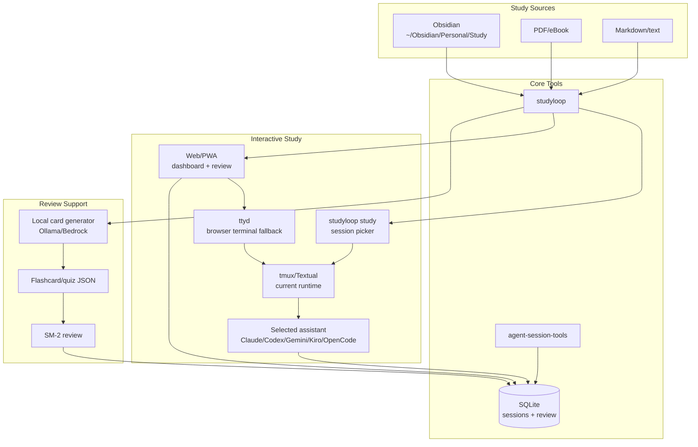
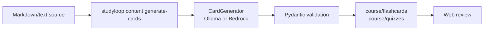
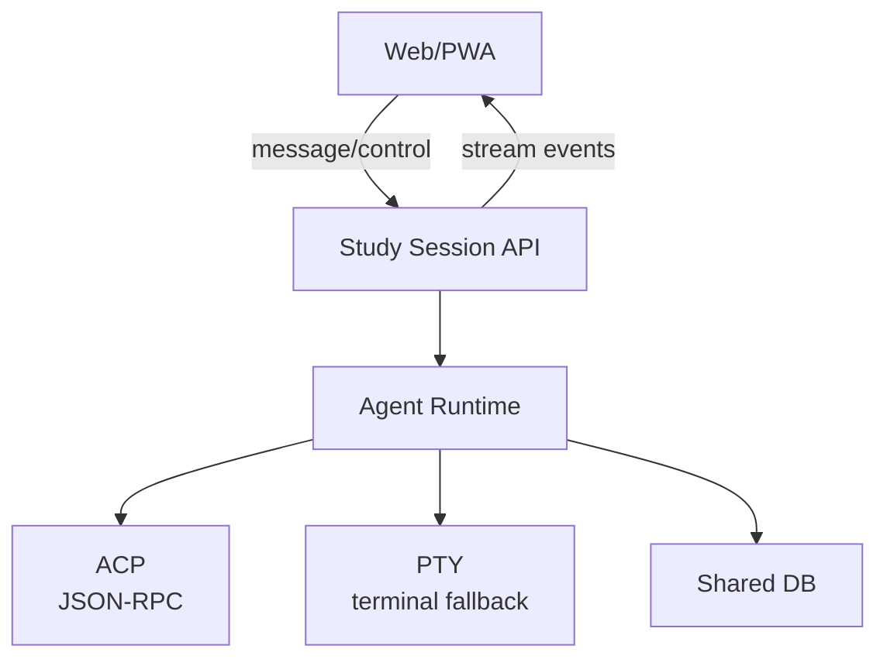

# System Overview

This page explains how the active system fits together from a user and operator perspective.

For deeper diagrams, see:

- [Current Architecture](architecture/current.md)
- [Target Architecture](architecture/target.md)
- [Web UI Guide](web-ui-guide.md)
- [Repository Standards](standards/repo-standards.md)

## Big Picture



## Primary Workflow: Interactive Study

The main workflow is live interaction with a mentor agent.


The shared DB matters because it lets the agent adapt using evidence:

- recurring struggle topics
- previous study sessions
- code-assistant sessions imported from other tools
- wins and progress
- spaced repetition state
- parked topics

## Supporting Workflow: Local Review Artefacts

Flashcards and quizzes support study, but they are not the product centre.

```bash
studyloop content generate-cards ~/Obsidian/Personal/Study/Python --course python
studyloop web
```



NotebookLM is not required for this workflow.

## Presentation Model

Current:

- tmux + assistant CLI for live interaction
- Textual sidebar for timer/activity
- Web dashboard for session state
- ttyd for browser terminal access

Target:

- Web/PWA live session panel as primary learner UI
- ACP transport where available
- PTY transport fallback where ACP is not available
- ttyd retained until the web session layer can fully replace it
- macOS/iOS apps use the same local API later



## Data Stores

| Store | Purpose |
|---|---|
| SQLite `sessions.db` | study sessions, progress, review state, imported assistant sessions |
| IPC files | current live session state for sidebar/dashboard |
| `content.base_path` | generated flashcard and quiz JSON |
| assistant session dirs | per-agent local conversation state |

## Optional Integrations

Optional integrations should be plugins, not core requirements:

- NotebookLM for audio/video artefacts if retained
- OCR/image parsing
- Office document parsing
- website scraping
- autoagent prompt/agent evaluation
- native macOS/iOS clients
