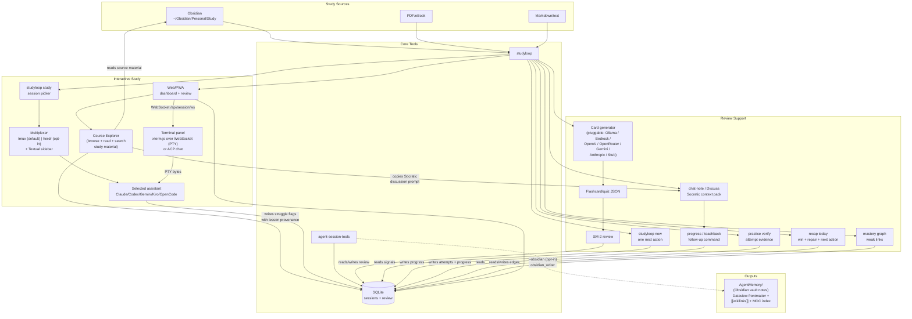
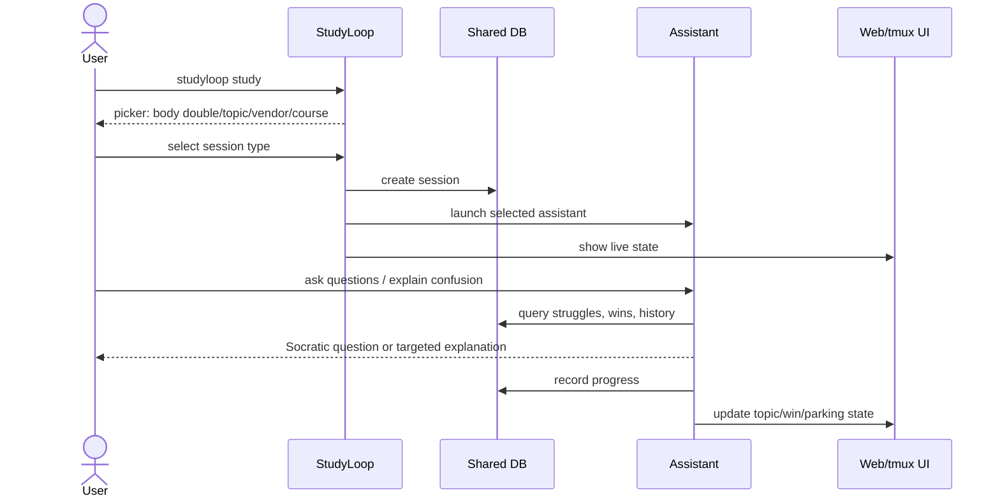
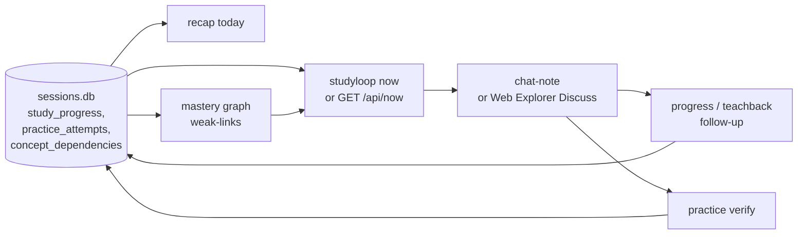
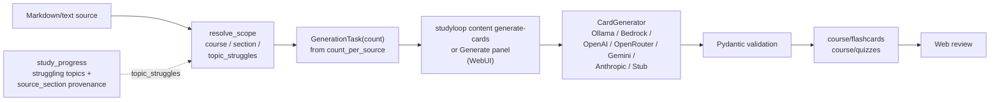
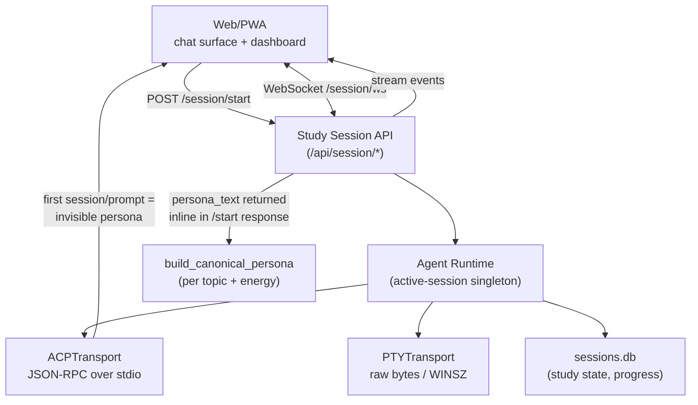

# System Overview

This page explains how the active system fits together from a user and operator perspective.

For deeper diagrams, see:

- [Current Architecture](architecture/current.md)
- [Target Architecture](architecture/target.md)
- [Web UI Guide](web-ui-guide.md)
- [Repository Standards](standards/repo-standards.md)

## Big Picture



## Primary Workflow: Interactive Study

The main workflow is live interaction with a mentor agent.



The shared DB matters because it lets the agent adapt using evidence:

- recurring struggle topics
- previous study sessions
- code-assistant sessions imported from other tools
- wins and progress
- spaced repetition state
- parked topics

## Supporting Workflow: Active Learning Decisions

The fastest path from "I have notes" to "I am learning" is the active-learning
loop. `studyloop now` chooses one useful action; the companion and practice
commands help record evidence; recap and mastery make the evidence visible
again.

```bash
studyloop now --energy medium --time 20
studyloop chat-note ~/Obsidian/Personal/Study/Python/decorators.md --mode trace
studyloop practice verify decorators-practice.json --task 1 --notes "what passed"
studyloop recap today --speak --audio-file recap.wav
studyloop mastery weak-links --topic python
```



This is deliberately small. The recommendation engine returns one primary
action plus at most two alternates, so it supports task initiation rather than
creating another menu to manage.

## Supporting Workflow: Local Review Artefacts

Flashcards and quizzes support study, but they are not the product centre.

```bash
studyloop content generate-cards ~/Obsidian/Personal/Study/Python --course python
studyloop web
```



The producer side is **pluggable**: a `ProviderProfile` registry plus two generic HTTP adapters (OpenAI Chat Completions and Anthropic Messages), with Bedrock and Ollama as first-class registry entries, cover six providers via registry rows. Adding a new provider is a registry edit, not new code. Auth credentials resolve **encrypted store first** (`~/.config/studyloop/secrets.bin`, written by the **Settings → LLM Providers** panel after a live verification), then a project-root `.env` (auto-loaded via `python-dotenv`); models are curated per-provider with cost-tier and thinking-flag annotations. The web Generate panel reports the requested `count_per_source`, resolved provider, and model in the job plan/progress view. See [Content Pipeline § Pluggable Provider Abstraction](content-pipeline.md#pluggable-provider-abstraction).

NotebookLM is not required for this workflow.

## Presentation Model

Current:

- tmux + assistant CLI for live interaction, behind a multiplexer abstraction
  (`multiplexer.py`; **tmux is the default**, herdr opt-in via
  `STUDYLOOP_MULTIPLEXER=herdr`)
- Textual sidebar for timer/activity
- Web dashboard for session state
- Browser terminal via **xterm.js over a WebSocket** (PTY), or **ACP chat** for
  structured-event agents

Target:

- Web/PWA live session panel as primary learner UI
- ACP transport where available
- PTY transport fallback where ACP is not available
- herdr as the default multiplexer once its journey suite is green
- macOS/iOS apps use the same local API later

The ttyd browser surface is **already gone** ([ADR-0005](adr/0005-retire-ttyd-browser-surface.md)).
It was removed as part of the PTY refresh work: a page reload no longer kills a
live session — the server holds a disconnected session in a detach grace window
(90 s by default) — and the console re-adopts that session on load, restoring
the terminal automatically. If a reload leaves an empty pane, the usual cause is
a grace window that expired; see
[the troubleshooting entry](troubleshooting.md#the-terminal-is-empty-after-a-page-refresh).
The ttyd **server** transport
(`STUDYLOOP_TRANSPORT=ttyd`, the `/terminal/` proxy) is retained for maintainers,
but a session started that way has no browser renderer and reports `unavailable`.



**Persona delivery — different per transport.** On the PTY path the persona is written to a temp file and embedded in the agent's launch command. On the ACP path (added 2026-05-28) the persona text is returned inline in the `/api/session/start` response and the browser ships it as the first invisible `session/prompt` after the WebSocket opens — ACP agents have no argv/env hook for system context, the prompt channel is the only injection point. The browser hides it from the chat (no user bubble, no assistant ack scrolls past) and shows a brief "Setting up your mentor…" banner instead.

## Data Stores

| Store | Purpose |
|---|---|
| SQLite `sessions.db` | study sessions, `study_progress`, review state, `practice_attempts`, `concept_dependencies`, imported assistant sessions |
| SQLite `explorer_fts.db` | derived lesson full-text index (rebuildable cache, separate from `sessions.db`, no migration) |
| IPC files | current live session state for sidebar/dashboard |
| `content.base_path` | source study material (markdown/text) + generated flashcard and quiz JSON |
| assistant session dirs | per-agent local conversation state |

## Optional Integrations

Optional integrations should be plugins, not core requirements:

- NotebookLM for audio/video artefacts if retained
- OCR/image parsing
- Office document parsing
- website scraping
- autoagent prompt/agent evaluation
- native macOS/iOS clients
