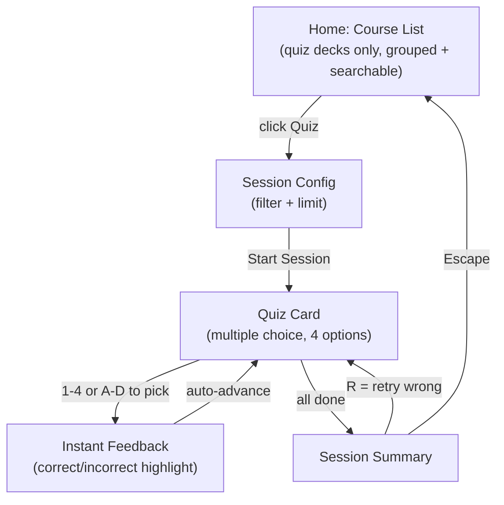
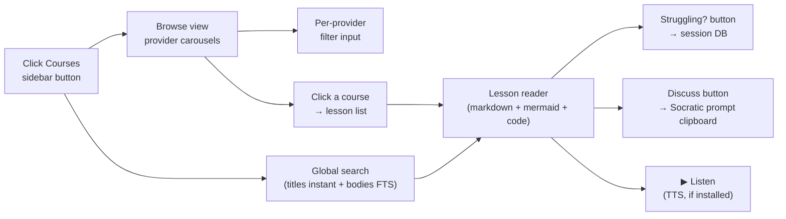
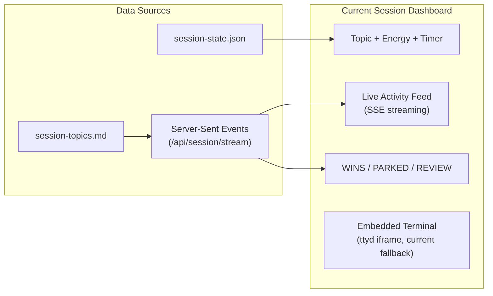
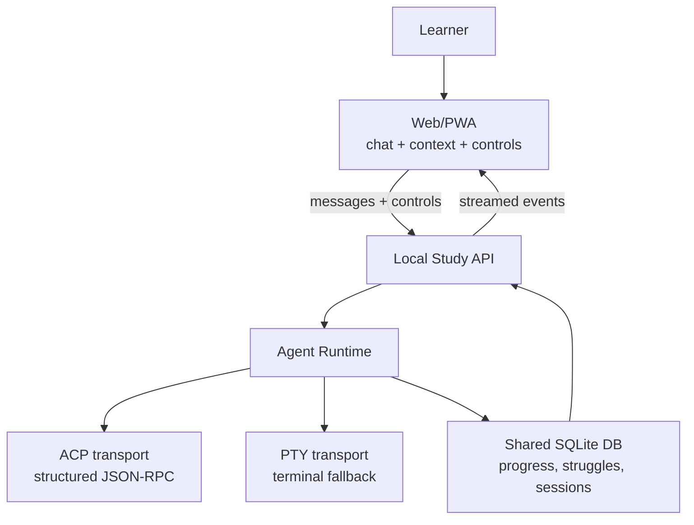
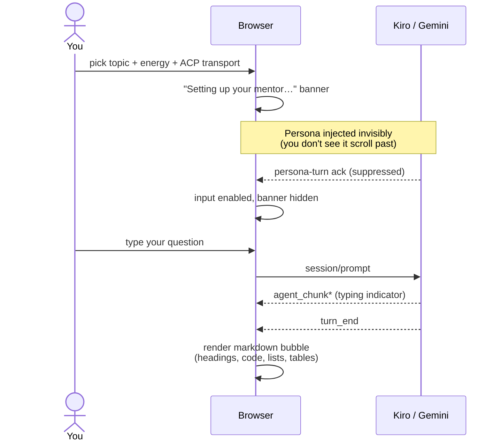
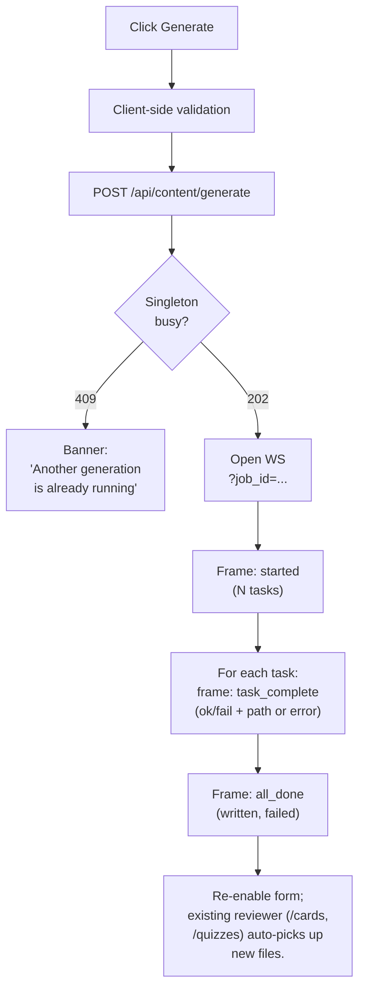
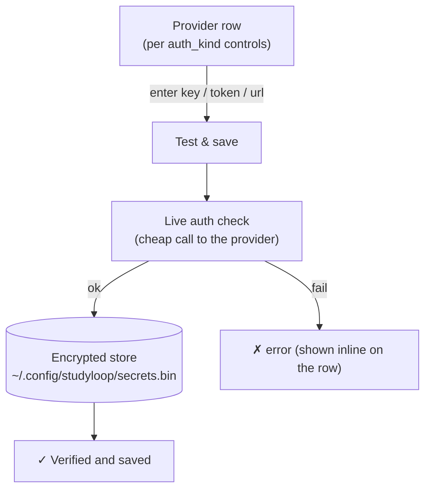

# Web UI Guide

> The web interface is the primary direction for learner-facing study: live interactive mentor sessions, body-doubling, session state, and supporting flashcards/quizzes.

---

## Starting the Web UI

```bash
studyloop web                        # localhost:8567
studyloop web --lan                  # LAN-accessible with auto-generated password
studyloop web --lan --password SECRET  # LAN with explicit password
studyloop web -p 9000                # custom port
```

Open your browser to `http://localhost:8567`. The PWA is installable; add it to your home screen on mobile for review and session visibility.

!!! note "Core workflow"
    The core workflow is interactive study with an agent. Flashcards and quizzes are useful support tools, but the web UI should increasingly serve the live mentor/body-doubling experience.

---

## Flashcard Review


### The course list (scales to 100+ sets)

The **Flashcards** and **Quizzes** panels are **mode-specific**: the Flashcards
panel lists only courses that have flashcards (with a single **Flashcards**
action per row); the Quizzes panel lists only courses with quiz questions (with
a single **Quiz** action). Each label means exactly what it says — neither panel
shows the other's button.

Courses render as **compact one-line rows** grouped under **collapsible publisher
headers** (e.g. `ARJANCODES (1)`, `CODEWITHMOSH (3)`), derived from the
`publisher/course` folder layout. A **search box** at the top filters by course
name instantly. This keeps the list usable as your library grows to hundreds of
sets: collapse the publishers you're not studying, type to filter, and each row
is far denser than the old cards.

- **Search** — type any substring of a course name; non-matching rows hide, and a
  publisher group with no matches disappears entirely. Clear the box to restore all.
- **Collapse/expand** — click a publisher header to fold its courses away; the
  collapsed state is per-group and persists while you browse (resets on reload).
- **Row meta** — each row shows the card count, a **due** badge when cards are
  due, and a **mastered** count once you've reviewed.

### Walkthrough

1. **Home screen** — shows courses grouped by publisher with a search box and
   per-row due-count badges. A 90-day activity heatmap below shows your study
   consistency.

2. **Pick a course** — click the **Flashcards** button on a course row. If the
   course has multiple chapters, you'll see a filter dropdown to select specific
   chapters and a card limit picker.

3. **Study cards** — each card shows the front (question). Press **Space** or **Enter** to flip and reveal the answer.

4. **Mark your answer**:
   - **Y** or click the green button — Correct (SM-2 interval increases)
   - **N** or click the red button — Incorrect (interval resets to 1 day)
   - **S** or click Skip — skip this card (no SM-2 update)

5. **Session summary** — shows your score (correct/incorrect/skipped), total time, and a per-card breakdown. Press **R** to retry only the cards you got wrong.

6. **Return home** — press **Escape** at any time.

### Keyboard Shortcuts (Flashcard Mode)

| Key | Action |
|-----|--------|
| Space / Enter | Flip card |
| Y | Mark correct |
| N | Mark incorrect |
| S | Skip card |
| T | Read card aloud (in-browser neural TTS) |
| V | Toggle auto-voice (reads every card) |
| Escape | Return to home |

> Voice uses an in-browser neural model (Kokoro via WebGPU/WASM) — no text leaves the browser. See [Voice Output § Web PWA Voice](voice-output.md#web-pwa-voice-in-browser-neural-tts).

---

## Quiz Mode



The Quizzes panel uses the same grouped, searchable, compact course list as the
Flashcards panel (see [The course list](#the-course-list-scales-to-100-sets)) —
but lists only decks that have quiz questions, with a single **Quiz** action per row.

### Walkthrough

1. **Pick a course** — click the **Quiz** button on a course row.

2. **Answer questions** — each card shows a question with 4 multiple-choice options. Press **1-4** or **A-D** to select your answer. Correct answers highlight green; wrong answers highlight red with the correct answer shown.

3. **Summary** — same as flashcard mode. Press **R** to retry wrong answers.

### Keyboard Shortcuts (Quiz Mode)

| Key | Action |
|-----|--------|
| 1-4 or A-D | Select answer option |
| T | Read question aloud |
| V | Toggle auto-voice |
| Escape | Return to home |

---

## Course Explorer

The **Course Explorer** is a persistent side panel (a third layout column) opened by the **Courses** button in the sidebar. It is independent of the Flashcards and Quizzes review panels — it is a reading surface for your source study material, not a review surface for generated decks.



### Walkthrough

1. **Open the panel** — click the **Courses** button in the sidebar. The layout gains a third column (320 px). Click again, or the × in the panel header, to close. The panel is hidden on screens narrower than 600 px.

2. **Browse by provider** — the browser view shows one horizontal carousel row per provider (top-level directories under `content.base_path`). Each carousel card shows the course name and provider. Use the **filter** input on a provider row to narrow by course name; use the **‹** / **›** buttons to scroll the carousel.

3. **Open a course** — click any course card. A lesson list expands below the carousel showing every source file in that course (`.md`, `.markdown`, `.txt`), numbered in file-system order.

4. **Read a lesson** — click any lesson in the list. The reader view renders the lesson's markdown: headings, lists, code blocks (syntax-highlighted via highlight.js), and mermaid diagrams (two-pass render via mermaid v11.4.1). YAML frontmatter is stripped before rendering. A back arrow returns to the browser view.

5. **Search** — type in the **Search lessons…** box (visible in browser view). Results appear grouped by provider. Two tiers run in parallel:
   - **Fuse.js** (client-side, vendored v7.0.0) — instant fuzzy match over provider/course/lesson titles.
   - **SQLite FTS5** (server-side, debounced) — full-text search over lesson bodies via `GET /api/explorer/search`. Porter-stemmed, BM25-ranked with title weighted higher than body, returns snippet excerpts with `<mark>` highlights. The FTS index (`explorer_fts.db`) is built lazily on first search and refreshed incrementally on each call.

   Click any result to open that lesson directly in the reader.

6. **Mark a struggle** — while reading a lesson, click the **Struggling?** button in the reader header. This writes a `study_progress` row (`confidence='struggling'`) to the session DB via `POST /api/history/struggling-topics`. The row uses the lesson slug as the generation topic and keeps the original course/section/publisher as provenance, so the next Generate session's "Topic I'm struggling on" scope targets the struggled lesson rather than the whole course. It also surfaces in `studyloop struggles`.

7. **Discuss the lesson** — click **Discuss** to open the in-app note companion. Pick recall, diagram, trace, teach-back, or repair mode; write a rough retrieval attempt; then use **Next nudge** or copy the mentor prompt/evidence command. This stays browser-local and does not send lesson text to a separate chat backend.

8. **Listen (TTS)** — the **▶ Listen** button appears only when `window.ttsEngine` is present. When the engine is absent the button is hidden and no-op. When active, click to start reading the lesson aloud; the button becomes **⏹ Stop**.

### Endpoints called

| Endpoint | Purpose |
|---|---|
| `GET /api/explorer/tree` | Provider→course tree (cached by visible tree fingerprint on server) |
| `GET /api/explorer/courses/{course_id}/lessons` | Lesson list for a course (`course_id` = `provider/course`) |
| `GET /api/explorer/lesson/{lesson_id}/content` | Raw markdown for a lesson (`lesson_id` = `provider/course/slug`) |
| `GET /api/explorer/search?q=&limit=20` | FTS5 full-text search over lesson bodies |
| `POST /api/history/struggling-topics` | Write a struggle flag to `study_progress` |

The **Discuss** action does not call a backend endpoint; it builds the prompt in the browser from the already-loaded lesson and writes only to the clipboard when you click a copy button.

All content endpoints are path-traversal guarded (resolved path must be a child of `content.base_path`; suffix restricted to `.md`, `.markdown`, `.txt`). The provider/course tree cache is keyed from the visible source tree, so adding or deleting nested courses refreshes the browser data while generated output folders do not invalidate the tree. The FTS index lives in its own file (`<session_db_dir>/explorer_fts.db`) — it is a derived cache, never touches `sessions.db`, and requires no schema migration.

---

## Mastery

The **Mastery** tab renders the same concept dependency data as `studyloop mastery`.

1. Enter a topic, such as `python`, `sql`, or `data-engineering`.
2. Click **Refresh** to load `/api/mastery/graph` and `/api/mastery/weak-links`.
3. Inspect the Mermaid graph, weak-link cards, and summary counts.
4. Use **Copy Mermaid** when you want to paste the graph into Obsidian.

The Web UI requests a bounded JSON graph by default (`limit=80`) and builds the
Mermaid source locally, so broad topics such as `python` stay readable and do
not trigger duplicate graph API calls. The summary shows when the browser is
displaying a subset.

| Endpoint | Purpose |
|---|---|
| `GET /api/mastery/graph?topic=python&limit=80` | JSON graph with nodes, edges, and total/limited metadata |
| `GET /api/mastery/graph?topic=python&format=mermaid&limit=80` | Mermaid graph source for the bounded graph |
| `GET /api/mastery/weak-links?topic=python&limit=12` | Struggling or low-score prerequisites with total/limited metadata |

---

## Live Interactive Sessions

When you start a study session with `--web`, the dashboard provides a real-time view of your session from any device:

```bash
studyloop study "Python Decorators" --energy 7 --web
```

### Accessing the Dashboard

- **Local**: `http://localhost:8567/session`
- **LAN** (with `--lan`): `http://<your-ip>:8567/session` (password-protected)

The LAN URL and password are printed to the terminal at session start.



### Current Dashboard Sections

**Header** — shows the study topic, energy level (as a `/10` badge), and a live timer matching the sidebar.

**Activity Feed** — real-time stream of topics as the agent logs them. Updates via SSE (Server-Sent Events) with no page refresh needed. Each entry shows the topic name, status icon, and note.

**Counter Bar** — WINS, PARKED, and REVIEW counts updated live.

**Embedded Terminal** — the ttyd terminal panel shows your tmux session, letting you interact with the agent from the browser. This is currently the main browser-based way to ask questions and have a live mentor conversation.

## Target Session Presentation

The target web UI should support live agent interaction without requiring a terminal emulator for the normal learner path.



### Target Session Controls

The web UI should expose structured controls:

- start session
- choose assistant
- ask a question
- stream agent response
- interrupt/cancel current turn
- park topic
- mark win
- mark struggle
- show recent struggles and wins from the DB
- end and summarize session
- resume previous session

Example target request:

```http
POST /api/sessions
Content-Type: application/json

{
  "topic": "Spark partitioning",
  "mode": "study",
  "agent": "kiro",
  "energy": 5,
  "transport": "auto"
}
```

Example target event:

```json
{
  "type": "agent_message_chunk",
  "content": "What do you already know about partition skew?"
}
```

### Transport Strategy

| Transport | Role | Use when |
|---|---|---|
| ACP | Preferred structured session transport | Agent supports Agent Client Protocol |
| PTY | Compatibility fallback | Agent only has an interactive terminal UI |
| Headless CLI | Background jobs only | One-shot summaries, generation, checks |
| ttyd | Current web terminal bridge | Until ACP/PTY web sessions are complete |

Do not remove ttyd until the web UI can complete an interactive study session without it.

---

## Terminal Fallback (ttyd)

The web dashboard embeds a terminal via ttyd, giving you full terminal access to the study session from a browser.

ttyd is currently important because it preserves the critical capability: the learner can ask questions and interact with the selected agent during study or body-doubling.

### How it works

ttyd runs as a background process alongside the web server. The dashboard embeds it in an iframe at `/terminal/`, proxied through FastAPI on the same port (no CORS issues).

### Pop-out and return

- **Pop-out** — click the pop-out button to open the terminal in a separate browser window. Useful on multi-monitor setups.
- **Return** — close the pop-out window or click "Show terminal" on the dashboard to re-embed the iframe.

The terminal stays connected during pop-out/return — your tmux session is not interrupted.

### LAN access

With `--lan`, the terminal is accessible from other devices on your network:

```bash
studyloop study "topic" --web --lan --password mypassword
```

Access from a tablet or phone at `http://<host-ip>:8567/session`. HTTP Basic Auth protects the connection.

### Without ttyd

If ttyd is not installed, the current dashboard works without the terminal panel. The activity feed, timer, and counters still function, but browser-based live agent interaction is degraded until the target ACP/PTY session transport exists.

---

## ACP Chat Mode (Kiro / Gemini)

When you start a session with **ACP** as the transport (Kiro or Gemini today), the dashboard renders a structured chat surface instead of a terminal. This is the preferred experience — markdown, syntax-highlighted code, proper headings, and no escape-sequence quirks.



### What to expect

**On session start.** A "Setting up your mentor…" banner appears in the chat area for a few seconds. The agent receives the StudyLoop persona — your topic, energy level, mode, and the AuDHD-aware Socratic mentoring instructions — as an invisible first prompt. You don't see it scroll past, and the agent's acknowledgement is hidden too. The input box stays disabled until the persona turn settles.

**During the persona turn.** The agent may make a few file-read tool calls to look at session IPC files for context. These tool-call cards are intentionally hidden during this turn and any permission prompts are auto-allowed — they're protocol noise, not something you triggered.

**While the agent is typing.** A subtle three-dot animation appears in the assistant bubble. Markdown is *not* rendered progressively — the previous design did that and it produced raw `##` and `**` source plus a cascade-staircase indent on Kiro's natural output. The fix is to render the full bubble once at `turn_end` instead of token-by-token.

**On `turn_end`.** The full response renders: headings, paragraphs, bullet lists, syntax-highlighted code fences, tables, links with `target="_blank" rel="noopener noreferrer"`. Inline content is sanitised through DOMPurify before insertion.

### Tool calls and permissions (after the persona turn)

Once you've started typing, tool-call cards DO appear — collapsed by default with a status badge (`◷ pending`, `◔ in_progress`, `✓ completed`, `✗ failed`). Click the chevron to expand. Bash-class tools render their output in a dark exec pane.

If the agent needs to do something that requires permission (e.g. write outside `/tmp`, run a destructive command), an inline allow/deny prompt appears in the chat with the available options. The exact prompts come from the agent — StudyLoop doesn't decide what's permissioned, just renders what the agent asks for.

### Live regression test

A real-browser test (`packages/studyloop/tests/test_web_acp_dogfood_kiro.py`, marked `@pytest.mark.live_kiro`) drives a real `kiro-cli acp` session via Playwright, asks "When should I use a SUM function in a SQL statement?", and asserts:

- The response is rendered as proper markdown HTML (no raw `##` or `**`).
- The persona text was actually transmitted on the wire.
- The response carries Socratic-mentor markers (Socratic dialogue patterns, mentor structural conventions).
- The persona-injection turn left zero artefacts in the chat.

Run it locally with `uv run pytest -m live_kiro` (requires `kiro-cli` authenticated).

Install ttyd with:

```bash
brew install ttyd      # macOS
apt install ttyd       # Debian/Ubuntu
```

---

## Generate Panel

> **Status (2026-05-29):** Shipped end-to-end. Backend (registry, two HTTP adapters, scope resolver, job orchestrator), HTTP surface (REST + WS + 4 supporting routes), and the sidebar UI all live on `main`. The Generate tab is now first-class alongside Flashcards / Quizzes / Body Double / Study Session.

The Generate tab in the sidebar (between **Quizzes** and **Body Double**) lets you produce flashcard and quiz decks from any course/section in your `~/Obsidian/Personal/Study/` tree, or from topics you've struggled with recently, without dropping to the CLI.

### Form fields

The content tree is three levels — `content.base_path/<publisher>/<course>/<lesson>.md` (lesson files typically live in a `study-notes/` subdir). The form cascades to match:

| Field | Source | Default |
|---|---|---|
| **Publisher** | Auto-discovered via `GET /api/content/publishers` (top-level dirs under `content.base_path`, e.g. ArjanCodes, CodeWithMosh) | empty — pick one |
| **Course** | `GET /api/content/courses?publisher=<P>` (courses under the chosen publisher) | empty — enabled after a publisher is picked |
| **Scope** | Whole course / One section / Topic I'm struggling on | Whole course |
| **Section** | `GET /api/courses/<course>/sections?publisher=<P>` — one entry per **lesson file** (a "section" is a single `.md`); output dirs skipped | empty — pick one when scope=section |
| **Topic** | `GET /api/history/struggling-topics?days=N` — distinct struggle topics with `confidence='struggling'` in the window; Course Explorer marks use the lesson slug | "all struggling topics in window" |
| **Window days** | numeric, 1-90 (Topic scope only) | 14 |
| **Kinds** | Flashcards / Quizzes (multi-select, ≥1 required) | Flashcards |
| **Count** | 5 / 10 / 15 / 20 / 25 / 50 cards/questions per source; sent as `count_per_source` and copied into every `GenerationTask.count` | 10 |
| **Provider** | `GET /api/content/providers`; providers without an env var are visible but disabled, with tooltip | "stub (offline, free)" |
| **Model** | curated list per provider, with cost-tier + thinking-model badges | provider's first cheap-tier model |
| **On existing** | Overwrite / Merge / New suffix | Merge (least destructive) |

`count_per_source` is a requested per-source target, not a post-write quota. The job plan and WebSocket `started` frame show the requested count, provider, and model so you can check what will run before watching task progress. Providers receive the count in their prompt/schema request, then the validated deck is written as returned by that provider. The deterministic Stub backend honours the requested count exactly; external providers can still under- or over-produce if their response fails to follow the prompt, in which case validation and the task status make the failure visible.

> **Why two course endpoints?** `GET /api/courses` lists courses that already have flashcards/quizzes JSON for the reviewer to render. The Generate panel uses `GET /api/content/courses` instead so a *fresh* course (markdown notes, no decks yet) is still a legitimate target.

### What happens when you click Generate



While the job is in flight, the Generate button is disabled. The progress area shows the planned task/source count, selected kinds, requested count per source, provider, model when known, and one row per task with a status icon, the source title, the deck kind, and the elapsed time.

If generation looks stuck, first check the visible job status in the Generate panel. A `409` banner means another generation job is already active; wait for it to finish. If the local process was killed mid-job and the UI never recovers, restart `studyloop web`. See [Troubleshooting § Generation is busy or stuck](troubleshooting.md#generation-is-busy-or-stuck).

### `on_existing` policies

- **Merge** (default) — loads the existing deck, deduplicates by normalised `front` (flashcards) or `question` (quizzes), and writes the merged result back. The original card content wins on collision; new cards are appended. Result is re-validated by pydantic so the exactly-one-correct-answer invariant survives. **Picked as default because it's the least destructive sensible behaviour** — no work is ever lost, and a re-run that produces overlapping content silently consolidates.
- **Suffix** — keeps the existing file, writes the new one as `<slug>-1-flashcards.json`, `<slug>-2-flashcards.json`, …
- **Overwrite** — replaces the existing file at `course/flashcards/<slug>-flashcards.json`. Destructive.

### Provider plumbing under the hood

The form's **Provider** dropdown is populated from a curated [provider registry](content-pipeline.md#pluggable-provider-abstraction). Six providers ship today: **OpenAI, OpenRouter, Gemini, Anthropic, AWS Bedrock,** and **Ollama** (local). Each provider's available models are tagged with cost-tier (cheap / balanced / premium) and a thinking-model flag; the **Model** dropdown lists the chosen provider's discovered models.

Credentials are resolved by `secrets.get_secret(slug)`, which checks the **encrypted store first, then the environment**:

1. **Encrypted store** — `~/.config/studyloop/secrets.bin` (Fernet-encrypted; key seed in `~/.config/studyloop/.secrets-key`, mode `0600`). This is what the **Settings → LLM Providers** panel writes (see below) — the recommended path.
2. **Environment / project-root `.env`** — `OPENAI_API_KEY`, `OPENROUTER_API_KEY`, `GEMINI_API_KEY`, `ANTHROPIC_API_KEY`. `.env` is auto-loaded on import (`studyloop/__init__.py`); explicitly-exported shell vars win.

Provider availability is computed per auth kind (see Settings below). API-key providers without a stored key or env var appear in the dropdown but are disabled with a tooltip. **Bedrock** authenticates with an AWS profile/SigV4 or an optional bearer token (no typed key); **Ollama** is local and keyless (available iff its endpoint responds).

### CLI parity

Everything the panel does is also available as the existing `studyloop content generate-cards` command. The panel is a UI over the same producer pipeline, not a separate code path.

---

## Settings → LLM Providers

The **Settings** tab in the sidebar holds an **LLM Providers** admin panel for
managing generation credentials from the browser — no `.env` editing required.
Keys are stored **encrypted** at `~/.config/studyloop/secrets.bin` and never
leave the machine.

Each provider renders one row whose controls match its **auth kind**:

| Auth kind | Providers | Controls |
|---|---|---|
| `api_key` | OpenAI, OpenRouter, Gemini, Anthropic | Password field + **Test & save** (the key is verified with a cheap live auth call before it's stored), **Delete**, **Test** |
| `bedrock_bearer` | AWS Bedrock | Optional bearer-token field (`AWS_BEARER_TOKEN_BEDROCK`) + **Test & save** / **Test AWS creds**. Leave empty to use your AWS profile / IAM role instead |
| `local_keyless` | Ollama (local) | Base-URL field (defaults to `http://localhost:11434`) + **Save URL** + **Test connection** (runs a real generation against a recommended model) |



**Why verify before storing?** A key that doesn't authenticate is worse than no
key — it fails silently at generation time. The panel tests the credential live
(or, for Bedrock, checks AWS creds; for Ollama, runs a real generation) and only
stores it on success, showing the result inline on that provider's row.

The same encrypted store backs both this panel and the Generate panel's provider
dropdown — a key added here immediately makes that provider "configured" in
Generate. The panel is its own Alpine component (`settingsPanel()`); it shares no
reactive state with the Generate form, only the store.

---

## Accessibility

### OpenDyslexic Font

Toggle the OpenDyslexic font via the **Aa** button in the header. The preference is saved in localStorage and persists across sessions.

### Theme Palettes

The header has a **theme dropdown** with twelve palettes — four originals plus a
broader set covering the common editor themes:

| Palette | Variant |
|---|---|
| Tokyo Night | dark (default) |
| Dracula | dark |
| Catppuccin Mocha / Latte | dark / light |
| Nord | dark |
| Gruvbox Dark / Light | dark / light |
| Solarized Dark / Light | dark / light |
| One Dark | dark |
| Rosé Pine | dark |
| Everforest | dark |

Selection persists to `localStorage` under `palette`. Each palette overrides a small set of CSS custom properties (`--bg`, `--bg-card`, `--text`, `--accent`, etc.); every component re-themes automatically.

The original light/dark **toggle button** is still present and orthogonal to the palette picker — it adjusts a body-level `light` class for backward compatibility. Most users will pick a palette and leave the legacy toggle alone.

### Voice Output

- **T** key — read the current card aloud (in-browser neural TTS — Kokoro on WebGPU/WASM)
- **V** key — toggle auto-voice (reads every card automatically)
- **Stop button** — appears in the header while speaking; interrupts neural playback mid-utterance
- Voice selector dropdown in the header lets you choose a Kokoro voice (falls back to OS voices if the device can't run the neural model)

Speech is synthesised entirely on-device — no text is sent to a remote API. The ~92 MB model downloads once on first use, then is cached for offline use. Full details: [Voice Output § Web PWA Voice](voice-output.md#web-pwa-voice-in-browser-neural-tts).

### Pomodoro Timer (Browser)

The web UI has its own Pomodoro timer in the header (independent of the TUI sidebar timer). Click the Pomodoro icon to start a 25/5/15 cycle. Uses browser notifications and audio chimes for transitions.

---

## PWA Installation

The web UI is a Progressive Web App. To install:

1. Open `http://localhost:8567` in Chrome/Safari
2. Click "Add to Home Screen" (mobile) or the install icon in the address bar (desktop)
3. The app works offline for reviewing cards you've already loaded

The service worker caches all vendored assets (HTMX, Alpine.js, fonts) for offline use. The in-browser TTS model is cached separately in Cache Storage (`transformers-cache`) by transformers.js — the service worker is configured to preserve it when refreshing app-shell assets, so the ~92 MB model never re-downloads on a code change.

---

## Developer Experiment Flags

### `--dev` — wterm terminal renderer

```bash
studyloop web --dev
```

Swaps the xterm.js terminal renderer (used in all study-session and ACP terminal panels) for [wterm](https://github.com/vercel-labs/wterm) — a Vercel Labs project that uses a Zig/WASM VT parser and a DOM renderer.

**What changes in dev mode:**
- The server injects a `<meta name="studyloop-dev-mode" content="wterm">` tag into the HTML.
- Two extra vendor scripts are loaded: `wterm-0.3.0.js` (60 KB IIFE bundle) and `wterm-adapter-0.3.0.js` (adapter shim).
- `window.Terminal` is patched to `WTermAdapter`, which maps the xterm.js API surface onto wterm — the rest of the JavaScript is unchanged.

**Advantages over xterm.js:**
- Native DOM rendering — browser selection, copy/paste, find, and screen readers work without a canvas overlay.
- ~10x smaller bundle (70 KB total vs. 720 KB xterm + WebGL).

**Known limitations in dev mode (wterm 0.3.0):**
- No WebGL renderer — DOM painting only.
- OSC 52 clipboard writes (agent "copy to clipboard") are silently dropped.
- The jump-to-bottom pill is disabled (`onScroll` is a no-op).
- **The Agent Terminal disconnects mid-session.** The wterm adapter doesn't yet mirror xterm.js's WebSocket lifecycle and ANSI write semantics; agent output stops streaming after the WS reconnect window. This is the active investigation thread for `--dev` — the flag is **not production-ready**, treat it as a sandbox for evaluating the swap.

**Default mode is unchanged.** `studyloop web` (no `--dev`) continues to load xterm.js exactly as before — no performance or behaviour difference.

See the full evaluation write-up at `docs/explorations/wterm-evaluation.md`.

---

## Quick Reference

```bash
# Start flashcard/quiz review
studyloop web

# Start a study session with web dashboard
studyloop study "topic" --web

# LAN access (tablet/phone)
studyloop study "topic" --web --lan

# Check what's due for review
studyloop review

# View study streaks and patterns
studyloop streaks
```
