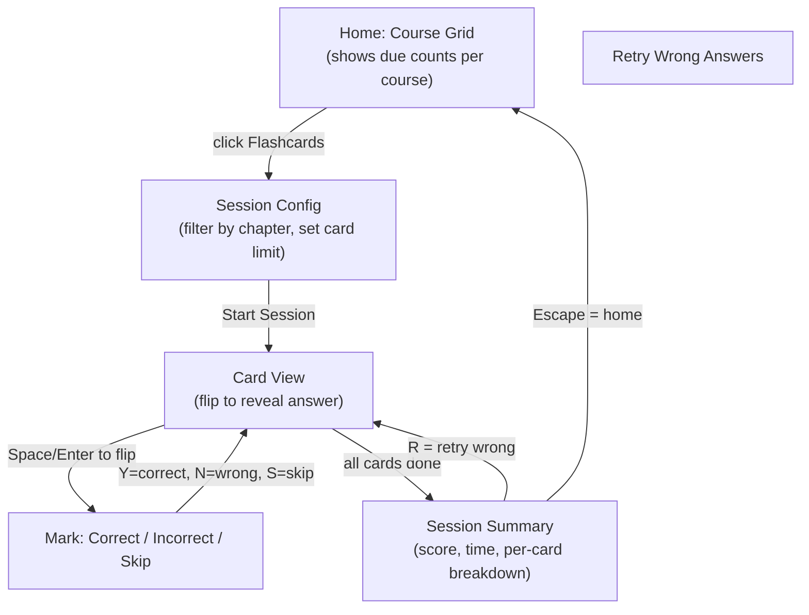
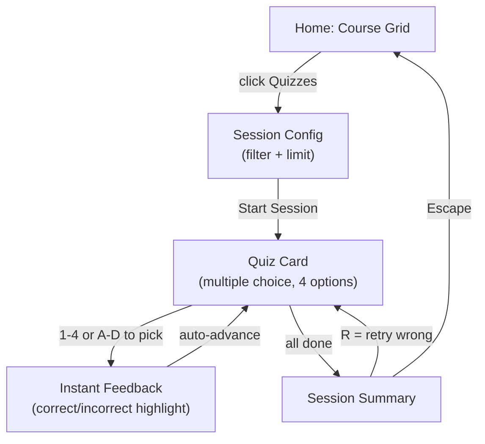
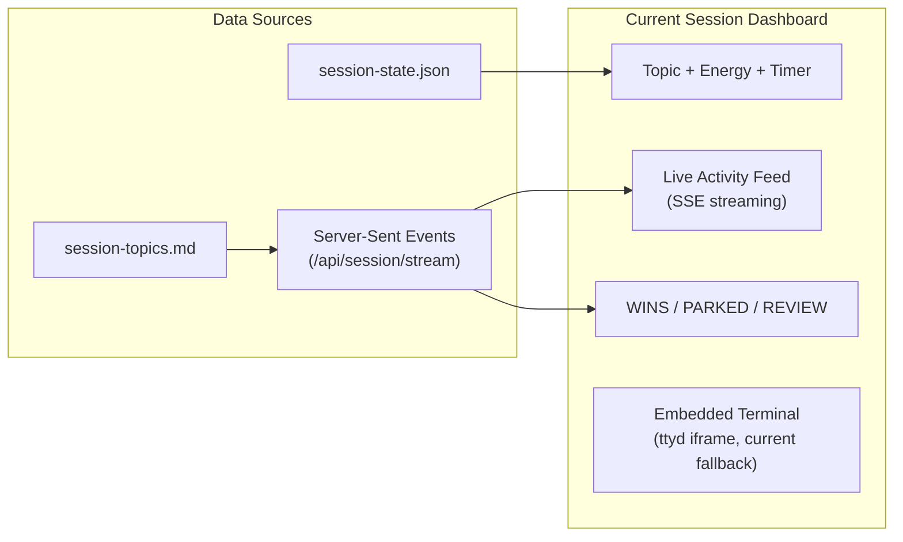
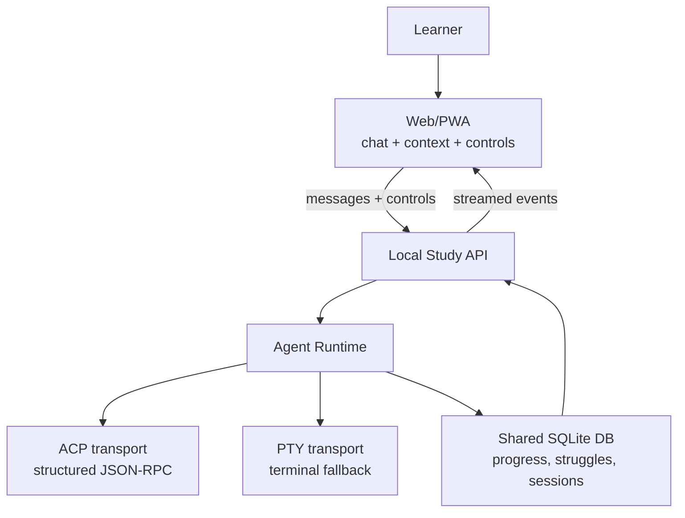
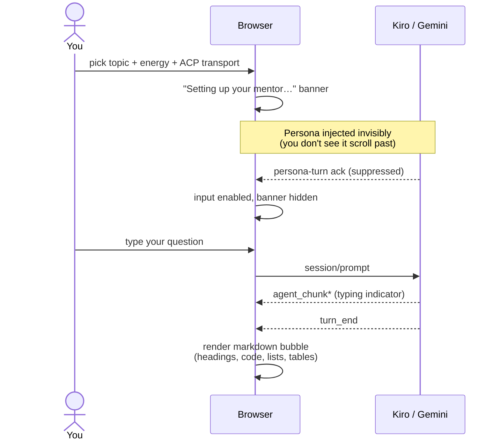
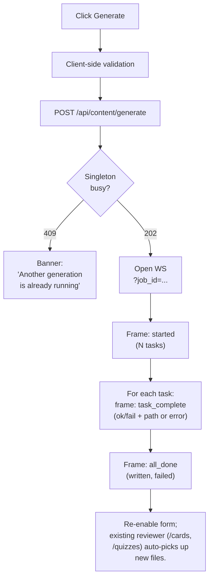

# Web UI Guide

> The web interface is the primary direction for learner-facing study: live interactive mentor sessions, body-doubling, session state, and supporting flashcards/quizzes.

---

## Starting the Web UI

```bash
studyloop web                        # localhost:8567
studyloop web --lan                  # LAN-accessible with auto-generated password
studyloop web --lan --password SECRET  # LAN with explicit password
studyloop web -p 9000                # custom port
```

Open your browser to `http://localhost:8567`. The PWA is installable; add it to your home screen on mobile for review and session visibility.

!!! note "Core workflow"
    The core workflow is interactive study with an agent. Flashcards and quizzes are useful support tools, but the web UI should increasingly serve the live mentor/body-doubling experience.

---

## Flashcard Review



### Walkthrough

1. **Home screen** — shows all courses as cards with due-count badges. A 90-day activity heatmap shows your study consistency. Courses with cards due today are highlighted.

2. **Pick a course** — click the **Flashcards** button on a course card. If the course has multiple chapters, you'll see a filter dropdown to select specific chapters and a card limit picker.

3. **Study cards** — each card shows the front (question). Press **Space** or **Enter** to flip and reveal the answer.

4. **Mark your answer**:
   - **Y** or click the green button — Correct (SM-2 interval increases)
   - **N** or click the red button — Incorrect (interval resets to 1 day)
   - **S** or click Skip — skip this card (no SM-2 update)

5. **Session summary** — shows your score (correct/incorrect/skipped), total time, and a per-card breakdown. Press **R** to retry only the cards you got wrong.

6. **Return home** — press **Escape** at any time.

### Keyboard Shortcuts (Flashcard Mode)

| Key | Action |
|-----|--------|
| Space / Enter | Flip card |
| Y | Mark correct |
| N | Mark incorrect |
| S | Skip card |
| T | Read card aloud (text-to-speech) |
| V | Toggle auto-voice (reads every card) |
| Escape | Return to home |

---

## Quiz Mode



### Walkthrough

1. **Pick a course** — click the **Quizzes** button on a course card.

2. **Answer questions** — each card shows a question with 4 multiple-choice options. Press **1-4** or **A-D** to select your answer. Correct answers highlight green; wrong answers highlight red with the correct answer shown.

3. **Summary** — same as flashcard mode. Press **R** to retry wrong answers.

### Keyboard Shortcuts (Quiz Mode)

| Key | Action |
|-----|--------|
| 1-4 or A-D | Select answer option |
| T | Read question aloud |
| V | Toggle auto-voice |
| Escape | Return to home |

---

## Live Interactive Sessions

When you start a study session with `--web`, the dashboard provides a real-time view of your session from any device:

```bash
studyloop study "Python Decorators" --energy 7 --web
```

### Accessing the Dashboard

- **Local**: `http://localhost:8567/session`
- **LAN** (with `--lan`): `http://<your-ip>:8567/session` (password-protected)

The LAN URL and password are printed to the terminal at session start.



### Current Dashboard Sections

**Header** — shows the study topic, energy level (as a `/10` badge), and a live timer matching the sidebar.

**Activity Feed** — real-time stream of topics as the agent logs them. Updates via SSE (Server-Sent Events) with no page refresh needed. Each entry shows the topic name, status icon, and note.

**Counter Bar** — WINS, PARKED, and REVIEW counts updated live.

**Embedded Terminal** — the ttyd terminal panel shows your tmux session, letting you interact with the agent from the browser. This is currently the main browser-based way to ask questions and have a live mentor conversation.

## Target Session Presentation

The target web UI should support live agent interaction without requiring a terminal emulator for the normal learner path.



### Target Session Controls

The web UI should expose structured controls:

- start session
- choose assistant
- ask a question
- stream agent response
- interrupt/cancel current turn
- park topic
- mark win
- mark struggle
- show recent struggles and wins from the DB
- end and summarize session
- resume previous session

Example target request:

```http
POST /api/sessions
Content-Type: application/json

{
  "topic": "Spark partitioning",
  "mode": "study",
  "agent": "kiro",
  "energy": 5,
  "transport": "auto"
}
```

Example target event:

```json
{
  "type": "agent_message_chunk",
  "content": "What do you already know about partition skew?"
}
```

### Transport Strategy

| Transport | Role | Use when |
|---|---|---|
| ACP | Preferred structured session transport | Agent supports Agent Client Protocol |
| PTY | Compatibility fallback | Agent only has an interactive terminal UI |
| Headless CLI | Background jobs only | One-shot summaries, generation, checks |
| ttyd | Current web terminal bridge | Until ACP/PTY web sessions are complete |

Do not remove ttyd until the web UI can complete an interactive study session without it.

---

## Terminal Fallback (ttyd)

The web dashboard embeds a terminal via ttyd, giving you full terminal access to the study session from a browser.

ttyd is currently important because it preserves the critical capability: the learner can ask questions and interact with the selected agent during study or body-doubling.

### How it works

ttyd runs as a background process alongside the web server. The dashboard embeds it in an iframe at `/terminal/`, proxied through FastAPI on the same port (no CORS issues).

### Pop-out and return

- **Pop-out** — click the pop-out button to open the terminal in a separate browser window. Useful on multi-monitor setups.
- **Return** — close the pop-out window or click "Show terminal" on the dashboard to re-embed the iframe.

The terminal stays connected during pop-out/return — your tmux session is not interrupted.

### LAN access

With `--lan`, the terminal is accessible from other devices on your network:

```bash
studyloop study "topic" --web --lan --password mypassword
```

Access from a tablet or phone at `http://<host-ip>:8567/session`. HTTP Basic Auth protects the connection.

### Without ttyd

If ttyd is not installed, the current dashboard works without the terminal panel. The activity feed, timer, and counters still function, but browser-based live agent interaction is degraded until the target ACP/PTY session transport exists.

---

## ACP Chat Mode (Kiro / Gemini)

When you start a session with **ACP** as the transport (Kiro or Gemini today), the dashboard renders a structured chat surface instead of a terminal. This is the preferred experience — markdown, syntax-highlighted code, proper headings, and no escape-sequence quirks.



### What to expect

**On session start.** A "Setting up your mentor…" banner appears in the chat area for a few seconds. The agent receives the StudyLoop persona — your topic, energy level, mode, and the AuDHD-aware Socratic mentoring instructions — as an invisible first prompt. You don't see it scroll past, and the agent's acknowledgement is hidden too. The input box stays disabled until the persona turn settles.

**During the persona turn.** The agent may make a few file-read tool calls to look at session IPC files for context. These tool-call cards are intentionally hidden during this turn and any permission prompts are auto-allowed — they're protocol noise, not something you triggered.

**While the agent is typing.** A subtle three-dot animation appears in the assistant bubble. Markdown is *not* rendered progressively — the previous design did that and it produced raw `##` and `**` source plus a cascade-staircase indent on Kiro's natural output. The fix is to render the full bubble once at `turn_end` instead of token-by-token.

**On `turn_end`.** The full response renders: headings, paragraphs, bullet lists, syntax-highlighted code fences, tables, links with `target="_blank" rel="noopener noreferrer"`. Inline content is sanitised through DOMPurify before insertion.

### Tool calls and permissions (after the persona turn)

Once you've started typing, tool-call cards DO appear — collapsed by default with a status badge (`◷ pending`, `◔ in_progress`, `✓ completed`, `✗ failed`). Click the chevron to expand. Bash-class tools render their output in a dark exec pane.

If the agent needs to do something that requires permission (e.g. write outside `/tmp`, run a destructive command), an inline allow/deny prompt appears in the chat with the available options. The exact prompts come from the agent — StudyLoop doesn't decide what's permissioned, just renders what the agent asks for.

### Live regression test

A real-browser test (`packages/studyloop/tests/test_web_acp_dogfood_kiro.py`, marked `@pytest.mark.live_kiro`) drives a real `kiro-cli acp` session via Playwright, asks "When should I use a SUM function in a SQL statement?", and asserts:

- The response is rendered as proper markdown HTML (no raw `##` or `**`).
- The persona text was actually transmitted on the wire.
- The response carries Socratic-mentor markers (Socratic dialogue patterns, mentor structural conventions).
- The persona-injection turn left zero artefacts in the chat.

Run it locally with `uv run pytest -m live_kiro` (requires `kiro-cli` authenticated).

Install ttyd with:

```bash
brew install ttyd      # macOS
apt install ttyd       # Debian/Ubuntu
```

---

## Generate Panel

> **Status (2026-05-29):** Shipped end-to-end. Backend (registry, two HTTP adapters, scope resolver, job orchestrator), HTTP surface (REST + WS + 4 supporting routes), and the sidebar UI all live on `main`. The Generate tab is now first-class alongside Flashcards / Quizzes / Body Double / Study Session.

The Generate tab in the sidebar (between **Quizzes** and **Body Double**) lets you produce flashcard and quiz decks from any course/section in your `~/Obsidian/Personal/Study/` tree, or from topics you've struggled with recently, without dropping to the CLI.

### Form fields

| Field | Source | Default |
|---|---|---|
| **Course** | Auto-discovered via `GET /api/content/courses` (subdirs of `content.base_path`) | empty — pick one |
| **Scope** | Whole course / One section / Topic I'm struggling on | Whole course |
| **Section** | `GET /api/courses/<course>/sections` (subdirs of the chosen course; output dirs skipped) | empty — pick one when scope=section |
| **Topic** | `GET /api/history/struggling-topics?days=N` — distinct topics with `confidence='struggling'` in the window | "all struggling topics in window" |
| **Window days** | numeric, 1-90 (Topic scope only) | 14 |
| **Kinds** | Flashcards / Quizzes (multi-select, ≥1 required) | Flashcards |
| **Count** | 5 / 10 / 15 / 20 / 25 / 50 cards-per-source | 10 |
| **Provider** | `GET /api/content/providers`; providers without an env var are visible but disabled, with tooltip | "stub (offline, free)" |
| **Model** | curated list per provider, with cost-tier + thinking-model badges | provider's first cheap-tier model |
| **On existing** | Overwrite / Merge / New suffix | Merge (least destructive) |

> **Why two course endpoints?** `GET /api/courses` lists courses that already have flashcards/quizzes JSON for the reviewer to render. The Generate panel uses `GET /api/content/courses` instead so a *fresh* course (markdown notes, no decks yet) is still a legitimate target.

### What happens when you click Generate



While the job is in flight, the Generate button is disabled. The progress area shows one row per task with a status icon, the source title, the deck kind, and the elapsed time.

### `on_existing` policies

- **Merge** (default) — loads the existing deck, deduplicates by normalised `front` (flashcards) or `question` (quizzes), and writes the merged result back. The original card content wins on collision; new cards are appended. Result is re-validated by pydantic so the exactly-one-correct-answer invariant survives. **Picked as default because it's the least destructive sensible behaviour** — no work is ever lost, and a re-run that produces overlapping content silently consolidates.
- **Suffix** — keeps the existing file, writes the new one as `<slug>-1-flashcards.json`, `<slug>-2-flashcards.json`, …
- **Overwrite** — replaces the existing file at `course/flashcards/<slug>-flashcards.json`. Destructive.

### Provider plumbing under the hood

The form's **Provider** dropdown is populated from a curated [provider registry](content-pipeline.md#pluggable-provider-abstraction). Five providers ship today: OpenAI, OpenRouter, Gemini, MiniMax (via its Anthropic-compat shim), and Anthropic. Each provider's available models are tagged with cost-tier (cheap / balanced / premium) and a thinking-model flag.

API keys live in a project-root `.env`:

```bash
OPENAI_API_KEY=
OPENROUTER_API_KEY=
GEMINI_API_KEY=
MINIMAX_API_KEY=
ANTHROPIC_API_KEY=
```

`.env` is auto-loaded on package import (see `studyloop/__init__.py`). Providers without a configured env var appear in the dropdown but are disabled with a tooltip telling you which env var to set.

### CLI parity

Everything the panel does is also available as the existing `studyloop content generate-cards` command. The panel is a UI over the same producer pipeline, not a separate code path.

---

## Accessibility

### OpenDyslexic Font

Toggle the OpenDyslexic font via the **Aa** button in the header. The preference is saved in localStorage and persists across sessions.

### Theme Palettes

The header has a **theme dropdown** with four palettes:

| Palette | Variant | Notes |
|---|---|---|
| Tokyo Night | dark (default) | Original StudyLoop palette. |
| Dracula | dark | High-contrast purple accent. |
| Catppuccin Mocha | dark | Pastel dark — eye-friendly for long sessions. |
| Catppuccin Latte | light | Light-mode partner to Mocha. |

Selection persists to `localStorage` under `palette`. Each palette overrides a small set of CSS custom properties (`--bg`, `--bg-card`, `--text`, `--accent`, etc.); every component re-themes automatically.

The original light/dark **toggle button** is still present and orthogonal to the palette picker — it adjusts a body-level `light` class for backward compatibility. Most users will pick a palette and leave the legacy toggle alone.

### Voice Output

- **T** key — read the current card aloud (Web Speech API)
- **V** key — toggle auto-voice (reads every card automatically)
- Voice selector dropdown in the header lets you choose from available English voices

### Pomodoro Timer (Browser)

The web UI has its own Pomodoro timer in the header (independent of the TUI sidebar timer). Click the Pomodoro icon to start a 25/5/15 cycle. Uses browser notifications and audio chimes for transitions.

---

## PWA Installation

The web UI is a Progressive Web App. To install:

1. Open `http://localhost:8567` in Chrome/Safari
2. Click "Add to Home Screen" (mobile) or the install icon in the address bar (desktop)
3. The app works offline for reviewing cards you've already loaded

The service worker caches all vendored assets (HTMX, Alpine.js, fonts) for offline use.

---

## Quick Reference

```bash
# Start flashcard/quiz review
studyloop web

# Start a study session with web dashboard
studyloop study "topic" --web

# LAN access (tablet/phone)
studyloop study "topic" --web --lan

# Check what's due for review
studyloop review

# View study streaks and patterns
studyloop streaks
```
